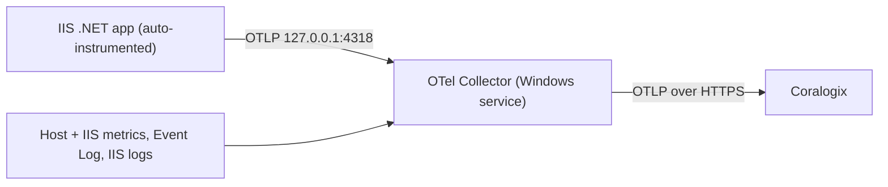

# IIS Instrumentation → Coralogix

Tooling and runbooks for shipping **Windows / IIS / .NET** telemetry to
[Coralogix](https://coralogix.com) via the OpenTelemetry Collector — from a
single host up to a scripted fleet rollout.

The collector runs as a Windows service (or under the OpAMP Supervisor for
remote config), scrapes host + IIS + .NET metrics, tails Windows event and IIS
logs, and receives OTLP traces from apps that are **zero-code auto-instrumented**
on the box. Span metrics (RED) are generated on the agent so Coralogix APM,
Infrastructure Explorer, and Database Monitoring light up.



## Repository layout

| Path | What it is |
| --- | --- |
| `docs/iis-instrumentation.md` | **Start here.** Single-host runbook: install the collector, zero-code .NET/IIS instrumentation, shared app-pool config, troubleshooting, full reference `config.yaml`. |
| `docs/fleet-deployment.md` | Fleet-scale runbook: build a package, push with BatchPatch, Supervisor mode, workload detection → selector attributes, Fleet Management. |
| `docs/agent-diagnostics.md` | **When something is wrong on a host.** Read-only diagnostics (`doctor.bat` / `Test-Agent.ps1` / the two instrumentation validators), graded exit codes, and what each finding means. |
| `docs/iis-e2e-matrix.md` | The IIS shapes and log layouts the end-to-end loop covers — and **every layout that needs a fix or a non-default setting** before telemetry works. |
| `docs/nodejs-windows-shape-matrix.md` | Every way **Node.js** runs on Windows — PM2 per-user, PM2 as a service under three different accounts, stopped daemon, bare `node.exe`, node-as-a-service, iisnode, IIS ARR → PM2 — which ones get zero-code telemetry, and which are reported out of scope rather than silently assumed. |
| `deploy/` | The deployment package payload (see below). |
| `Build-DeploymentPackage.ps1` | Zips `deploy/` into `coralogix-agent-deploy.zip`. |
| `poc/` | VirtualBox harness to validate the package on a throwaway Windows Server 2025 VM before fleet rollout. |
| `SimpleWebApp/` | A minimal ASP.NET Core 8 app (with a SQL Server call) used as an instrumentation target for testing. |
| `scripts/` | Single-host / test helpers: `deploy-app.ps1` (build + zero-code instrument `SimpleWebApp` on IIS in one pass), `generate-load.ps1` (emit test traffic), and the operator-side `Verify-Coralogix*.ps1` server-side gates. See [`scripts/README.md`](scripts/README.md). |
| `test/docker-win/` | Windows-container harnesses: the Coralogix E2E (IIS + PM2, and a RabbitMQ variant), the offline **asserting** diagnostics test `Run-DoctorTest.ps1`, and `Run-E2ELoop.ps1` — the full deploy loop over a 14-shape IIS host. Plus `test/Test-ResolveIISAppRuntime.ps1`, fixture-only unit tests for the app-runtime classification rules, and `test/Test-Pm2Topology.ps1`, the same for PM2 topology / service-hosted-daemon detection (no Docker, no IIS, no elevation, ~1s each). See [`test/docker-win/README.md`](test/docker-win/README.md). |
| `deploy-linux/` | **Linux** path: OpAMP Supervisor install for Linux DB hosts (Redis/Valkey/PostgreSQL/Elasticsearch), managed via Fleet Management. See [`deploy-linux/README.md`](deploy-linux/README.md). |

## Two paths

### Single host (manual)

Follow [`docs/iis-instrumentation.md`](docs/iis-instrumentation.md). In short:

1. Install the Coralogix OTel Collector as a Windows service with the reference
   `config.yaml`.
2. Install the OpenTelemetry .NET auto-instrumentation (Windows PowerShell **5.1**,
   elevated): `Import-Module` → `Install-OpenTelemetryCore` → `Register-OpenTelemetryForIIS`.
3. Point apps at the local collector (`OTEL_EXPORTER_OTLP_ENDPOINT=http://127.0.0.1:4318`).
   `Instrument-IIS.ps1` (or `deploy-app.ps1 -InstrumentAllApps`) auto-discovers every IIS
   site/app and sets a distinct `OTEL_SERVICE_NAME` per app from the site name + app path
   (root app → site name; nested `/api` → `Site/api`).
4. **"No Managed Code" is a pool setting, not a verdict on the app.** It is recommended for
   ASP.NET **Core** pools (they run on CoreCLR and never use the desktop CLR) and **wrong for
   ASP.NET Framework** pools, where it stops the app running at all. `Instrument-IIS.ps1`
   classifies each app's actual runtime first and skips what .NET auto-instrumentation cannot
   help — static sites, PHP/Node behind IIS, reverse proxies — keeping them out of
   `CX_IIS_SERVICES`. See [`docs/agent-diagnostics.md`](docs/agent-diagnostics.md).

### Fleet (scripted)

Follow [`docs/fleet-deployment.md`](docs/fleet-deployment.md).

```powershell
# 1. Build the package (from repo root). -KeyFile bakes the key in; -Region bakes the
#    Coralogix region in (region.txt); -OutFile overrides the output path.
.\Build-DeploymentPackage.ps1 -KeyFile C:\secrets\cx-send-your-data.key -Region eu2
#    -> coralogix-agent-deploy.zip
#    Region can also be chosen per host at deploy time: set CX_REGION=eu2 && deploy.bat
#    Private / non-standard ingress: set CX_DOMAIN=my-ingress.example.com && deploy.bat

# 2. Push with BatchPatch to a 2-3 host pilot, then the full fleet.
#    Each host runs deploy.bat -> Install-Agent.ps1:
#      detect workloads -> install collector (Supervisor mode) -> conditional IIS -> verify

# 3. Assign remote config in Coralogix Fleet Management, targeting agents by
#    the cx.host.role / workload.* selector attributes detection published.
```

Every fleet script's flags, defaults, and the `deploy.bat` / `uninstall.bat`
env-var → flag mappings are cataloged in
[`docs/fleet-deployment.md` → Command & flag reference](docs/fleet-deployment.md#command--flag-reference).

**Config backup.** Every install run snapshots each config it is about to change
into `C:\ProgramData\CoralogixDeploy\backups\<timestamp>\` (a `manifest.json` plus
`.bak` copies of `applicationHost.config` / `web.config` / the supervisor
`config.yaml` and `W3SVC.reg` / `WAS.reg` exports), and records exactly what it
added. `latest.json` points at the newest run.

**Uninstall & rollback.** Run `uninstall.bat` as the BatchPatch remote command
(or `Uninstall-Agent.ps1` elevated). It reads the backup manifest and reverses
only the installer's own changes — removes the collector/supervisor service,
unregisters the IIS profiler, strips the OTEL_* pool/`web.config`/env-var entries
it added (restoring any value that pre-existed), and leaves hosted apps untouched.
Staged config + binaries are kept by default; `CX_PURGE=1` also deletes them,
`CX_RESTORE=1` restores configs from the backup instead of surgical edits. Details
in [`docs/fleet-deployment.md`](docs/fleet-deployment.md).

### Linux (database hosts)

For Linux DB servers (Redis, Valkey, PostgreSQL, Elasticsearch), follow
[`deploy-linux/README.md`](deploy-linux/README.md). It installs the
Coralogix **OpAMP Supervisor + OTel Collector** so config is owned remotely by
Fleet Management — same pattern as the Windows fleet path.

```bash
# Copy the installer to the host, then run it with Fleet labels + DB credentials:
sudo env \
  CORALOGIX_PRIVATE_KEY="<send-your-data-key>" \
  CORALOGIX_REGION="eu2" \
  APP_TYPE="postgresql" \
  ENV_TYPE="prod" \
  POSTGRES_OTEL_PASSWORD="<otel_monitor_password>" \
  ./install-supervisor-default.sh

# Then create + Activate a Configuration group in Fleet Management, targeting
# agents by the app.type / env.type labels set at install time.
```

The Supervisor tags each agent with `app.type` / `env.type` for Fleet grouping;
`deploy-linux/config.yaml` is a metrics/logs starting point to Activate
remotely. Full env-var reference, verification steps, and troubleshooting live in
that folder's README.

## The `deploy/` package

| File | Role |
| --- | --- |
| `deploy.bat` | BatchPatch entry point; launches the orchestrator under PowerShell 5.1. |
| `uninstall.bat` | BatchPatch entry point for uninstall; launches `Uninstall-Agent.ps1` (`CX_PURGE=1` → `-Purge`, `CX_RESTORE=1` → `-RestoreConfigs`). |
| `Install-Agent.ps1` | Orchestrator: detect → install supervisor → conditional IIS / Node → verify. Opens a backup session and records every config it changes. |
| `Uninstall-Agent.ps1` | Reverse the install, manifest-guided (removes only what install added, restores prior values). See **Uninstall & rollback** below. |
| `Detect-Workloads.ps1` | Detects IIS, .NET, Node, PM2, Redis, Valkey, SQL Server, DB2, RabbitMQ, Elasticsearch → `OTEL_RESOURCE_ATTRIBUTES`. Dot-source it to get the probe helpers without running a scan. |
| `Install-CoralogixSupervisor.ps1` | Collector install with `-Supervisor`; injects selector attributes into the OpAMP AgentDescription. |
| `Instrument-IIS.ps1` | Zero-code .NET auto-instrumentation, IIS hosts only. |
| `Resolve-IISServiceNames.ps1` | Per-app `OTEL_SERVICE_NAME` mapping + `web.config` read/write helpers (dot-sourced by the install + uninstall scripts). |
| `Resolve-IISLogPaths.ps1` | Discovers where IIS really writes access logs (custom `logFile.directory`, central W3C, non-W3C formats) and publishes `CX_IIS_LOG_DIR_n`, so sites logging outside the collector's default glob are not silently lost. |
| `Instrument-NodePM2.ps1` | Zero-code Node instrumentation via per-app `NODE_OPTIONS`, PM2 hosts only. `-Apps` for a staged rollout, `-WhatIf` to see what would restart. Runs `pm2` as the daemon's owning account when PM2 is hosted as a Windows service. |
| `Resolve-NodeServiceNames.ps1` | PM2 topology + per-app Node `OTEL_SERVICE_NAME` mapping helpers (dot-sourced by the detect, install, uninstall and doctor scripts). Finds a service-hosted PM2 daemon and its app set without being able to query it — see [`docs/nodejs-pm2-instrumentation.md`](docs/nodejs-pm2-instrumentation.md). |
| `Backup-Config.ps1` | Backup + manifest helper; snapshots every config the install mutates before it changes it. |
| `doctor.bat` | BatchPatch entry point for the read-only host diagnostic; propagates the graded exit code (`0` pass / `1` hard fail / `2` degraded). |
| `Test-Agent.ps1` | Host doctor: env vars, per-app `OTEL_SERVICE_NAME` readback, services, health, export counters, OTLP ports, effective-config processor, plus the two instrumentation validators. `-Only` runs a subset. See [`docs/agent-diagnostics.md`](docs/agent-diagnostics.md). |
| `Test-IISInstrumentation.ps1` | Validates the IIS instrumentation actually landed (CLR profiler, profiler DLL, pool OTLP env, "No Managed Code"). Runs standalone or dot-sourced by `Test-Agent.ps1`. |
| `Test-NodeInstrumentation.ps1` | Same for Node/PM2 (`NODE_OPTIONS`, register bootstrap, per-app service names). Runs standalone or dot-sourced. |
| `Write-DeployLog.ps1` | Shared finding model + console formatters used by the diagnostics. |
| `config.supervisor.yaml` | Base config = reference `config.yaml` **minus the `opamp` extension** (the Supervisor owns that connection). |
| `SendDataKey.txt` | Send-Your-Data key (baked in via `-KeyFile`, or supplied at deploy time). |

## POC (VirtualBox)

`poc/Run-TestVM.ps1` spins up a disposable Windows Server 2025 VM to validate the
package end-to-end before touching real servers. Preferred flow is fully scripted:

```powershell
cd poc
.\Run-TestVM.ps1 -Action Unattended            # auto Windows install + Guest Additions (~20-40 min)
.\Run-TestVM.ps1 -Action Snapshot -SnapshotName baseline
.\Run-TestVM.ps1 -Action Configure             # enable IIS + WinRM/firewall in guest
..\Build-DeploymentPackage.ps1 -KeyFile C:\secrets\cx.key
.\Run-TestVM.ps1 -Action Deploy                # copy + expand + run deploy.bat
```

Validated end-to-end on Windows Server 2025 (2026-07-14 and 2026-07-15): supervisor
registered with Fleet Management, collector healthy, selector attributes published,
IIS zero-code instrumentation configured.

> **VM-only gotcha:** VirtualBox exposes no SMBIOS Type 4, so `resourcedetection`
> `host.cpu.*` attributes crash-loop the collector. The base config drops them; a
> Fleet-Management remote config that re-adds them re-triggers it on SMBIOS-less
> hosts. Real fleet hardware is unaffected. See `docs/fleet-deployment.md`.

## Prerequisites

- Windows 10/11 or Windows Server 2016+, Administrator access.
- **Windows PowerShell 5.1** (the .NET auto-instrumentation module requires 5.1, not 7).
- A Coralogix **Send-Your-Data API key** and the **region** the key belongs to
  (`eu1`, `eu2`, `us1`, `us2`, `us3`, `ap1`, `ap2`, `ap3` — domain
  `<region>.coralogix.com`). Pass it as `-Region` / `CX_REGION`, or bake it into the
  package with `Build-DeploymentPackage.ps1 -Region`. Default is `eu1`; a key used
  against the wrong region authenticates nowhere while the host still reports healthy.
  For a private / non-standard ingress domain the region table does not cover, pass the
  domain itself as `-Domain` / `CX_DOMAIN` instead — it wins over the region and is taken
  verbatim, so it cannot be baked into the package and must be set per host.
- IIS role installed if using the IIS receivers.

> **Security:** never commit the Send-Your-Data key. The collector reads it from
> the `CORALOGIX_PRIVATE_KEY` environment variable; keyed deploy zips are secrets.
