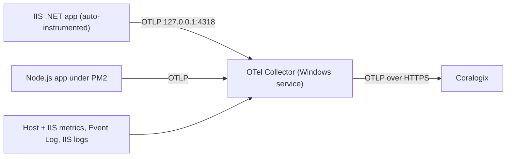

# Windows telemetry → Coralogix

Tooling and runbooks for shipping **Windows / IIS / .NET / Node.js** telemetry to
[Coralogix](https://coralogix.com) through the OpenTelemetry Collector — from a single host up to a
scripted fleet rollout, with a Linux path for database servers.

The collector runs as a Windows service, or under the OpAMP Supervisor when configuration should be
owned remotely by Coralogix Fleet Management. It scrapes host, IIS and .NET metrics, tails Windows
event and IIS access logs, and receives OTLP from applications that are **zero-code
auto-instrumented** on the box. Span metrics (RED) are generated on the agent, so Coralogix APM,
Infrastructure Explorer and Database Monitoring light up without touching application code.



## Quick start

### A fleet of Windows hosts

```powershell
# 1. Build the package on your workstation. -KeyFile bakes the Send-Your-Data key in,
#    -Region bakes the Coralogix region in.
.\Build-DeploymentPackage.ps1 -KeyFile C:\secrets\cx-send-your-data.key -Region eu2
#    -> coralogix-agent-deploy.zip

# 2. Copy the extracted package to each host with your fleet tool and run deploy.bat.
#    It detects workloads, installs the collector under the supervisor, instruments
#    IIS / Node where present, and verifies.

# 3. In Coralogix, assign a remote config in Fleet Management, targeting agents by the
#    cx.host.role / workload.* selector attributes detection published.
```

Full runbook: [docs/fleet.md](docs/fleet.md).

### One Windows host, by hand

Install the collector as a Windows service, install the OpenTelemetry .NET auto-instrumentation
(Windows PowerShell **5.1**, elevated), then point applications at `http://127.0.0.1:4318` and give
each a distinct `OTEL_SERVICE_NAME`. `deploy\Instrument-IIS.ps1` does the discovery and naming for
every IIS site and application in one pass.

Full runbook: [docs/single-host.md](docs/single-host.md).

### A Linux database host

```bash
sudo env \
  CORALOGIX_PRIVATE_KEY="<send-your-data-key>" \
  CORALOGIX_REGION="eu2" \
  APP_TYPE="postgresql" \
  ENV_TYPE="prod" \
  POSTGRES_OTEL_PASSWORD="<otel_monitor_password>" \
  ./install-supervisor-default.sh
```

Then create and activate a configuration group in Fleet Management, targeting agents by the
`app.type` / `env.type` labels set at install time. Full runbook: [docs/linux.md](docs/linux.md).

## Documentation

| Document | Covers |
| --- | --- |
| [docs/README.md](docs/README.md) | Index — which document answers which question |
| [docs/single-host.md](docs/single-host.md) | Single-host runbook, and the deepest IIS background |
| [docs/fleet.md](docs/fleet.md) | Fleet rollout, Fleet Management, uninstall and rollback |
| [docs/linux.md](docs/linux.md) | Linux database hosts |
| [docs/nodejs-pm2.md](docs/nodejs-pm2.md) | Node.js under PM2, and as a Windows service |
| [docs/diagnostics.md](docs/diagnostics.md) | Reading a `doctor.bat` result |
| [docs/iis-service-ownership.md](docs/iis-service-ownership.md) | Infrastructure-Explorer Service ownership |
| [docs/reference/cli.md](docs/reference/cli.md) | Every command and argument |
| [docs/reference/env-vars.md](docs/reference/env-vars.md) | Every environment variable |
| [docs/reference/exit-codes.md](docs/reference/exit-codes.md) | Exit codes and all finding codes |

## Repository layout

| Path | What it is |
| --- | --- |
| `deploy/` | The Windows deployment package: entry points, orchestrator, workload detection, instrumenters, diagnostics, base collector config. |
| `Build-DeploymentPackage.ps1` | Zips `deploy/` into `coralogix-agent-deploy.zip`. |
| `deploy/templates/` | Per-workload collector config fragments to layer onto the base (for example RabbitMQ). |
| `deploy-linux/` | The Linux installer, its base config, and per-database templates. |
| `scripts/` | Operator-side verification: query Coralogix to confirm what actually arrived. See [scripts/README.md](scripts/README.md). |
| `docs/` | The documentation above. |
| `misc/` | Legacy self-contained single-host scripts, superseded by `deploy/`. |
| Development | `test/` and `poc/` hold the harnesses used to validate the package before release. Not part of a deployment; each has its own README. |

## Prerequisites

- Windows 10/11 or Windows Server 2016 or later, with Administrator access.
- **Windows PowerShell 5.1.** The .NET auto-instrumentation module requires 5.1, not PowerShell 7.
  The `.bat` entry points select it, and re-launch out of WOW64 when started from a 32-bit process.
- A Coralogix **Send-Your-Data API key** and the **region** that key belongs to — `eu1`, `eu2`,
  `us1`, `us2`, `us3`, `ap1`, `ap2`, `ap3`, resolving to `<region>.coralogix.com`. Pass it as
  `-Region` / `CX_REGION`, or bake it in with `Build-DeploymentPackage.ps1 -Region`. Default is
  `eu1`. **A key used against the wrong region authenticates nowhere while the host still reports
  healthy.** For a private ingress domain the region table does not cover, pass `-Domain` /
  `CX_DOMAIN` instead: it is taken verbatim, wins over the region, and cannot be baked into a
  package.
- The IIS role installed, if you intend to use the IIS receivers.

## Uninstall and rollback

Every install run snapshots each config it is about to change into
`C:\ProgramData\CoralogixDeploy\backups\<timestamp>\` — a `manifest.json` plus copies of
`applicationHost.config`, each `web.config`, the supervisor `config.yaml`, and the W3SVC/WAS
registry exports — and records exactly what it added. `latest.json` points at the newest run.

Run `uninstall.bat` as the remote command, or `Uninstall-Agent.ps1` elevated. It reads the manifest
and reverses **only the installer's own changes**: removes the collector and supervisor services,
unregisters the IIS profiler, strips the `OTEL_*` pool, `web.config` and machine-variable entries it
added (restoring any value that pre-existed), and leaves hosted applications untouched. Staged
config and binaries are kept by default; `CX_PURGE=1` also deletes them, and `CX_RESTORE=1` restores
configs from the backup instead of making surgical edits.

## Security

- Never commit a Send-Your-Data key. A package built with `-KeyFile` contains one, so **a keyed zip
  is a secret**.
- The collector reads the key from the `CORALOGIX_PRIVATE_KEY` environment variable, which the
  installer persists for the service. `-PrivateKey` takes the key **value**; `-KeyFile` takes a
  **path**. Passing a path where the value is expected is accepted verbatim, and the install then
  reports success while every export is rejected — see
  [docs/reference/cli.md](docs/reference/cli.md).
- The diagnostics are read-only: they never set a variable, never run `appcmd` or `iisreset`, never
  start or stop a service, and never download anything.

## License

See [LICENSE](LICENSE).
