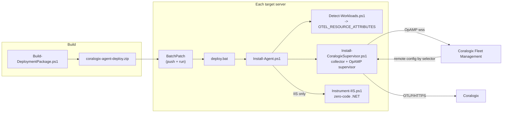

# Fleet Deployment Runbook — Coralogix OTel Collector (Supervisor Mode) via BatchPatch

This runbook automates installing the Coralogix OpenTelemetry Collector **in
Supervisor mode** (remote-config ready via Coralogix Fleet Management) across a
mixed Windows fleet (~10–20 servers), **detecting what each host runs**, tagging
each agent with **selector attributes** so Fleet Management can target it, and —
**only when IIS is present** — configuring zero-code .NET auto-instrumentation.

For the single-host / manual details and the deep IIS background, see
[`iis-instrumentation.md`](./iis-instrumentation.md). This document is the
fleet-scale, scripted path.

---

## Architecture



Two ideas do the heavy lifting:

1. **Supervisor mode.** The collector runs under the OpAMP **Supervisor**, which
   holds the OpAMP connection to Coralogix. A local **base config**
   (`config.supervisor.yaml`) provides sane defaults; Fleet Management merges a
   **remote config** on top. The base config therefore must **not** contain an
   `opamp` extension (the Supervisor owns that) — this is the key difference from
   the repo's local-mode `config.yaml`.

2. **Selector attributes.** `Detect-Workloads.ps1` sets machine-level
   `OTEL_RESOURCE_ATTRIBUTES`. `Install-CoralogixSupervisor.ps1` then writes those
   `cx.host.role` / `workload.*` pairs into the OpAMP Supervisor config's
   `agent.description.non_identifying_attributes`, so the Supervisor advertises them
   in its OpAMP **AgentDescription**. Coralogix Fleet Management can then group /
   target agents by `cx.host.role` and `workload.*`. (The base config's
   `resourcedetection/env` also stamps them onto the telemetry **data**, but the
   AgentDescription — not the data — is what Fleet Management reads for selectors, so
   the Supervisor-side injection is what actually makes them selectable.)

---

## Package contents

`deploy/` is the payload BatchPatch distributes:

| File | Role |
| --- | --- |
| `deploy.bat` | BatchPatch remote-command entry; launches the orchestrator under PowerShell 5.1 |
| `uninstall.bat` | BatchPatch remote-command entry for uninstall; launches `Uninstall-Agent.ps1` |
| `Install-Agent.ps1` | Orchestrator: detect → install supervisor → conditional IIS → verify |
| `Uninstall-Agent.ps1` | Reverse the install (manifest-guided); see **Uninstall** below |
| `Detect-Workloads.ps1` | Workload detection → `OTEL_RESOURCE_ATTRIBUTES` + JSON summary |
| `Install-CoralogixSupervisor.ps1` | Collector install with `-Supervisor` |
| `Instrument-IIS.ps1` | Zero-code .NET auto-instrumentation (IIS hosts only) |
| `Resolve-IISServiceNames.ps1` | Per-app service-name mapping + `web.config` read/write helpers |
| `Instrument-NodePM2.ps1` | Zero-code Node/PM2 instrumentation via `NODE_OPTIONS` (PM2 hosts only) |
| `Resolve-NodeServiceNames.ps1` | Per-app Node service-name mapping helpers |
| `Backup-Config.ps1` | Backup + manifest helper; snapshots every config the install mutates |
| `doctor.bat` | BatchPatch remote-command entry for the **read-only** host diagnostic |
| `Test-Agent.ps1` | Host doctor — nine checks, graded exit code, `-Only` for a subset |
| `Test-IISInstrumentation.ps1` | Validates the IIS instrumentation landed; standalone or dot-sourced |
| `Test-NodeInstrumentation.ps1` | Validates the Node/PM2 instrumentation landed; standalone or dot-sourced |
| `Write-DeployLog.ps1` | Shared finding model + console formatters for the diagnostics |
| `config.supervisor.yaml` | Base config = repo `config.yaml` **minus the opamp extension** |
| `SendDataKey.txt` | Send-Your-Data key (or supply at deploy time — see below) |

`Build-DeploymentPackage.ps1` (repo root) zips these into
`coralogix-agent-deploy.zip`. `batchpatch.zip` in the repo is the BatchPatch.exe
tool itself — **not** this package.

---

## Step 1 — Build the package

```powershell
# From the repo root, on your workstation:
.\Build-DeploymentPackage.ps1 -KeyFile C:\secrets\cx-send-your-data.key
# -> coralogix-agent-deploy.zip
```

- With `-KeyFile`, the real key is baked into the package as `SendDataKey.txt`.
- Without `-KeyFile`, the package ships **keyless**; supply the key at deploy time
  (Step 2, option B). Treat the keyed zip as a secret.
- Override the output path with `-OutFile`. Full flags: see
  [Command & flag reference](#command--flag-reference).

## Step 2 — Deploy across the fleet with BatchPatch

BatchPatch has no atomic "copy + run" object, so we ship one folder and one
`deploy.bat` that orchestrates everything.

1. In BatchPatch, select the target servers (start with a **2–3 host pilot**).
2. **Actions → Deploy software/patches/scripts.** Source = the extracted
   `coralogix-agent-deploy.zip` contents (or configure BatchPatch to extract the
   zip). Destination on each host, e.g. `C:\cx-deploy\`.
3. Set the **remote command** to run after copy:
   - **Option A (key in package):** `deploy.bat`
   - **Option B (key at deploy time):**
     `set CORALOGIX_PRIVATE_KEY=cxtp_xxx && deploy.bat`
   - **Environment label (optional, combine with either):** prepend
     `set CX_ENVIRONMENT=<production|staging|dev> &&` to tag this host's telemetry
     for the Coralogix per-environment split (see *Environment labeling* below), e.g.
     `set CX_ENVIRONMENT=staging && set CORALOGIX_PRIVATE_KEY=cxtp_xxx && deploy.bat`.
4. Run. BatchPatch executes `deploy.bat` elevated; a **non-zero exit code marks
   the row failed**. Per-host logs land next to the scripts:
   `install-agent.log`, `install-agent-status.json`, `detect-workloads.json`.
5. Review the pilot, then widen to the full fleet.

> The same model matches how New Relic / Dynatrace agents were pushed — both the
> collector install and the instrumentation are PowerShell.

## Step 3 — Assign remote config in Coralogix Fleet Management

1. In Coralogix (**eu1**), open **Fleet Management**. New agents appear as they
   register over OpAMP.
2. Confirm each agent's **AgentDescription** carries the selector attributes:
   `cx.host.role`, `workload.iis`, `workload.redis`, etc.
3. Build agent groups / config assignments that **select on those attributes**,
   e.g.:
   - `workload.iis = true` → IIS + ASP.NET receivers overlay
   - `workload.redis = true` OR `workload.valkey = true` → Redis receiver overlay
   - `workload.sqlserver = true` → SQL Server receiver overlay
   - `workload.elasticsearch = true` → Elasticsearch receiver overlay
4. The remote config is **merged on top of** `config.supervisor.yaml`, so a fresh
   agent already ships host + Windows + IIS signals before any assignment.

---

## Environment labeling (per-environment split in Infra Explorer)

Set **`CX_ENVIRONMENT`** on a host (via `deploy.bat`, or `Install-Agent.ps1
-Environment <env>`) to tag *all* of that host's telemetry with the deployment
environment, so Coralogix can separate `production` / `staging` / `dev` in Infra
Explorer and APM.

- Persisted as a machine env var by `Install-CoralogixSupervisor.ps1`.
- The base `config.supervisor.yaml` has a `resource/environment` processor that
  upserts it (from `${env:CX_ENVIRONMENT:-unspecified}`) onto every pipeline — host
  metrics/logs, IIS logs, app spans, **and** the Infra Explorer host entity
  (`logs/resource_catalog`) — under three keys: `tags.cx_environment`,
  `tags.cx_env`, and the OTel semconv `deployment.environment.name`.
- Unset → `unspecified` (a forgotten host is obvious, not silently "production").
- The same value is also fed to the OpAMP AgentDescription
  (`deployment.environment.name`) so you can **group by environment** in Fleet
  Management.

---

## Service labeling on infrastructure data (IIS)

> Full detail, key verdicts and value format live in
> [`iis-service-ownership.md`](./iis-service-ownership.md). This is the fleet summary.

Populates the Coralogix Infrastructure-Explorer **Service** ownership for a Windows/IIS host
with the service(s) it runs. Split across automation and (remote) config:

- **Automation (deploy scripts) — env var only.** `Instrument-IIS.ps1` sets the machine env var
  **`CX_IIS_SERVICES`** to the comma-joined distinct service name(s) the host runs on IIS, via
  `Get-IISServiceLabelValue -Map $svcMap` — the **same** `$svcMap` whose `.ServiceName` is
  assigned as each app's `OTEL_SERVICE_NAME`. So each host Service-ownership item equals a
  per-app `OTEL_SERVICE_NAME` (the APM service name) — **aligned by construction**.
- **Config — remote.** The `transform/iis_service_labels` processor lives in the **remote Fleet
  Management config**. It splits `${env:CX_IIS_SERVICES}` into an array and stamps **7 keys**
  onto the **logs-related pipelines only** (`logs` + `logs/resource_catalog`, the host entity
  that drives ownership). The repo collector YAMLs +
  [`iis-service-ownership.collector.yaml`](./iis-service-ownership.collector.yaml) are the
  **reference source** to copy into the remote config — the automation does **not** push config,
  and the supervisor's base-stage → pull-remote → merge flow is unchanged.

Keys (all resolve to Service ownership and split arrays into discrete items, verified via the
per-key Docker POC): `service`, `tags.{service,cx_svc,CX_SERVICE_NAME}`,
`cx.infra.labels.{service,cx_svc,CX_SERVICE_NAME}`. Bare `cx_service` and `CX_SERVICE_NAME` were
**ignored** by ownership and dropped.

Value format: an **OTel array**, e.g. `["Default Web Site","SimpleWebApp"]` (single app → a
one-element array). Multiple items = one per IIS app, which is what APM resource correlation
needs to match a single service to the host. Arrays stay arrays on the logs/entity path; on
metrics they collapse to a comma-string label (ownership is resolved from the entity, not
metric labels). Unset `CX_IIS_SERVICES` (non-IIS host) → the processor's guard leaves all keys
unset.

Verify with `scripts/Verify-CoralogixInfraLabels.ps1` (DataPrime/PromQL). Note: the supervised
collector only sees `${env:CX_IIS_SERVICES}` if the machine env var is set before it starts —
set it at machine scope and restart the supervisor.

---

## Workload detection & attribute schema

`Detect-Workloads.ps1` uses several independent signals per workload (Windows
services, processes, listening ports, install dirs / registry). Any one hit marks
the workload present; every probe is non-fatal.

| Workload | Primary signals |
| --- | --- |
| IIS | `W3SVC`/`WAS` service, `w3wp` process, IIS optional feature, `appcmd.exe` |
| .NET | `dotnet` CLI / install dir, .NET Framework `NDP\v4\Full` registry |
| Node.js (9→latest) | `node --version`, `%ProgramFiles%\nodejs` |
| RabbitMQ | `RabbitMQ*` service, ports 5672/15672, install dir |
| Redis | `Redis*` service, `redis-server` process, port 6379 |
| Valkey | `Valkey*` service, `valkey-server` process, port 6379 |
| SQL Server | `MSSQL*` service, `sqlservr` process, port 1433 |
| DB2 | `DB2*` service, `db2sysc*` process, port 50000/25000 |
| Elasticsearch | `elasticsearch*` service, ports 9200/9300, install dir |

Emitted `OTEL_RESOURCE_ATTRIBUTES` (the agent-selector contract):

| Attribute | Meaning |
| --- | --- |
| `cx.host.role=<primary>` | Single coarse role, by priority: `iis > sqlserver > db2 > elasticsearch > rabbitmq > redis > valkey > nodejs > dotnet` |
| `workload.<name>=true` | One per detected workload (multi-role hosts get several) |
| `workload.nodejs.version` | Node.js version, when present |
| `workload.dotnet.version` | .NET version, when present |

> Redis and Valkey share port 6379; when only the port is seen the host is tagged
> `redis`. A Valkey **service/process** disambiguates and clears the redis tag.
>
> **Non-Windows workloads** (Redis/Valkey/RabbitMQ/DB2/Elasticsearch on Linux) are
> out of scope for this Windows package — deploy a matching Linux collector config
> there (see the template matrix in `iis-instrumentation.md`).

---

## Conditional IIS zero-code instrumentation

When detection reports IIS, the orchestrator runs `Instrument-IIS.ps1`:

- Installs the OpenTelemetry .NET auto-instrumentation module in strict order
  (`Import-Module` → `Install-OpenTelemetryCore` → `Register-OpenTelemetryForIIS`).
- Sets the OTLP endpoint **host-wide** on `applicationPoolDefaults`
  (`OTEL_EXPORTER_OTLP_ENDPOINT=http://localhost:4318`,
  `OTEL_EXPORTER_OTLP_PROTOCOL=http/protobuf`) — the fleet "set once" pattern.
- Auto-discovers every IIS site + application (`Resolve-IISServiceNames.ps1`) and sets
  a distinct `OTEL_SERVICE_NAME` for each, from the site name + app path (root app →
  site name; nested app `/api` → `Site/api`). Apps on a **dedicated** pool get the name
  on the pool (the OTLP endpoint/protocol are re-set there too, per the inheritance
  rule below); apps that **share** a pool get it in their own `web.config`. Rename
  specific apps with `-ServiceNameOverrides @{ 'Site/api' = 'custom' }` or
  `-OverridesJson <path>` (see [Command & flag reference](#command--flag-reference)).

Reminders from `iis-instrumentation.md`:
- Requires **Windows PowerShell 5.1** (not 7).
- ASP.NET **Core** app pools must be **"No Managed Code"** or they emit nothing.
- A trailing blank line in the W3SVC `Environment` REG_MULTI_SZ prevents IIS start.

---

## POC validation with VirtualBox (throwaway)

`poc/Run-TestVM.ps1` spins up a disposable Windows target to validate the package
before fleet rollout. `vm_images/` holds a Windows Server 2025 **EVAL ISO**.

**Fully scripted path (preferred — no interactive steps).** `-Action Unattended`
drives Windows Setup from an answer file and installs Guest Additions automatically,
so the whole cycle is hands-off and `VBoxManage guestcontrol` works afterwards:

```powershell
cd poc
.\Run-TestVM.ps1 -Action Unattended                 # auto Windows install + Guest Additions (~20-40 min)
# WAIT for the guest to finish installing AND reach the desktop before continuing.
# Guest Additions run level can read 3 while the guest is still in OOBE and the
# guestcontrol EXEC service is NOT ready yet; a first-boot reboot settles it.
# Poll with an EXIT-CODE check (a string match is unreliable - VBoxManage echoes the
# command back inside its error text, so grepping the token gives false positives):
#   do { $null = VBoxManage guestcontrol cx-fleet-test --username Administrator `
#          --password 'Otel!Passw0rd2026' run --exe C:\Windows\System32\cmd.exe `
#          --wait-stdout -- /c echo READY; Start-Sleep 15 } until ($LASTEXITCODE -eq 0)
.\Run-TestVM.ps1 -Action Snapshot -SnapshotName baseline
.\Run-TestVM.ps1 -Action Configure                  # enable IIS + WinRM/firewall in guest
..\Build-DeploymentPackage.ps1 -KeyFile C:\secrets\cx.key
.\Run-TestVM.ps1 -Action Deploy                     # copyto + expand + run deploy.bat
# reset and repeat (restore powers off first, then Start again):
.\Run-TestVM.ps1 -Action Restore -SnapshotName baseline
.\Run-TestVM.ps1 -Action Start
```

**Manual path (fallback).** If unattended install misbehaves, `-Action Create` then
`-Action Start -Gui` lets you install Windows + Guest Additions by hand, then snapshot.

**Keyboard-injection fallback (no guestcontrol).** If Guest Additions never come up
(older ISOs / GA install failures), the guest can't be driven by `guestcontrol`.
`poc/Guest-PullDeploy.ps1` is pushed via `VBoxManage controlvm keyboardputstring`:
the guest pulls `coralogix-agent-deploy.zip` from a host HTTP server and runs
`deploy.bat`, exfiltrating logs through its IIS wwwroot.

This is POC-only; production targets are reached with BatchPatch, not VirtualBox.

### POC run results (validated 2026-07-14)

The package was validated end-to-end on a VirtualBox Windows Server 2025 guest
(`cx-fleet-test`). Confirmed on the target:

- `opampsupervisor` running and **registered with Coralogix Fleet Management**
  over OpAMP (`Connected to the OpAMP server`, `ingress.eu1.coralogix.com`,
  `accepts_remote_config: true`, effective config = the base merged).
- `otelcol-contrib` running, health `127.0.0.1:13133` → **200 `Server available`**,
  internal metrics on `:8888`.
- Selector attributes published:
  `cx.host.role=iis,workload.iis=true,workload.dotnet=true,workload.dotnet.version=4.8.09032`.
- IIS zero-code instrumentation configured (`Register-OpenTelemetryForIIS` + pool
  OTLP defaults + `iisreset`), `install-agent-status.json` → `result: success`.

**Environment note on the push mechanism.** BatchPatch is a GUI app with no CLI, so
in a headless POC it can't be driven programmatically. On the 2026-07-14 run Guest
Additions had not installed, so the payload was pushed via
**`VBoxManage controlvm keyboardputstring`** injection (guest pulls the zip from a
host HTTP server and runs `deploy.bat` — see `poc/Guest-PullDeploy.ps1`). On the
2026-07-15 re-run the **`-Action Unattended`** install brought Guest Additions up
cleanly, so `guestcontrol` copy + run worked directly (`-Action Configure` /
`-Action Deploy`). Either way, on a real fleet BatchPatch performs the same copy +
remote-command step from its GUI; `poc/Deploy-FromHost.ps1` shows the WinRM
equivalent for scripted pushes.

### POC re-validation (2026-07-15, fresh VM from scratch)

A brand-new `cx-fleet-test` VM was provisioned from the ISO via `-Action Unattended`
and deployed end-to-end over `guestcontrol`. Confirmed:

- Detection → `cx.host.role=iis,workload.iis=true,workload.dotnet=true,workload.dotnet.version=4.8.09032`.
- `opampsupervisor` v0.155.0 running and **`Connected to the OpAMP server`** (Fleet
  Management eu1); collector exported metric points + logs to the `coralogix` exporter.
- IIS zero-code instrumentation configured (`Register-OpenTelemetryForIIS` + pool
  OTLP defaults + `iisreset`), `deploy.bat` exit code 0.
- The **base config runs healthy standalone** (`otelcol-contrib --config collector.yaml`
  → health `127.0.0.1:13133` → 200, "Everything is ready") after the `host.cpu.*` fix.

**Known POC limitation — collector crash-loop under a Fleet-Management remote config.**
On this VM the collector crash-looped (`health` → 503) whenever a **remote config was
assigned in Fleet Management**. Root cause: the assigned remote config re-introduces
`resourcedetection/entity` with `host.cpu.*` attributes; collector v0.155.0 then reads
**SMBIOS Type 4** (processor info), which VirtualBox does not expose, so the component
fails to start (`failed getting host cpuinfo: SMBIOS processor information not found`)
and the whole collector restarts in a loop. The OpAMP Supervisor merges the **remote
config on top of the base**, so removing `host.cpu.*` from the base
(`config.supervisor.yaml`) is **not** sufficient once a remote config re-adds them.
This is **VM-only**: real fleet hardware exposes SMBIOS, so the same config runs fine
in production. To exercise a Fleet-Management-managed agent on a SMBIOS-less VM, the
**assigned remote config** must also omit `host.cpu.*` (or the `system` detector).

### Fixes found during POC (already applied)

1. **`deploy.bat` must use an absolute `-File` path.** With a relative path,
   `$PSScriptRoot` is empty and `Install-Agent.ps1` throws at parameter binding
   (`Join-Path : ... empty string`). Fixed: `deploy.bat` calls
   `"%~dp0Install-Agent.ps1"` and `Install-Agent.ps1` falls back to
   `$MyInvocation.MyCommand.Definition`.
2. **`resourcedetection/entity` `host.cpu.*` require SMBIOS Type 4.** VirtualBox
   (and some cloud VMs) don't expose it, so the system detector fails to start
   (`failed getting host cpuinfo: SMBIOS processor information not found`) and
   crash-loops the whole collector. On collector **v0.155.0**, merely *listing* a
   `host.cpu.*` key — even `enabled: false` — initializes the SMBIOS reader and
   triggers the fatal read, so *disabling* them (the original 2026-07-14 fix) is
   **not** enough. Fixed in `config.supervisor.yaml`: the `host.cpu.*` keys are now
   **removed entirely** (they are disabled by default; host.id/ip/mac/os.description
   are retained). The sister `resourcedetection/env` detector lists no `host.cpu.*`
   and never crashed — that confirmed the root cause. Verified: the base config now
   runs healthy standalone on the VM (health 13133 → 200). NOTE: a Fleet-Management
   **remote config** that re-adds `host.cpu.*` overrides the base and re-triggers the
   crash on SMBIOS-less hosts — see the Known POC limitation above.
3. **Updating an already-installed supervisor's base config.** Re-running the
   vendor installer does **not** overwrite the supervisor's `collector.yaml`. To
   change the base on an existing host, replace
   `C:\Program Files\OpenTelemetry OpAMP Supervisor\collector.yaml`, clear
   `C:\ProgramData\opampsupervisor\state\effective.yaml` +
   `last_recv_remote_config.dat`, and restart `opampsupervisor` — or push the
   change through Coralogix Fleet Management (the intended path).
4. **`Run-TestVM.ps1` `Destroy`/`Restore` threw on an already-off VM.** `controlvm
   poweroff` returns non-zero ("not currently running") and the `VBox` wrapper turned
   that into a terminating error, so `Destroy` never reached `unregistervm`. Fixed:
   a tolerant `VBoxSoft` helper swallows the poweroff exit code (under
   `$ErrorActionPreference='Stop'` PS 5.1 also turns a native stderr write into a
   terminating error even with `2>$null`, so the helper wraps the call in try/catch).
5. **`Run-TestVM.ps1` `Configure`/`Deploy` guestcontrol calls dropped the `--`.**
   PowerShell strips a bare `--` token (its end-of-parameters marker) before it
   reaches `VBoxManage`, which then parsed `-NoProfile` as its own option and failed
   (`Unknown option: -NoProfile`). Fixed: quote it as `'--'` and drop the redundant
   leading `powershell` arg (args after `--` go straight to the `--exe` binary).
6. **`Install-Agent.ps1` step 4 restarted a non-existent service.** In Supervisor
   mode there is no `otelcol-contrib` *service* (the collector is a child of
   `opampsupervisor`), so the "restart to apply `OTEL_RESOURCE_ATTRIBUTES`" step was
   a no-op and the single immediate health probe reported a false `health=False`.
   Fixed: restart `opampsupervisor` (fall back to `otelcol-contrib` for local mode)
   and retry the health check for up to ~60 s.

---

## Config backup

Every install run opens a **backup session** and snapshots each config *before* it
is mutated, plus a JSON manifest recording exactly what was added (so uninstall can
reverse only the installer's own changes). Handled by `Backup-Config.ps1`, wired
into the install scripts.

- Location: `C:\ProgramData\CoralogixDeploy\backups\<yyyyMMddHHmmss>\`
  - `manifest.json` — env vars (with `added`/prior value), pool env (with
    `preexisted`), web.config edits (with prior value), backed-up files, registry exports.
  - `applicationHost.config.bak`, `<app>-web.config.bak` — copies of the mutated configs.
  - `W3SVC.reg` / `WAS.reg` — CLR-profiler registry export (pre-Register).
  - supervisor `config.yaml` copy (pre-`non_identifying_attributes` inject).
- `C:\ProgramData\CoralogixDeploy\backups\latest.json` points at the newest session;
  uninstall reads it automatically.
- `install-agent-status.json` includes the `backupDir` for the run.

## Uninstall

Reverse the install with the `uninstall.bat` remote command (mirrors `deploy.bat`),
or run `Uninstall-Agent.ps1` directly (elevated). It reads the latest backup manifest
and undoes **only fleet artifacts** — never a hosted app or any IIS site/pool.

```
# BatchPatch remote command (default: keep staged config + binaries):
uninstall.bat

# also delete staged config + vendor binaries:
set CX_PURGE=1 && uninstall.bat

# restore mutated configs from backup instead of surgical edits:
set CX_RESTORE=1 && uninstall.bat
```

Full flags (including `-NoReset` / `-BackupRoot` when running `Uninstall-Agent.ps1`
directly): see [Command & flag reference](#command--flag-reference).

What it does, in order:
1. **IIS de-instrument** — strip the installer's `OTEL_SERVICE_NAME` from each app
   `web.config` (value-matched; a value someone else set is left alone, a pre-existing
   value is restored), remove the `OTEL_*` `applicationHost.config` pool env vars the
   installer added (entries flagged `preexisted` are kept), then vendor
   `Unregister-OpenTelemetryForIIS` + `Uninstall-OpenTelemetryCore`.
2. **Collector/supervisor** — vendor `-Uninstall`, then a hard fallback that stops +
   `sc.exe delete`s `opampsupervisor` / `otelcol-contrib` if they remain. (The old
   standalone uninstaller only ever removed `otelcol-contrib`.)
3. **Machine env vars** — delete the ones the install created
   (`OTEL_RESOURCE_ATTRIBUTES`, `CORALOGIX_DOMAIN`, `CORALOGIX_PRIVATE_KEY`,
   `CX_ENVIRONMENT`); restore any that had a prior value.
4. **`-Purge`** (opt-in) — also delete `C:\otel`, `C:\ProgramData\OpenTelemetry\Collector`,
   `C:\ProgramData\opampsupervisor`, and the `OpenTelemetry {OpAMP Supervisor,Collector,
   .NET AutoInstrumentation}` Program Files dirs. Off by default so a re-install is fast.
5. **`iisreset`** (unless `-NoReset`) so workers drop the profiler + env changes.

No manifest (e.g. an install done before backups existed)? Uninstall falls back to a
conservative removal of the installer-owned names/services only. Result is written to
`uninstall-agent-status.json`.

## Verification

1. **Detection** — run `Detect-Workloads.ps1 -SetEnv:$false` on a host; confirm the
   printed `OTEL_RESOURCE_ATTRIBUTES` matches reality and `detect-workloads.json`
   is written.
2. **Base config validity** —
   `& "C:\Program Files\OpenTelemetry Collector\otelcol-contrib.exe" validate --config C:\otel\config.supervisor.yaml`
   (must have no `opamp` extension).
3. **Services** — `opampsupervisor` and `otelcol-contrib` both **Running**; health
   `http://127.0.0.1:13133` → 200; internal metrics on `127.0.0.1:8888`.
4. **Fleet Management** — agent visible in Coralogix (eu1) with the `cx.host.role`
   / `workload.*` attributes; a selector on `workload.iis=true` matches IIS hosts.
5. **IIS APM** — on an IIS host, spans reach the APM Service Catalog (allow a few
   minutes for span-metrics flush).
6. **Status file** — `install-agent-status.json` shows `result: success`.

## Command & flag reference

Every script below is **Windows PowerShell 5.1**, run **elevated**. On the fleet
the orchestrator is driven by `deploy.bat` / `uninstall.bat` (BatchPatch remote
command), which map a few env vars onto flags; each `.ps1` can also be run
directly. Defaults are taken verbatim from each script's `param()` block.

### Package build — `Build-DeploymentPackage.ps1` (repo root)

Zips `deploy/` into the artifact BatchPatch pushes.

| Flag | Type | Default | Purpose |
| --- | --- | --- | --- |
| `-KeyFile` | string | *(none)* | Path to a real Send-Your-Data key, baked into the package as `SendDataKey.txt`. Omit → **keyless** zip (supply the key at deploy time). |
| `-OutFile` | string | `.\coralogix-agent-deploy.zip` | Output zip path. |

```powershell
.\Build-DeploymentPackage.ps1 -KeyFile C:\secrets\cx.key -OutFile C:\build\cx-agent.zip
```

### Deploy entry point — `deploy.bat` (env var → `Install-Agent.ps1` flag)

Set either/both/neither before the call; each is independent.

| Env var | Maps to | Effect |
| --- | --- | --- |
| `CORALOGIX_PRIVATE_KEY` | `-PrivateKey` | Send-Your-Data key at deploy time (overrides a baked-in `SendDataKey.txt`). |
| `CX_ENVIRONMENT` | `-Environment` | Stamps the deployment environment on all of this host's telemetry. |

### Uninstall entry point — `uninstall.bat` (env var → `Uninstall-Agent.ps1` flag)

| Env var | Maps to | Effect |
| --- | --- | --- |
| `CX_PURGE=1` | `-Purge` | Also delete staged config + vendor binaries. |
| `CX_RESTORE=1` | `-RestoreConfigs` | Restore mutated configs from the backup manifest instead of surgical edits. |

### Diagnostic entry point — `doctor.bat` (env var → `Test-Agent.ps1` flag)

Read-only. Changes nothing on the host; safe to run and re-run at any time.

| Env var | Maps to | Effect |
| --- | --- | --- |
| `CX_DOCTOR_ONLY` | `-Only` | Run a subset, **comma-separated, no spaces** (e.g. `env,iisServiceName`). |
| `CX_DOCTOR_QUIET=1` | `-Quiet` | Print only the checks that are not passing. |
| `CX_DOCTOR_NOFILE=1` | `-NoFileOutput` | Do not write `agent-doctor.json` next to the scripts. |

### Host diagnostic — `Test-Agent.ps1`

| Flag | Type | Default | Purpose |
| --- | --- | --- | --- |
| `-Only` | string[] | all nine | Subset of `env,iisServiceName,services,health,exportCounters,ports,effectiveConfig,iisInstrumentation,nodeInstrumentation`. Accepts a comma-joined string (required under `powershell -File`) or a native array. Case-insensitive. |
| `-JsonPath` | string | `<scriptdir>\agent-doctor.json` | Machine-readable report path. |
| `-NoFileOutput` | switch | off | Print only; write no report. |
| `-Quiet` | switch | off | Suppress `pass`/`skip` rows. |
| `-PassThru` | switch | off | Also emit the report object to the pipeline. |
| `-HealthUrl` / `-MetricsUrl` | string | `127.0.0.1:13133` / `:8888/metrics` | Probe targets (parameterised so failure branches are testable). |
| `-OtlpHttpPort` / `-OtlpGrpcPort` | int | `4318` / `4317` | OTLP receiver ports to check. |
| `-EffectiveConfig` | string | `C:\ProgramData\opampsupervisor\state\effective.yaml` | Merged config to search for the processor. |
| `-RequiredProcessors` / `-RequiredPipelines` | string[] | `transform/iis_service_labels` / `logs`,`logs/resource_catalog` | What must be present and wired. |
| `-ServiceNameOverrides` / `-OverridesJson` | hashtable / string | empty | Must match what the install used, or every app reports false drift. |
| `-HealthRetries` / `-HealthDelaySec` / `-TimeoutSec` | int | `3` / `5` / `8` | Health probe tuning (shorter than the installer's, which has just restarted the supervisor). |
| `-SkipIIS` / `-SkipNode` / `-SkipMetrics` | switch | off | Skip a check group. |

Exit codes: `0` pass, `1` hard fail, `2` degraded. See
[`agent-diagnostics.md`](agent-diagnostics.md) for every finding code.

### Instrumentation validators — `Test-IISInstrumentation.ps1` / `Test-NodeInstrumentation.ps1`

Dual-mode: run directly for a standalone report and graded exit code, or dot-source to get
`Test-IISInstrumentation` / `Test-NodeInstrumentation` returning findings. `Test-Agent.ps1`
dot-sources both, so there is one implementation behind both entry points.

| Flag | Applies to | Default | Purpose |
| --- | --- | --- | --- |
| `-ExpectedOtlpEndpoint` | both | `http://127.0.0.1:4318` | The endpoint apps should carry. |
| `-AppHostConfig` | IIS | `%windir%\System32\inetsrv\config\applicationHost.config` | Config to parse. |
| `-BackupRoot` | IIS | `%ProgramData%\CoralogixDeploy\backups` | Where to read the manifest for the instrumentation version. |
| `-InstallPrefix` | Node | `C:\cx\otel-node` | Where the OTel Node package should be staged. |
| `-Package` | Node | `@opentelemetry/auto-instrumentations-node` | Package providing the `register` bootstrap. |
| `-Quiet` / `-PassThru` | both | off | As above. |

### Install orchestrator — `Install-Agent.ps1`

The single entry point `deploy.bat` invokes; runnable directly when not using BatchPatch.

| Flag | Type | Default | Purpose |
| --- | --- | --- | --- |
| `-Domain` | string | `eu1.coralogix.com` | Coralogix region domain. |
| `-KeyFile` | string | `$null` → `<scriptdir>\SendDataKey.txt` | File holding the Send-Your-Data key. |
| `-PrivateKey` | string | `$null` | Key value; overrides `-KeyFile`. Prefer a secured file / BatchPatch env var. |
| `-Environment` | string | `$null` | `deployment.environment.name` resource attribute (e.g. `production`). |
| `-SkipInstrument` | switch | off | Skip IIS zero-code instrumentation even if IIS is detected. |
| `-InstrumentVersion` | string | `v1.16.0-beta.1` | Auto-instrumentation release tag forwarded to `Instrument-IIS.ps1`. |

```powershell
.\Install-Agent.ps1 -Environment production -PrivateKey cxtp_xxx
```

### Uninstall orchestrator — `Uninstall-Agent.ps1`

Manifest-guided reversal; runnable directly when not using BatchPatch.

| Flag | Type | Default | Purpose |
| --- | --- | --- | --- |
| `-Purge` | switch | off | Also delete `C:\otel`, the collector/supervisor ProgramData dirs, and the OpenTelemetry Program Files dirs. Off by default so a re-install stays fast. |
| `-RestoreConfigs` | switch | off | Restore configs from the backup instead of surgical edits (profiler still unregistered, services still removed). |
| `-NoReset` | switch | off | Skip the final `iisreset`. |
| `-InstrumentVersion` | string | `v1.16.0-beta.1` | Vendor module tag used to unregister; falls back to the manifest version, then this default. |
| `-BackupRoot` | string | `C:\ProgramData\CoralogixDeploy\backups` | Where to read the backup manifest. |

### IIS instrumentation — `Instrument-IIS.ps1`

Invoked by the orchestrator on IIS hosts; runnable standalone.

| Flag | Type | Default | Purpose |
| --- | --- | --- | --- |
| `-Version` | string | `v1.16.0-beta.1` | Auto-instrumentation release tag. |
| `-OtlpEndpoint` | string | `http://localhost:4318` | Local collector OTLP HTTP endpoint. |
| `-NoReset` | switch | off | Skip the final `iisreset` (and pass `-NoReset` to `Register-OpenTelemetryForIIS`). |
| `-ServiceNameOverrides` | hashtable | `@{}` | Rename apps, keyed by the auto-derived service name, e.g. `@{ 'Wallet/api' = 'wallet-api' }`. Merged over `-OverridesJson` if both are given. |
| `-OverridesJson` | string | *(unset)* | Path to a JSON file of the same `{ autoName = overrideName }` shape. |

### Collector install — `Install-CoralogixSupervisor.ps1`

Invoked by the orchestrator; documented for standalone supervisor installs.

| Flag | Type | Default | Purpose |
| --- | --- | --- | --- |
| `-Domain` | string | `eu1.coralogix.com` | Coralogix region domain. |
| `-PrivateKey` | string | `$null` | Send-Your-Data key; if omitted, read from `-KeyFile`. |
| `-KeyFile` | string | `<scriptdir>\SendDataKey.txt` | Key file (falls back to `..\SimpleWebApp\coralogix\SendDataKey.txt`). |
| `-BaseConfig` | string | `<scriptdir>\config.supervisor.yaml` | Base config passed as `-SupervisorCollectorBaseConfig` (must have **no** `opamp` extension). |
| `-StageDir` | string | `C:\otel` | Where the base config is staged on the host. |
| `-Version` | string | `$null` | Collector version to pin (vendor installer `-Version`). |
| `-Environment` | string | `$null` | Persisted as machine env var `CX_ENVIRONMENT`. |
| `-ResourceAttributes` | string | `$null` → machine `OTEL_RESOURCE_ATTRIBUTES` | Comma-separated `key=value` selector attrs published in the OpAMP AgentDescription. |

### Workload detection — `Detect-Workloads.ps1`

Invoked by the orchestrator; run standalone (with `-SetEnv:$false`) to preview detection.

| Flag | Type | Default | Purpose |
| --- | --- | --- | --- |
| `-SetEnv` | bool | `$true` | Persist the attr string to machine `OTEL_RESOURCE_ATTRIBUTES` (requires elevation). `-SetEnv:$false` = dry run. |
| `-LogPath` | string | `.\detect-workloads.json` | JSON detection summary path. |
| `-ExtraAttributes` | hashtable | `@{}` | Additional resource attributes to merge. |

## Troubleshooting

**Start by running the host diagnostic.** `doctor.bat` is read-only, safe to run at any
time, and answers most of the rows below directly instead of by inference:

```
doctor.bat                                      # all checks, graded exit code
set CX_DOCTOR_ONLY=env,iisServiceName && doctor.bat
```

Exit `0` = pass, `1` = hard fail (collector down / no key / not elevated), `2` = degraded.
BatchPatch shows both `1` and `2` as red rows — the Exit Code column tells them apart.
Full finding reference: [`agent-diagnostics.md`](agent-diagnostics.md).

| Symptom | Likely cause / fix |
| --- | --- |
| Service won't start | Base config needs `file_storage` → installer must pass `-EnableDynamicIISParsing` (it does). Run `validate`. Confirm `CORALOGIX_PRIVATE_KEY` set on the service. |
| Agent not in Fleet Management | Supervisor can't reach OpAMP: check `CORALOGIX_DOMAIN`/key, and that the **base config has no opamp extension**. |
| Selector attributes (`cx.host.role`/`workload.*`) not shown in Fleet Management | They must be in the **Supervisor** config `agent.description.non_identifying_attributes`, not just `OTEL_RESOURCE_ATTRIBUTES` (the vendor template writes only static `service.name`/`cx.agent.type`). `Install-CoralogixSupervisor.ps1` injects them post-install + restarts `opampsupervisor`. If still absent: detection didn't run elevated (empty `OTEL_RESOURCE_ATTRIBUTES`), or the vendor template changed the `non_identifying_attributes:` anchor. Re-run deploy, or patch `C:\Program Files\OpenTelemetry OpAMP Supervisor\config.yaml` + restart. |
| No IIS telemetry | Run `doctor.bat`. `POOL_NOT_NO_MANAGED_CODE` → the ASP.NET Core pool is not "No Managed Code"; recycle after fixing. `PROFILER_NOT_REGISTERED` → `Register-OpenTelemetryForIIS` never ran on this host. `PROFILER_PATH_MISSING` → the profiler DLL was deleted; IIS starts and emits nothing. `OTLP_ENDPOINT_LOCALHOST` → `localhost` resolves to `::1` first and export is silently dropped; use `127.0.0.1`. |
| `CX_IIS_SERVICES` not set / Service ownership blank | Run `doctor.bat -Only env,iisServiceName,effectiveConfig`. `CX_IIS_SERVICES_MISSING` → `Instrument-IIS.ps1` never ran or was not elevated. `CX_IIS_SERVICES_DRIFT` → sites changed after instrumentation; re-run and restart the collector. `EFFECTIVE_PROCESSOR_MISSING`/`_NOT_WIRED` → the env var is fine but `transform/iis_service_labels` is absent from the **remote** Fleet config, so it is never stamped. |
| Endpoint fixed centrally but hosts still export nowhere | `POOL_ENV_STALE`. A pool's own `<environmentVariables>` block replaces `applicationPoolDefaults` and is only a snapshot taken when the pool was first written — later changes to the defaults never reach it. Re-run `Instrument-IIS.ps1` and recycle the pool. |
| GitHub download TLS error | Older Server defaults to TLS 1.0; scripts enable TLS 1.2 first. |
| BatchPatch row failed | Read `install-agent.log` (or `uninstall-agent.log`) on the host; `deploy.bat`/`uninstall.bat` propagate the PowerShell exit code. |
| `opampsupervisor` still present after uninstall | Vendor `-Uninstall` doesn't always remove the supervisor service; `Uninstall-Agent.ps1` hard-deletes it via `sc.exe delete`. If it lingers, re-run `uninstall.bat`, or `Stop-Service opampsupervisor; sc.exe delete opampsupervisor`. |
| IIS won't start after uninstall | A stale profiler entry in the W3SVC/WAS `Environment` REG_MULTI_SZ. `Unregister-OpenTelemetryForIIS` clears it; if hand-edited, restore `W3SVC.reg`/`WAS.reg` from the backup dir (`reg import`). `doctor.bat` reports this as `PROFILER_REGISTRY_MALFORMED` (a hard fail) when the value contains an empty element. |
| Collector crash-loops, health → 503, log `failed getting host cpuinfo: SMBIOS processor information not found` | Host has no SMBIOS Type 4 (VirtualBox / some VMs). The base drops `host.cpu.*`, but a **Fleet-Management remote config** that re-adds them (or the `system` detector) overrides the base and re-triggers it. Remove `host.cpu.*` from the *assigned remote config* too, or don't assign one. Real fleet hardware is unaffected. |
| `guestcontrol` fails after unattended install (`guest execution service not ready`) | Guest still in first-boot/OOBE. GA run level can read 3 before the exec service is up; wait for the desktop (a first-boot reboot settles it), then poll `guestcontrol run … echo <token>` on **exit code 0**, not a string match. |
| POC `Deploy`/`Configure` fails `Unknown option: -NoProfile` | Old `Run-TestVM.ps1` passed a bare `--` to `VBoxManage`; PowerShell strips it. Fixed to `'--'`. Update the script. |

See `iis-instrumentation.md` for deeper IIS and config detail.
