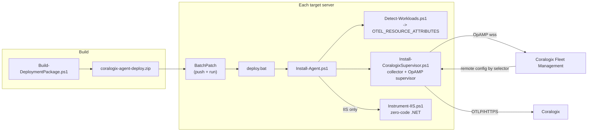

# Fleet Deployment Runbook — Coralogix OTel Collector (Supervisor Mode) via BatchPatch

This runbook automates installing the Coralogix OpenTelemetry Collector **in
Supervisor mode** (remote-config ready via Coralogix Fleet Management) across a
mixed Windows fleet (~10–20 servers), **detecting what each host runs**, tagging
each agent with **selector attributes** so Fleet Management can target it, and —
**only when IIS is present** — configuring zero-code .NET auto-instrumentation.

For the single-host / manual details and the deep IIS background, see
[`iis-instrumentation.md`](./iis-instrumentation.md). This document is the
fleet-scale, scripted path.

---

## Architecture



Two ideas do the heavy lifting:

1. **Supervisor mode.** The collector runs under the OpAMP **Supervisor**, which
   holds the OpAMP connection to Coralogix. A local **base config**
   (`config.supervisor.yaml`) provides sane defaults; Fleet Management merges a
   **remote config** on top. The base config therefore must **not** contain an
   `opamp` extension (the Supervisor owns that) — this is the key difference from
   the repo's local-mode `config.yaml`.

2. **Selector attributes.** `Detect-Workloads.ps1` sets machine-level
   `OTEL_RESOURCE_ATTRIBUTES`. The base config's `resourcedetection/env` promotes
   those into resource attributes; the Supervisor reports the collector's resource
   in its OpAMP **AgentDescription**. Coralogix Fleet Management can then group /
   target agents by `cx.host.role` and `workload.*`.

---

## Package contents

`deploy/` is the payload BatchPatch distributes:

| File | Role |
| --- | --- |
| `deploy.bat` | BatchPatch remote-command entry; launches the orchestrator under PowerShell 5.1 |
| `Install-Agent.ps1` | Orchestrator: detect → install supervisor → conditional IIS → verify |
| `Detect-Workloads.ps1` | Workload detection → `OTEL_RESOURCE_ATTRIBUTES` + JSON summary |
| `Install-CoralogixSupervisor.ps1` | Collector install with `-Supervisor` |
| `Instrument-IIS.ps1` | Zero-code .NET auto-instrumentation (IIS hosts only) |
| `config.supervisor.yaml` | Base config = repo `config.yaml` **minus the opamp extension** |
| `SendDataKey.txt` | Send-Your-Data key (or supply at deploy time — see below) |

`Build-DeploymentPackage.ps1` (repo root) zips these into
`coralogix-agent-deploy.zip`. `batchpatch.zip` in the repo is the BatchPatch.exe
tool itself — **not** this package.

---

## Step 1 — Build the package

```powershell
# From the repo root, on your workstation:
.\Build-DeploymentPackage.ps1 -KeyFile C:\secrets\cx-send-your-data.key
# -> coralogix-agent-deploy.zip
```

- With `-KeyFile`, the real key is baked into the package as `SendDataKey.txt`.
- Without `-KeyFile`, the package ships **keyless**; supply the key at deploy time
  (Step 2, option B). Treat the keyed zip as a secret.

## Step 2 — Deploy across the fleet with BatchPatch

BatchPatch has no atomic "copy + run" object, so we ship one folder and one
`deploy.bat` that orchestrates everything.

1. In BatchPatch, select the target servers (start with a **2–3 host pilot**).
2. **Actions → Deploy software/patches/scripts.** Source = the extracted
   `coralogix-agent-deploy.zip` contents (or configure BatchPatch to extract the
   zip). Destination on each host, e.g. `C:\cx-deploy\`.
3. Set the **remote command** to run after copy:
   - **Option A (key in package):** `deploy.bat`
   - **Option B (key at deploy time):**
     `set CORALOGIX_PRIVATE_KEY=cxtp_xxx && deploy.bat`
4. Run. BatchPatch executes `deploy.bat` elevated; a **non-zero exit code marks
   the row failed**. Per-host logs land next to the scripts:
   `install-agent.log`, `install-agent-status.json`, `detect-workloads.json`.
5. Review the pilot, then widen to the full fleet.

> The same model matches how New Relic / Dynatrace agents were pushed — both the
> collector install and the instrumentation are PowerShell.

## Step 3 — Assign remote config in Coralogix Fleet Management

1. In Coralogix (**eu1**), open **Fleet Management**. New agents appear as they
   register over OpAMP.
2. Confirm each agent's **AgentDescription** carries the selector attributes:
   `cx.host.role`, `workload.iis`, `workload.redis`, etc.
3. Build agent groups / config assignments that **select on those attributes**,
   e.g.:
   - `workload.iis = true` → IIS + ASP.NET receivers overlay
   - `workload.redis = true` OR `workload.valkey = true` → Redis receiver overlay
   - `workload.sqlserver = true` → SQL Server receiver overlay
   - `workload.elasticsearch = true` → Elasticsearch receiver overlay
4. The remote config is **merged on top of** `config.supervisor.yaml`, so a fresh
   agent already ships host + Windows + IIS signals before any assignment.

---

## Workload detection & attribute schema

`Detect-Workloads.ps1` uses several independent signals per workload (Windows
services, processes, listening ports, install dirs / registry). Any one hit marks
the workload present; every probe is non-fatal.

| Workload | Primary signals |
| --- | --- |
| IIS | `W3SVC`/`WAS` service, `w3wp` process, IIS optional feature, `appcmd.exe` |
| .NET | `dotnet` CLI / install dir, .NET Framework `NDP\v4\Full` registry |
| Node.js (9→latest) | `node --version`, `%ProgramFiles%\nodejs` |
| RabbitMQ | `RabbitMQ*` service, ports 5672/15672, install dir |
| Redis | `Redis*` service, `redis-server` process, port 6379 |
| Valkey | `Valkey*` service, `valkey-server` process, port 6379 |
| SQL Server | `MSSQL*` service, `sqlservr` process, port 1433 |
| DB2 | `DB2*` service, `db2sysc*` process, port 50000/25000 |
| Elasticsearch | `elasticsearch*` service, ports 9200/9300, install dir |

Emitted `OTEL_RESOURCE_ATTRIBUTES` (the agent-selector contract):

| Attribute | Meaning |
| --- | --- |
| `cx.host.role=<primary>` | Single coarse role, by priority: `iis > sqlserver > db2 > elasticsearch > rabbitmq > redis > valkey > nodejs > dotnet` |
| `workload.<name>=true` | One per detected workload (multi-role hosts get several) |
| `workload.nodejs.version` | Node.js version, when present |
| `workload.dotnet.version` | .NET version, when present |

> Redis and Valkey share port 6379; when only the port is seen the host is tagged
> `redis`. A Valkey **service/process** disambiguates and clears the redis tag.
>
> **Non-Windows workloads** (Redis/Valkey/RabbitMQ/DB2/Elasticsearch on Linux) are
> out of scope for this Windows package — deploy a matching Linux collector config
> there (see the template matrix in `iis-instrumentation.md`).

---

## Conditional IIS zero-code instrumentation

When detection reports IIS, the orchestrator runs `Instrument-IIS.ps1`:

- Installs the OpenTelemetry .NET auto-instrumentation module in strict order
  (`Import-Module` → `Install-OpenTelemetryCore` → `Register-OpenTelemetryForIIS`).
- Sets the OTLP endpoint **host-wide** on `applicationPoolDefaults`
  (`OTEL_EXPORTER_OTLP_ENDPOINT=http://localhost:4318`,
  `OTEL_EXPORTER_OTLP_PROTOCOL=http/protobuf`) — the fleet "set once" pattern.
- Leaves `OTEL_SERVICE_NAME` per-app / auto-generated.

Reminders from `iis-instrumentation.md`:
- Requires **Windows PowerShell 5.1** (not 7).
- ASP.NET **Core** app pools must be **"No Managed Code"** or they emit nothing.
- A trailing blank line in the W3SVC `Environment` REG_MULTI_SZ prevents IIS start.

---

## POC validation with VirtualBox (throwaway)

`poc/Run-TestVM.ps1` spins up a disposable Windows target to validate the package
before fleet rollout. `vm_images/` holds a Windows Server 2025 **EVAL ISO**.

**Fully scripted path (preferred — no interactive steps).** `-Action Unattended`
drives Windows Setup from an answer file and installs Guest Additions automatically,
so the whole cycle is hands-off and `VBoxManage guestcontrol` works afterwards:

```powershell
cd poc
.\Run-TestVM.ps1 -Action Unattended                 # auto Windows install + Guest Additions (~20-40 min)
# WAIT for the guest to finish installing AND reach the desktop before continuing.
# Guest Additions run level can read 3 while the guest is still in OOBE and the
# guestcontrol EXEC service is NOT ready yet; a first-boot reboot settles it.
# Poll with an EXIT-CODE check (a string match is unreliable - VBoxManage echoes the
# command back inside its error text, so grepping the token gives false positives):
#   do { $null = VBoxManage guestcontrol cx-fleet-test --username Administrator `
#          --password 'Otel!Passw0rd2026' run --exe C:\Windows\System32\cmd.exe `
#          --wait-stdout -- /c echo READY; Start-Sleep 15 } until ($LASTEXITCODE -eq 0)
.\Run-TestVM.ps1 -Action Snapshot -SnapshotName baseline
.\Run-TestVM.ps1 -Action Configure                  # enable IIS + WinRM/firewall in guest
..\Build-DeploymentPackage.ps1 -KeyFile C:\secrets\cx.key
.\Run-TestVM.ps1 -Action Deploy                     # copyto + expand + run deploy.bat
# reset and repeat (restore powers off first, then Start again):
.\Run-TestVM.ps1 -Action Restore -SnapshotName baseline
.\Run-TestVM.ps1 -Action Start
```

**Manual path (fallback).** If unattended install misbehaves, `-Action Create` then
`-Action Start -Gui` lets you install Windows + Guest Additions by hand, then snapshot.

**Keyboard-injection fallback (no guestcontrol).** If Guest Additions never come up
(older ISOs / GA install failures), the guest can't be driven by `guestcontrol`.
`poc/Guest-PullDeploy.ps1` is pushed via `VBoxManage controlvm keyboardputstring`:
the guest pulls `coralogix-agent-deploy.zip` from a host HTTP server and runs
`deploy.bat`, exfiltrating logs through its IIS wwwroot.

This is POC-only; production targets are reached with BatchPatch, not VirtualBox.

### POC run results (validated 2026-07-14)

The package was validated end-to-end on a VirtualBox Windows Server 2025 guest
(`cx-fleet-test`). Confirmed on the target:

- `opampsupervisor` running and **registered with Coralogix Fleet Management**
  over OpAMP (`Connected to the OpAMP server`, `ingress.eu1.coralogix.com`,
  `accepts_remote_config: true`, effective config = the base merged).
- `otelcol-contrib` running, health `127.0.0.1:13133` → **200 `Server available`**,
  internal metrics on `:8888`.
- Selector attributes published:
  `cx.host.role=iis,workload.iis=true,workload.dotnet=true,workload.dotnet.version=4.8.09032`.
- IIS zero-code instrumentation configured (`Register-OpenTelemetryForIIS` + pool
  OTLP defaults + `iisreset`), `install-agent-status.json` → `result: success`.

**Environment note on the push mechanism.** BatchPatch is a GUI app with no CLI, so
in a headless POC it can't be driven programmatically. On the 2026-07-14 run Guest
Additions had not installed, so the payload was pushed via
**`VBoxManage controlvm keyboardputstring`** injection (guest pulls the zip from a
host HTTP server and runs `deploy.bat` — see `poc/Guest-PullDeploy.ps1`). On the
2026-07-15 re-run the **`-Action Unattended`** install brought Guest Additions up
cleanly, so `guestcontrol` copy + run worked directly (`-Action Configure` /
`-Action Deploy`). Either way, on a real fleet BatchPatch performs the same copy +
remote-command step from its GUI; `poc/Deploy-FromHost.ps1` shows the WinRM
equivalent for scripted pushes.

### POC re-validation (2026-07-15, fresh VM from scratch)

A brand-new `cx-fleet-test` VM was provisioned from the ISO via `-Action Unattended`
and deployed end-to-end over `guestcontrol`. Confirmed:

- Detection → `cx.host.role=iis,workload.iis=true,workload.dotnet=true,workload.dotnet.version=4.8.09032`.
- `opampsupervisor` v0.155.0 running and **`Connected to the OpAMP server`** (Fleet
  Management eu1); collector exported metric points + logs to the `coralogix` exporter.
- IIS zero-code instrumentation configured (`Register-OpenTelemetryForIIS` + pool
  OTLP defaults + `iisreset`), `deploy.bat` exit code 0.
- The **base config runs healthy standalone** (`otelcol-contrib --config collector.yaml`
  → health `127.0.0.1:13133` → 200, "Everything is ready") after the `host.cpu.*` fix.

**Known POC limitation — collector crash-loop under a Fleet-Management remote config.**
On this VM the collector crash-looped (`health` → 503) whenever a **remote config was
assigned in Fleet Management**. Root cause: the assigned remote config re-introduces
`resourcedetection/entity` with `host.cpu.*` attributes; collector v0.155.0 then reads
**SMBIOS Type 4** (processor info), which VirtualBox does not expose, so the component
fails to start (`failed getting host cpuinfo: SMBIOS processor information not found`)
and the whole collector restarts in a loop. The OpAMP Supervisor merges the **remote
config on top of the base**, so removing `host.cpu.*` from the base
(`config.supervisor.yaml`) is **not** sufficient once a remote config re-adds them.
This is **VM-only**: real fleet hardware exposes SMBIOS, so the same config runs fine
in production. To exercise a Fleet-Management-managed agent on a SMBIOS-less VM, the
**assigned remote config** must also omit `host.cpu.*` (or the `system` detector).

### Fixes found during POC (already applied)

1. **`deploy.bat` must use an absolute `-File` path.** With a relative path,
   `$PSScriptRoot` is empty and `Install-Agent.ps1` throws at parameter binding
   (`Join-Path : ... empty string`). Fixed: `deploy.bat` calls
   `"%~dp0Install-Agent.ps1"` and `Install-Agent.ps1` falls back to
   `$MyInvocation.MyCommand.Definition`.
2. **`resourcedetection/entity` `host.cpu.*` require SMBIOS Type 4.** VirtualBox
   (and some cloud VMs) don't expose it, so the system detector fails to start
   (`failed getting host cpuinfo: SMBIOS processor information not found`) and
   crash-loops the whole collector. On collector **v0.155.0**, merely *listing* a
   `host.cpu.*` key — even `enabled: false` — initializes the SMBIOS reader and
   triggers the fatal read, so *disabling* them (the original 2026-07-14 fix) is
   **not** enough. Fixed in `config.supervisor.yaml`: the `host.cpu.*` keys are now
   **removed entirely** (they are disabled by default; host.id/ip/mac/os.description
   are retained). The sister `resourcedetection/env` detector lists no `host.cpu.*`
   and never crashed — that confirmed the root cause. Verified: the base config now
   runs healthy standalone on the VM (health 13133 → 200). NOTE: a Fleet-Management
   **remote config** that re-adds `host.cpu.*` overrides the base and re-triggers the
   crash on SMBIOS-less hosts — see the Known POC limitation above.
3. **Updating an already-installed supervisor's base config.** Re-running the
   vendor installer does **not** overwrite the supervisor's `collector.yaml`. To
   change the base on an existing host, replace
   `C:\Program Files\OpenTelemetry OpAMP Supervisor\collector.yaml`, clear
   `C:\ProgramData\opampsupervisor\state\effective.yaml` +
   `last_recv_remote_config.dat`, and restart `opampsupervisor` — or push the
   change through Coralogix Fleet Management (the intended path).
4. **`Run-TestVM.ps1` `Destroy`/`Restore` threw on an already-off VM.** `controlvm
   poweroff` returns non-zero ("not currently running") and the `VBox` wrapper turned
   that into a terminating error, so `Destroy` never reached `unregistervm`. Fixed:
   a tolerant `VBoxSoft` helper swallows the poweroff exit code (under
   `$ErrorActionPreference='Stop'` PS 5.1 also turns a native stderr write into a
   terminating error even with `2>$null`, so the helper wraps the call in try/catch).
5. **`Run-TestVM.ps1` `Configure`/`Deploy` guestcontrol calls dropped the `--`.**
   PowerShell strips a bare `--` token (its end-of-parameters marker) before it
   reaches `VBoxManage`, which then parsed `-NoProfile` as its own option and failed
   (`Unknown option: -NoProfile`). Fixed: quote it as `'--'` and drop the redundant
   leading `powershell` arg (args after `--` go straight to the `--exe` binary).
6. **`Install-Agent.ps1` step 4 restarted a non-existent service.** In Supervisor
   mode there is no `otelcol-contrib` *service* (the collector is a child of
   `opampsupervisor`), so the "restart to apply `OTEL_RESOURCE_ATTRIBUTES`" step was
   a no-op and the single immediate health probe reported a false `health=False`.
   Fixed: restart `opampsupervisor` (fall back to `otelcol-contrib` for local mode)
   and retry the health check for up to ~60 s.

---

## Verification

1. **Detection** — run `Detect-Workloads.ps1 -SetEnv:$false` on a host; confirm the
   printed `OTEL_RESOURCE_ATTRIBUTES` matches reality and `detect-workloads.json`
   is written.
2. **Base config validity** —
   `& "C:\Program Files\OpenTelemetry Collector\otelcol-contrib.exe" validate --config C:\otel\config.supervisor.yaml`
   (must have no `opamp` extension).
3. **Services** — `opampsupervisor` and `otelcol-contrib` both **Running**; health
   `http://127.0.0.1:13133` → 200; internal metrics on `127.0.0.1:8888`.
4. **Fleet Management** — agent visible in Coralogix (eu1) with the `cx.host.role`
   / `workload.*` attributes; a selector on `workload.iis=true` matches IIS hosts.
5. **IIS APM** — on an IIS host, spans reach the APM Service Catalog (allow a few
   minutes for span-metrics flush).
6. **Status file** — `install-agent-status.json` shows `result: success`.

## Troubleshooting

| Symptom | Likely cause / fix |
| --- | --- |
| Service won't start | Base config needs `file_storage` → installer must pass `-EnableDynamicIISParsing` (it does). Run `validate`. Confirm `CORALOGIX_PRIVATE_KEY` set on the service. |
| Agent not in Fleet Management | Supervisor can't reach OpAMP: check `CORALOGIX_DOMAIN`/key, and that the **base config has no opamp extension**. |
| Selector attributes missing | `OTEL_RESOURCE_ATTRIBUTES` not set (detection needs elevation) or collector not restarted after detection. Orchestrator restarts it; re-run if needed. |
| No IIS telemetry | ASP.NET Core pool not "No Managed Code"; recycle after fixing. |
| GitHub download TLS error | Older Server defaults to TLS 1.0; scripts enable TLS 1.2 first. |
| BatchPatch row failed | Read `install-agent.log` on the host; `deploy.bat` propagates the PowerShell exit code. |
| Collector crash-loops, health → 503, log `failed getting host cpuinfo: SMBIOS processor information not found` | Host has no SMBIOS Type 4 (VirtualBox / some VMs). The base drops `host.cpu.*`, but a **Fleet-Management remote config** that re-adds them (or the `system` detector) overrides the base and re-triggers it. Remove `host.cpu.*` from the *assigned remote config* too, or don't assign one. Real fleet hardware is unaffected. |
| `guestcontrol` fails after unattended install (`guest execution service not ready`) | Guest still in first-boot/OOBE. GA run level can read 3 before the exec service is up; wait for the desktop (a first-boot reboot settles it), then poll `guestcontrol run … echo <token>` on **exit code 0**, not a string match. |
| POC `Deploy`/`Configure` fails `Unknown option: -NoProfile` | Old `Run-TestVM.ps1` passed a bare `--` to `VBoxManage`; PowerShell strips it. Fixed to `'--'`. Update the script. |

See `iis-instrumentation.md` for deeper IIS and config detail.
