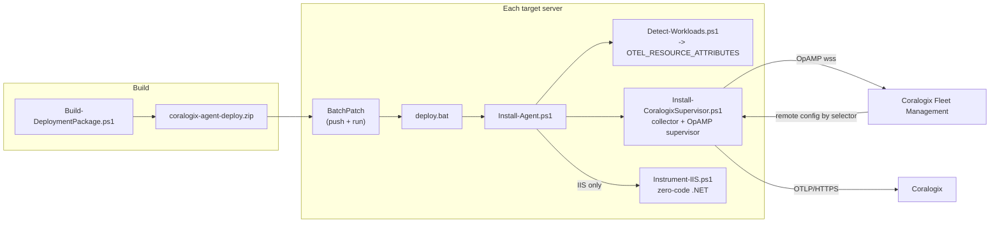

# Fleet Deployment Runbook — Coralogix OTel Collector (Supervisor Mode) via BatchPatch

This runbook automates installing the Coralogix OpenTelemetry Collector **in
Supervisor mode** (remote-config ready via Coralogix Fleet Management) across a
mixed Windows fleet (~10–20 servers), **detecting what each host runs**, tagging
each agent with **selector attributes** so Fleet Management can target it, and —
**only when IIS is present** — configuring zero-code .NET auto-instrumentation.

For the single-host / manual details and the deep IIS background, see
[`iis-instrumentation.md`](./iis-instrumentation.md). This document is the
fleet-scale, scripted path.

---

## Architecture



Two mechanisms do the work:

1. **Supervisor mode.** The collector runs under the OpAMP **Supervisor**, which
   holds the OpAMP connection to Coralogix. A local **base config**
   (`config.supervisor.yaml`) provides sane defaults; Fleet Management merges a
   **remote config** on top. The base config therefore must **not** contain an
   `opamp` extension (the Supervisor owns that) — this is the key difference from
   the repo's local-mode `config.yaml`.

2. **Selector attributes.** `Detect-Workloads.ps1` sets machine-level
   `OTEL_RESOURCE_ATTRIBUTES`. `Install-CoralogixSupervisor.ps1` then writes those
   `cx.host.role` / `workload.*` pairs into the OpAMP Supervisor config's
   `agent.description.non_identifying_attributes`, so the Supervisor advertises them
   in its OpAMP **AgentDescription**. Coralogix Fleet Management can then group /
   target agents by `cx.host.role` and `workload.*`. (The base config's
   `resourcedetection/env` also stamps them onto the telemetry **data**, but the
   AgentDescription — not the data — is what Fleet Management reads for selectors, so
   the Supervisor-side injection is what actually makes them selectable.)

---

## Package contents

`deploy/` is the payload BatchPatch distributes:

| File | Role |
| --- | --- |
| `deploy.bat` | BatchPatch remote-command entry; launches the orchestrator under PowerShell 5.1 |
| `uninstall.bat` | BatchPatch remote-command entry for uninstall; launches `Uninstall-Agent.ps1` |
| `Install-Agent.ps1` | Orchestrator: detect → install supervisor → conditional IIS → verify |
| `Uninstall-Agent.ps1` | Reverse the install (manifest-guided); see **Uninstall** below |
| `Detect-Workloads.ps1` | Workload detection → `OTEL_RESOURCE_ATTRIBUTES` + JSON summary |
| `Install-CoralogixSupervisor.ps1` | Collector install with `-Supervisor` |
| `Instrument-IIS.ps1` | Zero-code .NET auto-instrumentation (IIS hosts only) |
| `Resolve-IISServiceNames.ps1` | Per-app service-name mapping + `web.config` read/write helpers |
| `Backup-Config.ps1` | Backup + manifest helper; snapshots every config the install mutates |
| `config.supervisor.yaml` | Base config = repo `config.yaml` **minus the opamp extension** |
| `SendDataKey.txt` | Send-Your-Data key, written by `Build-DeploymentPackage.ps1 -KeyFile` (the repo carries only `SendDataKey.txt.example`). Or supply the key at deploy time — see below |

`Build-DeploymentPackage.ps1` (repo root) zips these into
`coralogix-agent-deploy.zip`.

---

## Step 1 — Build the package

```powershell
# From the repo root, on your workstation:
.\Build-DeploymentPackage.ps1 -KeyFile C:\secrets\cx-send-your-data.key
# -> coralogix-agent-deploy.zip
```

- With `-KeyFile`, the real key is baked into the package as `SendDataKey.txt`.
- Without `-KeyFile`, the package ships **keyless**; supply the key at deploy time
  (Step 2, option B). Treat the keyed zip as a secret.

## Step 2 — Deploy across the fleet with BatchPatch

BatchPatch has no atomic "copy + run" object, so we ship one folder and one
`deploy.bat` that orchestrates everything.

1. In BatchPatch, select the target servers (start with a **2–3 host pilot**).
2. **Actions → Deploy software/patches/scripts.** Source = the extracted
   `coralogix-agent-deploy.zip` contents (or configure BatchPatch to extract the
   zip). Destination on each host, e.g. `C:\cx-deploy\`.
3. Set the **remote command** to run after copy:
   - **Option A (key in package):** `deploy.bat`
   - **Option B (key at deploy time):**
     `set CORALOGIX_PRIVATE_KEY=cxtp_xxx && deploy.bat`
   - **Environment label (optional, combine with either):** prepend
     `set CX_ENVIRONMENT=<production|staging|dev> &&` to tag this host's telemetry
     for the Coralogix per-environment split (see *Environment labeling* below), e.g.
     `set CX_ENVIRONMENT=staging && set CORALOGIX_PRIVATE_KEY=cxtp_xxx && deploy.bat`.
4. Run. BatchPatch executes `deploy.bat` elevated; a **non-zero exit code marks
   the row failed**. Per-host logs land next to the scripts:
   `install-agent.log`, `install-agent-status.json`, `detect-workloads.json`.
5. Review the pilot, then widen to the full fleet.

## Step 3 — Assign remote config in Coralogix Fleet Management

1. In Coralogix (**eu1**), open **Fleet Management**. New agents appear as they
   register over OpAMP.
2. Confirm each agent's **AgentDescription** carries the selector attributes:
   `cx.host.role`, `workload.iis`, `workload.redis`, etc.
3. Build agent groups / config assignments that **select on those attributes**,
   e.g.:
   - `workload.iis = true` → IIS + ASP.NET receivers overlay
   - `workload.redis = true` OR `workload.valkey = true` → Redis receiver overlay
   - `workload.sqlserver = true` → SQL Server receiver overlay
   - `workload.elasticsearch = true` → Elasticsearch receiver overlay
4. The remote config is **merged on top of** `config.supervisor.yaml`, so a fresh
   agent already ships host + Windows + IIS signals before any assignment.

---

## Environment labeling (per-environment split in Infra Explorer)

Set **`CX_ENVIRONMENT`** on a host (via `deploy.bat`, or `Install-Agent.ps1
-Environment <env>`) to tag *all* of that host's telemetry with the deployment
environment, so Coralogix can separate `production` / `staging` / `dev` in Infra
Explorer and APM.

- Persisted as a machine env var by `Install-CoralogixSupervisor.ps1`.
- The base `config.supervisor.yaml` has a `resource/environment` processor that
  upserts it (from `${env:CX_ENVIRONMENT:-unspecified}`) onto every pipeline — host
  metrics/logs, IIS logs, app spans, **and** the Infra Explorer host entity
  (`logs/resource_catalog`) — under three keys: `tags.cx_environment`,
  `tags.cx_env`, and the OTel semconv `deployment.environment.name`.
- Unset → `unspecified` (a forgotten host is obvious, not silently "production").
- The same value is also fed to the OpAMP AgentDescription
  (`deployment.environment.name`) so you can **group by environment** in Fleet
  Management.

---

## Service labeling on infrastructure data (IIS)

> Full detail, key verdicts and value format live in
> [`iis-service-ownership.md`](./iis-service-ownership.md). This is the fleet summary.

Populates the Coralogix Infrastructure-Explorer **Service** ownership for a Windows/IIS host
with the service(s) it runs. Split across automation and (remote) config:

- **Automation (deploy scripts) — env var only.** `Instrument-IIS.ps1` sets the machine env var
  **`CX_IIS_SERVICES`** to the comma-joined distinct service name(s) the host runs on IIS, via
  `Get-IISServiceLabelValue -Map $svcMap` — the **same** `$svcMap` whose `.ServiceName` is
  assigned as each app's `OTEL_SERVICE_NAME`. So each host Service-ownership item equals a
  per-app `OTEL_SERVICE_NAME` (the APM service name) — **aligned by construction**.
- **Config — remote.** The `transform/iis_service_labels` processor lives in the **remote Fleet
  Management config**. It splits `${env:CX_IIS_SERVICES}` into an array and stamps **7 keys**
  onto the **logs-related pipelines only** (`logs` + `logs/resource_catalog`, the host entity
  that drives ownership). The repo collector YAMLs
  ([`deploy/config.supervisor.yaml`](../deploy/config.supervisor.yaml)) are the
  **reference source** to copy into the remote config — the automation does **not** push config,
  and the supervisor's base-stage → pull-remote → merge flow is unchanged.

Keys (all resolve to Service ownership and split arrays into discrete items, verified via the
per-key Docker POC): `service`, `tags.{service,cx_svc,CX_SERVICE_NAME}`,
`cx.infra.labels.{service,cx_svc,CX_SERVICE_NAME}`. Bare `cx_service` and `CX_SERVICE_NAME` were
**ignored** by ownership and dropped.

Value format: an **OTel array**, e.g. `["Default Web Site","SimpleWebApp"]` (single app → a
one-element array). Multiple items = one per IIS app, which is what APM resource correlation
needs to match a single service to the host. Arrays stay arrays on the logs/entity path; on
metrics they collapse to a comma-string label (ownership is resolved from the entity, not
metric labels). Unset `CX_IIS_SERVICES` (non-IIS host) → the processor's guard leaves all keys
unset.

Verify with `scripts/Verify-CoralogixInfraLabels.ps1` (DataPrime/PromQL). Note: the supervised
collector only sees `${env:CX_IIS_SERVICES}` if the machine env var is set before it starts —
set it at machine scope and restart the supervisor.

---

## Workload detection & attribute schema

`Detect-Workloads.ps1` uses several independent signals per workload (Windows
services, processes, listening ports, install dirs / registry). Any one hit marks
the workload present; every probe is non-fatal.

| Workload | Primary signals |
| --- | --- |
| IIS | `W3SVC`/`WAS` service, `w3wp` process, IIS optional feature, `appcmd.exe` |
| .NET | `dotnet` CLI / install dir, .NET Framework `NDP\v4\Full` registry |
| Node.js (9→latest) | `node --version`, `%ProgramFiles%\nodejs` |
| RabbitMQ | `RabbitMQ*` service, ports 5672/15672, install dir |
| Redis | `Redis*` service, `redis-server` process, port 6379 |
| Valkey | `Valkey*` service, `valkey-server` process, port 6379 |
| SQL Server | `MSSQL*` service, `sqlservr` process, port 1433 |
| DB2 | `DB2*` service, `db2sysc*` process, port 50000/25000 |
| Elasticsearch | `elasticsearch*` service, ports 9200/9300, install dir |

Emitted `OTEL_RESOURCE_ATTRIBUTES` (the agent-selector contract):

| Attribute | Meaning |
| --- | --- |
| `cx.host.role=<primary>` | Single coarse role, by priority: `iis > sqlserver > db2 > elasticsearch > rabbitmq > redis > valkey > nodejs > dotnet` |
| `workload.<name>=true` | One per detected workload (multi-role hosts get several) |
| `workload.nodejs.version` | Node.js version, when present |
| `workload.dotnet.version` | .NET version, when present |

> Redis and Valkey share port 6379; when only the port is seen the host is tagged
> `redis`. A Valkey **service/process** disambiguates and clears the redis tag.
>
> **Non-Windows workloads** (Redis/Valkey/RabbitMQ/DB2/Elasticsearch on Linux) are
> out of scope for this Windows package — deploy a matching Linux collector config
> there (see the template matrix in `iis-instrumentation.md`).

---

## Conditional IIS zero-code instrumentation

When detection reports IIS, the orchestrator runs `Instrument-IIS.ps1`:

- Installs the OpenTelemetry .NET auto-instrumentation module in strict order
  (`Import-Module` → `Install-OpenTelemetryCore` → `Register-OpenTelemetryForIIS`).
- Sets the OTLP endpoint **host-wide** on `applicationPoolDefaults`
  (`OTEL_EXPORTER_OTLP_ENDPOINT=http://localhost:4318`,
  `OTEL_EXPORTER_OTLP_PROTOCOL=http/protobuf`) — the fleet "set once" pattern.
- Auto-discovers every IIS site + application (`Resolve-IISServiceNames.ps1`) and sets
  a distinct `OTEL_SERVICE_NAME` for each, from the site name + app path (root app →
  site name; nested app `/api` → `Site/api`). Apps on a **dedicated** pool get the name
  on the pool (the OTLP endpoint/protocol are re-set there too, per the inheritance
  rule below); apps that **share** a pool get it in their own `web.config`. Rename
  specific apps with `-ServiceNameOverrides @{ 'Site/api' = 'custom' }` or
  `-OverridesJson <path>`.

Reminders from `iis-instrumentation.md`:
- Requires **Windows PowerShell 5.1** (not 7).
- ASP.NET **Core** app pools must be **"No Managed Code"** or they emit nothing.
- A trailing blank line in the W3SVC `Environment` REG_MULTI_SZ prevents IIS start.

---

## Pre-rollout validation (VirtualBox, optional)

`poc/Run-TestVM.ps1` spins up a disposable Windows Server 2025 target to validate the
package before touching real servers. Place a Windows Server 2025 evaluation ISO in
`vm_images/` (gitignored). POC only — production targets are reached with BatchPatch.

```powershell
cd poc
.\Run-TestVM.ps1 -Action Unattended                 # scripted Windows install + Guest Additions (~20-40 min)
.\Run-TestVM.ps1 -Action Snapshot -SnapshotName baseline
.\Run-TestVM.ps1 -Action Configure                  # enable IIS + WinRM/firewall in guest
..\Build-DeploymentPackage.ps1 -KeyFile C:\secrets\cx.key
.\Run-TestVM.ps1 -Action Deploy                     # copy + expand + run deploy.bat

# reset and repeat (Restore powers off first, so Start again after):
.\Run-TestVM.ps1 -Action Restore -SnapshotName baseline
.\Run-TestVM.ps1 -Action Start
```

> **Wait for the guest to reach the desktop before `Configure`.** Guest Additions can
> report run level 3 while the guest is still in OOBE and the `guestcontrol` exec service
> is not yet up; a first-boot reboot settles it. Poll on the **exit code** of a
> `guestcontrol run … echo` command, not on a string match — `VBoxManage` echoes the
> command back inside its own error text, so grepping for the token gives false positives.

If Guest Additions never come up, `guestcontrol` cannot drive the guest. Fall back to
`poc/Guest-PullDeploy.ps1`, pushed via `VBoxManage controlvm keyboardputstring`: the guest
pulls the deploy zip from a host HTTP server and runs `deploy.bat` itself.

> **Known VM-only limitation.** A Fleet Management remote config that re-adds
> `host.cpu.*` (or the `system` detector) crash-loops the collector on a host without
> SMBIOS Type 4, which VirtualBox does not expose. The base config omits those keys, but
> the remote config is merged **on top of** the base, so the assigned remote config must
> omit them too. Real fleet hardware is unaffected.

---

## Config backup

Every install run opens a **backup session** and snapshots each config *before* it
is mutated, plus a JSON manifest recording exactly what was added (so uninstall can
reverse only the installer's own changes). Handled by `Backup-Config.ps1`, wired
into the install scripts.

- Location: `C:\ProgramData\CoralogixDeploy\backups\<yyyyMMddHHmmss>\`
  - `manifest.json` — env vars (with `added`/prior value), pool env (with
    `preexisted`), web.config edits (with prior value), backed-up files, registry exports.
  - `applicationHost.config.bak`, `<app>-web.config.bak` — copies of the mutated configs.
  - `W3SVC.reg` / `WAS.reg` — CLR-profiler registry export (pre-Register).
  - supervisor `config.yaml` copy (pre-`non_identifying_attributes` inject).
- `C:\ProgramData\CoralogixDeploy\backups\latest.json` points at the newest session;
  uninstall reads it automatically.
- `install-agent-status.json` includes the `backupDir` for the run.

## Uninstall

Reverse the install with the `uninstall.bat` remote command (mirrors `deploy.bat`),
or run `Uninstall-Agent.ps1` directly (elevated). It reads the latest backup manifest
and undoes **only fleet artifacts** — never a hosted app or any IIS site/pool.

```
# BatchPatch remote command (default: keep staged config + binaries):
uninstall.bat

# also delete staged config + vendor binaries:
set CX_PURGE=1 && uninstall.bat

# restore mutated configs from backup instead of surgical edits:
set CX_RESTORE=1 && uninstall.bat
```

What it does, in order:
1. **IIS de-instrument** — strip the installer's `OTEL_SERVICE_NAME` from each app
   `web.config` (value-matched; a value someone else set is left alone, a pre-existing
   value is restored), remove the `OTEL_*` `applicationHost.config` pool env vars the
   installer added (entries flagged `preexisted` are kept), then vendor
   `Unregister-OpenTelemetryForIIS` + `Uninstall-OpenTelemetryCore`.
2. **Collector/supervisor** — vendor `-Uninstall`, then a hard fallback that stops +
   `sc.exe delete`s `opampsupervisor` / `otelcol-contrib` if they remain. (The old
   standalone uninstaller only ever removed `otelcol-contrib`.)
3. **Machine env vars** — delete the ones the install created
   (`OTEL_RESOURCE_ATTRIBUTES`, `CORALOGIX_DOMAIN`, `CORALOGIX_PRIVATE_KEY`,
   `CX_ENVIRONMENT`); restore any that had a prior value.
4. **`-Purge`** (opt-in) — also delete `C:\otel`, `C:\ProgramData\OpenTelemetry\Collector`,
   `C:\ProgramData\opampsupervisor`, and the `OpenTelemetry {OpAMP Supervisor,Collector,
   .NET AutoInstrumentation}` Program Files dirs. Off by default so a re-install is fast.
5. **`iisreset`** (unless `-NoReset`) so workers drop the profiler + env changes.

No manifest (e.g. an install done before backups existed)? Uninstall falls back to a
conservative removal of the installer-owned names/services only. Result is written to
`uninstall-agent-status.json`.

## Verification

1. **Detection** — run `Detect-Workloads.ps1 -SetEnv:$false` on a host; confirm the
   printed `OTEL_RESOURCE_ATTRIBUTES` matches reality and `detect-workloads.json`
   is written.
2. **Base config validity** —
   `& "C:\Program Files\OpenTelemetry Collector\otelcol-contrib.exe" validate --config C:\otel\config.supervisor.yaml`
   (must have no `opamp` extension).
3. **Services** — `opampsupervisor` and `otelcol-contrib` both **Running**; health
   `http://127.0.0.1:13133` → 200; internal metrics on `127.0.0.1:8888`.
4. **Fleet Management** — agent visible in Coralogix (eu1) with the `cx.host.role`
   / `workload.*` attributes; a selector on `workload.iis=true` matches IIS hosts.
5. **IIS APM** — on an IIS host, spans reach the APM Service Catalog (allow a few
   minutes for span-metrics flush).
6. **Status file** — `install-agent-status.json` shows `result: success`.

## Troubleshooting

| Symptom | Likely cause / fix |
| --- | --- |
| Service won't start | Base config needs `file_storage` → installer must pass `-EnableDynamicIISParsing` (it does). Run `validate`. Confirm `CORALOGIX_PRIVATE_KEY` set on the service. |
| Agent not in Fleet Management | Supervisor can't reach OpAMP: check `CORALOGIX_DOMAIN`/key, and that the **base config has no opamp extension**. |
| Selector attributes (`cx.host.role`/`workload.*`) not shown in Fleet Management | They must be in the **Supervisor** config `agent.description.non_identifying_attributes`, not just `OTEL_RESOURCE_ATTRIBUTES` (the vendor template writes only static `service.name`/`cx.agent.type`). `Install-CoralogixSupervisor.ps1` injects them post-install + restarts `opampsupervisor`. If still absent: detection didn't run elevated (empty `OTEL_RESOURCE_ATTRIBUTES`), or the vendor template changed the `non_identifying_attributes:` anchor. Re-run deploy, or patch `C:\Program Files\OpenTelemetry OpAMP Supervisor\config.yaml` + restart. |
| No IIS telemetry | ASP.NET Core pool not "No Managed Code"; recycle after fixing. |
| GitHub download TLS error | Older Server defaults to TLS 1.0; scripts enable TLS 1.2 first. |
| BatchPatch row failed | Read `install-agent.log` (or `uninstall-agent.log`) on the host; `deploy.bat`/`uninstall.bat` propagate the PowerShell exit code. |
| `opampsupervisor` still present after uninstall | Vendor `-Uninstall` doesn't always remove the supervisor service; `Uninstall-Agent.ps1` hard-deletes it via `sc.exe delete`. If it lingers, re-run `uninstall.bat`, or `Stop-Service opampsupervisor; sc.exe delete opampsupervisor`. |
| IIS won't start after uninstall | A stale profiler entry in the W3SVC/WAS `Environment` REG_MULTI_SZ. `Unregister-OpenTelemetryForIIS` clears it; if hand-edited, restore `W3SVC.reg`/`WAS.reg` from the backup dir (`reg import`). |
| Collector crash-loops, health → 503, log `failed getting host cpuinfo: SMBIOS processor information not found` | Host has no SMBIOS Type 4 (VirtualBox / some VMs). The base drops `host.cpu.*`, but a **Fleet-Management remote config** that re-adds them (or the `system` detector) overrides the base and re-triggers it. Remove `host.cpu.*` from the *assigned remote config* too, or don't assign one. Real fleet hardware is unaffected. |
| `guestcontrol` fails after unattended install (`guest execution service not ready`) | Guest still in first-boot/OOBE. GA run level can read 3 before the exec service is up; wait for the desktop (a first-boot reboot settles it), then poll `guestcontrol run … echo <token>` on **exit code 0**, not a string match. |
| POC `Deploy`/`Configure` fails `Unknown option: -NoProfile` | Old `Run-TestVM.ps1` passed a bare `--` to `VBoxManage`; PowerShell strips it. Fixed to `'--'`. Update the script. |

See `iis-instrumentation.md` for deeper IIS and config detail.
