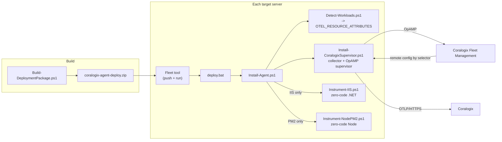

# Fleet deployment

Installs the Coralogix OpenTelemetry Collector **in supervisor mode** — remote-config ready via
Coralogix Fleet Management — across a mixed Windows fleet, detects what each host runs, tags each
agent with **selector attributes** so Fleet Management can target it, and configures zero-code
instrumentation **only for the workloads actually present**.

For the manual, one-host path and the deep IIS background, see [single-host.md](single-host.md).
For every flag on every script, [reference/cli.md](reference/cli.md).

## Architecture



Two ideas do the heavy lifting:

1. **Supervisor mode.** The collector runs under the OpAMP **supervisor**, which holds the OpAMP
   connection to Coralogix. A local **base config** (`config.supervisor.yaml`) provides sane
   defaults; Fleet Management merges a **remote config** on top. The base config must therefore
   **not** contain an `opamp` extension — the supervisor owns that connection.
2. **Selector attributes.** `Detect-Workloads.ps1` sets machine-scope `OTEL_RESOURCE_ATTRIBUTES`.
   `Install-CoralogixSupervisor.ps1` then writes those `cx.host.role` and `workload.*` pairs into
   the supervisor config's `agent.description.non_identifying_attributes`, so the supervisor
   advertises them in its OpAMP **AgentDescription**. Fleet Management can then group and target
   agents by them. The base config also stamps them onto the telemetry *data*, but Fleet Management
   reads the **AgentDescription** for selectors — the supervisor-side injection is what makes them
   selectable.

## What the package contains

`deploy/` is the payload your fleet tool distributes: the two `.bat` entry points, the
orchestrator, the workload detector, the collector installer, the four instrumenters, the three
diagnostics, the dot-sourced helper libraries, the base collector config, and `SendDataKey.txt` if
you baked a key in. Each file and its arguments: [reference/cli.md](reference/cli.md).

`Build-DeploymentPackage.ps1` at the repo root zips them into `coralogix-agent-deploy.zip`.

## Step 1 — build the package

```powershell
# On your workstation, from the repo root
.\Build-DeploymentPackage.ps1 -KeyFile C:\secrets\cx-send-your-data.key -Region eu2
# -> coralogix-agent-deploy.zip
```

- `-KeyFile` bakes the key into the package as `SendDataKey.txt`. **Treat the keyed zip as a
  secret.**
- `-Region` bakes the region into `region.txt`, so the remote command stays a bare `deploy.bat`.
- Without `-KeyFile` the package ships keyless; supply the key at deploy time instead.

## Step 2 — push it to the fleet

The package is one folder plus one `deploy.bat` that orchestrates everything, which suits any tool
that can copy a directory and run a command — BatchPatch, an RMM agent, a scheduled task, or
`Invoke-Command`.

1. Select the target servers. **Start with a 2–3 host pilot.**
2. Copy the extracted package to each host, e.g. `C:\cx-deploy\`.
3. Set the remote command to run after the copy:

   ```bat
   REM key baked into the package and region baked in
   deploy.bat

   REM key supplied at deploy time
   set CORALOGIX_PRIVATE_KEY=cxtp_<key> && deploy.bat

   REM region chosen per host (required unless baked in, or your account is eu1)
   set CX_REGION=eu2 && set CORALOGIX_PRIVATE_KEY=cxtp_<key> && deploy.bat

   REM private or non-standard ingress domain, taken verbatim; wins over CX_REGION
   set CX_DOMAIN=my-ingress.example.com && deploy.bat

   REM environment label, combine with any of the above
   set CX_ENVIRONMENT=staging && deploy.bat
   ```

   The region must match the account the key belongs to. A key from another region authenticates
   nowhere, and **the host still reports healthy while sending nothing**.

4. Run it. The command executes elevated, and a **non-zero exit code marks the row failed**.
   Per-host artifacts land next to the scripts: `install-agent.log`,
   `install-agent-status.json`, `detect-workloads.json`.
5. Review the pilot, then widen to the full fleet.

Arguments and environment variables are **mutually exclusive** — typing any argument makes
`deploy.bat` skip the environment-variable block entirely. See
[reference/cli.md](reference/cli.md) for why.

### 32-bit launchers (WOW64)

`deploy.bat`, `uninstall.bat` and `doctor.bat` re-launch themselves through
`%SystemRoot%\Sysnative\WindowsPowerShell\v1.0\powershell.exe` when `PROCESSOR_ARCHITEW6432` is
defined — that is, when the process that started them is 32-bit. Nothing to configure; this is a
note on *why*, because the failure it prevents looks like success.

On 64-bit Windows the WOW64 redirector rewrites `%windir%\System32` to `%windir%\SysWOW64` for a
32-bit process. `SysWOW64\inetsrv` exists and contains `appcmd.exe`, and even has a `config\`
folder — but that folder holds only `Schema\` and `Export\`, with **no `applicationHost.config`**.
So inside a 32-bit deploy:

- **`appcmd` still works**, because it reaches the IIS configuration store through the
  bitness-agnostic `ahadmin` COM API. Pool environment variables are written correctly and the
  deploy reports success.
- **Every direct file operation on `applicationHost.config` silently misses.** Without the guard,
  the backup snapshots nothing and the "was this variable already set?" test answers `$false` for
  every variable — so the run mutates the live config with **no backup** and records pre-existing
  `OTEL_*` values as its own, which a later uninstall would delete.
- **`%ProgramFiles%` resolves to `Program Files (x86)`**, so the .NET auto-instrumentation would
  install into the wrong tree.
- **The doctor reports `APPHOST_UNREADABLE`** on a host that is in fact instrumented.

A 32-bit launcher is not exotic: several fleet and RMM tools are 32-bit applications, as are
scheduled tasks created by 32-bit tooling. The `.bat` guard is the primary fix; the PowerShell
scripts additionally resolve the IIS directory themselves, for the case where a `.ps1` is invoked
directly from a 32-bit shell.

## Step 3 — assign a remote config in Fleet Management

1. In Coralogix open **Fleet Management**. New agents appear as they register over OpAMP.
2. Confirm each agent's **AgentDescription** carries the selector attributes: `cx.host.role`,
   `workload.iis`, `workload.redis`, and so on.
3. Build agent groups and config assignments that **select on those attributes**:
   - `workload.iis = true` → IIS and ASP.NET receivers overlay
   - `workload.redis = true` OR `workload.valkey = true` → Redis receiver overlay
   - `workload.sqlserver = true` → SQL Server receiver overlay
   - `workload.elasticsearch = true` → Elasticsearch receiver overlay
4. The remote config is **merged on top of** the base config, so a fresh agent already ships host,
   Windows and IIS signals before any assignment.

Remember that a remote config which redefines a pipeline **replaces** the base's processor list for
it. Anything the base contributes to that pipeline — including
`transform/iis_service_labels` — must be present in the remote config too.

## Environment labelling

Set **`CX_ENVIRONMENT`** on a host, via `deploy.bat` or `Install-Agent.ps1 -Environment <env>`, to
tag *all* of that host's telemetry with the deployment environment, so Coralogix can separate
`prod`, `staging` and `dev` in Infrastructure Explorer and APM.

- Persisted as a machine variable by `Install-CoralogixSupervisor.ps1`.
- The base config's `transform/environment` processor stamps it onto every pipeline: host metrics
  and logs, IIS logs, application spans, **and** the Infrastructure Explorer host entity — under
  three keys: `tags.cx_environment`, `tags.cx_env`, and the OTel semantic-convention
  `deployment.environment.name`.
- When `CX_ENVIRONMENT` **is** set, the host value wins over anything an application supplied for
  itself. When it is **not** set, the processor fills `unspecified` only where nothing else has
  claimed the key — so a forgotten host is still obvious rather than silently "production", but an
  application that labelled itself keeps its own answer instead of having it overwritten.
- The same value is fed to the OpAMP AgentDescription, so you can group by environment in Fleet
  Management.
- Two stores hold this label: machine `CX_ENVIRONMENT` and `deployment.environment.name` inside
  machine `OTEL_RESOURCE_ATTRIBUTES`. A re-run that omits the flag inherits the persisted value
  rather than clearing one of them, and `doctor.bat` reports `CX_ENVIRONMENT_MISMATCH` if they
  ever disagree.

## Team labelling

Set **`CX_TEAM`** on a host, via `deploy.bat` or `Install-Agent.ps1 -Team <team>`, to record which
team owns it.

- Persisted by `Install-CoralogixSupervisor.ps1` under **two** machine variables with the same
  value: `CX_TEAM` and the bare `TEAM`, because software already deployed on these hosts reads the
  bare name. The prior value of each is recorded, so an uninstall restores a `TEAM` the host owned
  before the install rather than deleting it.
- **Env-var only, on purpose.** Nothing in the base config reads either variable, so setting a team
  changes no attribute on any signal. Consume it from a remote Fleet Management config as
  `${env:CX_TEAM}` when you want it on telemetry — which keeps the choice of key, and of which
  pipelines carry it, in the remote config where the rest of your fleet policy lives.
- Omit the flag on a re-run and the label is inherited rather than dropped: `-Team`, then
  `CX_TEAM`, then a bare `TEAM` the host already carried, then the persisted `CX_TEAM`. The install
  transcript names which of those it used — worth reading once per fleet, since the third source is
  a value nothing in this package set.
- `doctor.bat` grades the pair, not just its presence: `CX_TEAM_PARTIAL` when only one name is set,
  `CX_TEAM_MISMATCH` when the two disagree. Neither set at all is `info`, because an unlabelled
  host loses no telemetry.

## Application naming

The Coralogix **application** name is resolved per signal by the `coralogix` exporter, which walks
`application_name_attributes` in order and takes the **first non-empty resource attribute**:

| # | Source | Set by |
| --- | --- | --- |
| 1 | `cx.application.name` | An explicit per-signal override from a sender or a remote config. |
| 2 | `service.namespace` | `transform/appname`, from the machine variable **`CX_APPLICATION`** (`Install-Agent.ps1 -Application`). Skipped entirely when the variable is unset. |
| 3 | `host.name` | **The default.** The `system` detector in `resourcedetection/env`. Each host reports under its own name. |
| 4 | `application_name: otel` | Static last resort, unreachable in practice because `host.name` is always present. The exporter *requires* a non-empty value here, so it stays. |

On a fresh host you set nothing and the host names its own application. `CX_APPLICATION` exists
only to group several hosts under one shared application.

Two implementation notes worth keeping:

- A bare `cx.application.name` **resource attribute is not enough on its own** — the exporter only
  consults it directly when `application_name` is empty, which its own config validation rejects.
  It works here purely because it is listed in `application_name_attributes`.
- `service.namespace` is set by a **transform with a condition**, not by the `resource` processor.
  `value: ${env:CX_APPLICATION:-}` on a `resource` processor fails at startup when the variable is
  unset: confmap types a value that is entirely one `${env:…}` reference, an empty expansion becomes
  YAML `null`, and the processor rejects it with *"error creating AttrProc. Either field `value`,
  `from_attribute` … must be specified"*. Quoting does not help. Inside an OTTL statement the same
  reference is plain string substitution, so empty is harmless.

Confirm it with `scripts\Verify-CoralogixAppName.ps1 -ExpectedApplication <hostname>`.

## Service labelling on infrastructure data

Populates Infrastructure Explorer's **Service** ownership for a host with the services it runs.
The work is split:

- **Automation sets variables only.** `Instrument-IIS.ps1` publishes `CX_IIS_SERVICES`, the Node and
  .NET service instrumenters publish their own slices, and `Install-Agent.ps1` publishes the union
  `CX_SERVICES`. Each name equals a per-application `OTEL_SERVICE_NAME`, aligned by construction.
- **Config is remote.** The `transform/iis_service_labels` processor lives in the remote Fleet
  Management config, splits the variable into an array, and stamps seven ownership keys onto the
  logs-signal pipelines — including the host entity that drives ownership. The repo YAMLs are the
  reference to copy from; the automation never pushes config.

Full key list, value format and the alignment rules: [iis-service-ownership.md](iis-service-ownership.md).
Confirm with `scripts\Verify-CoralogixInfraLabels.ps1`. Note that the supervised collector only
sees the variable if it was set **before** the collector started.

## Workload detection and the attribute schema

`Detect-Workloads.ps1` uses several independent signals per workload — Windows services, processes,
listening ports, install directories, registry. Any one hit marks the workload present, and every
probe is non-fatal.

| Workload | Primary signals |
| --- | --- |
| IIS | `W3SVC`/`WAS` service, `w3wp` process, IIS optional feature, `appcmd.exe` |
| .NET | `dotnet` CLI or install dir, .NET Framework `NDP\v4\Full` registry |
| Node.js | `node --version`, `%ProgramFiles%\nodejs` |
| PM2 | `pm2` on PATH, the PM2 app list, `%USERPROFILE%\.pm2` or `$PM2_HOME`, and machine-wide process/service probes for a service-hosted daemon |
| RabbitMQ | `RabbitMQ*` service, ports 5672/15672, install dir |
| Redis | `Redis*` service, `redis-server` process, port 6379 |
| Valkey | `Valkey*` service, `valkey-server` process, port 6379 |
| SQL Server | `MSSQL*` service, `sqlservr` process, port 1433 |
| DB2 | `DB2*` service, `db2sysc*` process, ports 50000/25000 |
| Elasticsearch | `elasticsearch*` service, ports 9200/9300, install dir |

Published `OTEL_RESOURCE_ATTRIBUTES` — the agent-selector contract:

| Attribute | Meaning |
| --- | --- |
| `cx.host.role=<primary>` | Single coarse role, by priority: `iis > sqlserver > db2 > elasticsearch > rabbitmq > redis > valkey > nodejs-pm2 > nodejs > dotnet` |
| `workload.<name>=true` | One per detected workload; a multi-role host gets several |
| `workload.pm2`, `workload.pm2.apps`, `workload.pm2.hosting`, `workload.pm2.owner`, `workload.pm2.home` | PM2 presence, app count, and the daemon's hosting model and owner |
| `workload.nodejs.version`, `workload.dotnet.version` | Runtime versions, when present |

Redis and Valkey share port 6379; when only the port is seen the host is tagged `redis`. A Valkey
service or process disambiguates and clears the redis tag.

Non-Windows workloads — Redis, Valkey, RabbitMQ, DB2, Elasticsearch on Linux — are out of scope for
this package. Deploy a Linux collector there instead: [linux.md](linux.md).

## Conditional IIS instrumentation

When detection reports IIS, the orchestrator runs `Instrument-IIS.ps1`:

- Installs the OpenTelemetry .NET auto-instrumentation module in strict order (`Import-Module` →
  `Install-OpenTelemetryCore` → `Register-OpenTelemetryForIIS`).
- Sets the OTLP endpoint **host-wide** on `applicationPoolDefaults` — the fleet "set once" pattern.
- Auto-discovers every IIS site and application and sets a distinct `OTEL_SERVICE_NAME` for each,
  from the site name plus the application path: a root application takes the site name, a nested
  application at `/api` becomes `Site/api`. An application on a **dedicated** pool gets the name on
  the pool, with the OTLP endpoint and protocol re-set there too; applications that **share** a pool
  get the name in their own `web.config`. A shared pool that already declares its own
  `<environmentVariables>` also gets the OTLP settings written directly onto it, because such a pool
  does not inherit the defaults at all. Rename specific applications with `-ServiceNameOverrides` or
  `-OverridesJson`.

Only applications whose runtime classifies as **ASP.NET Core or ASP.NET Framework** are named at
all. Static sites, native and ISAPI handlers, PHP/Node/Java behind IIS, and URL-Rewrite reverse
proxies are skipped and kept out of the ownership variables — .NET auto-instrumentation emits
nothing for them, so claiming them would point Service ownership at telemetry that never arrives.
An application the installer cannot classify is reported as `RUNTIME_UNKNOWN_NEEDS_OVERRIDE` rather
than guessed at; force it with `CX_RUNTIME_OVERRIDES_JSON`, and give the doctor the same file.

Three reminders that carry over from the manual path:

- Requires **Windows PowerShell 5.1**, not 7.
- **"No Managed Code" is a pool setting, and it is per-runtime.** Recommended for ASP.NET **Core**
  pools, and **wrong for ASP.NET Framework** pools, where it stops the application serving requests
  at all. Never apply it fleet-wide.
- A trailing blank line in the W3SVC `Environment` REG_MULTI_SZ prevents IIS from starting.

> **`localhost` vs `127.0.0.1`.** On a dual-stack host `localhost` resolves to `::1` first, the
> receivers bind IPv4 only, and OTLP export is **silently dropped** — no exporter error, so the
> application looks instrumented and nothing arrives. The instrumenters default to `127.0.0.1` and
> rewrite a `localhost` value passed explicitly. The doctor still flags `OTLP_ENDPOINT_LOCALHOST`
> when it finds one from another source: a hand edit, a pre-existing pool block, or an older
> install. That is a real finding, not a false positive.

> **A pool's environment block is a snapshot.** A pool with its own `<environmentVariables>`
> **replaces** `applicationPoolDefaults`, and IIS copies the defaults into that block the first
> time `appcmd` writes any variable to the pool. The copy never refreshes, so changing the defaults
> later never reaches an already-instrumented pool. Reported as `POOL_ENV_STALE`.

To read back what actually landed, run `Test-IISInstrumentation.ps1` or the full `doctor.bat`.

## Conditional Node and PM2 instrumentation

When detection reports PM2, the orchestrator runs `Instrument-NodePM2.ps1` unless
`-SkipInstrument` is set:

- Stages the OTel Node package under `-InstallPrefix` (default `C:\cx\otel-node`) — this needs npm
  registry access at deploy time, or a pre-staged prefix with `-SkipInstall` — then resolves the
  absolute `register` bootstrap.
- Per app: sets `NODE_OPTIONS`, the `OTEL_*` exporter variables and a per-app `OTEL_SERVICE_NAME`,
  then `pm2 restart --update-env` and `pm2 save` so the environment survives a daemon restart.
- Publishes `CX_NODE_SERVICES`.

If PM2 is hosted as a Windows service under another account, the instrumenter routes `pm2` through
the owning account — otherwise the deploy reports success while instrumenting nothing. That whole
failure mode, and the Node service and .NET service instrumenters, are covered in
[nodejs-pm2.md](nodejs-pm2.md).

## Config backup

Every install run opens a **backup session** and snapshots each config *before* mutating it, plus a
JSON manifest recording exactly what was added, so uninstall can reverse only the installer's own
changes.

- Location: `C:\ProgramData\CoralogixDeploy\backups\<yyyyMMddHHmmss>\`
  - `manifest.json` — environment variables with their prior values and an `added` flag, pool
    variables with a `preexisted` flag, `web.config` edits with prior values, backed-up files, and
    registry exports.
  - `applicationHost.config.bak`, `<app>-web.config.bak` — copies of the mutated configs.
  - `W3SVC.reg` / `WAS.reg` — CLR-profiler registry export taken before registration.
  - A copy of the supervisor `config.yaml` taken before the attribute injection.
- `backups\latest.json` points at the newest session, and uninstall reads it automatically.
- `install-agent-status.json` records the `backupDir` for the run.

## Uninstall

Run `uninstall.bat` as the remote command, or `Uninstall-Agent.ps1` directly, elevated. It reads
the latest manifest and undoes **only fleet artifacts** — never a hosted application, and never an
IIS site or pool.

```bat
REM default: keep staged config and binaries
uninstall.bat

REM also delete staged config and vendor binaries
set CX_PURGE=1 && uninstall.bat

REM restore mutated configs from the backup instead of surgical edits
set CX_RESTORE=1 && uninstall.bat
```

In order:

1. **IIS de-instrument** — strip the installer's `OTEL_SERVICE_NAME` from each application's
   `web.config` (value-matched, so a value someone else set is left alone and a pre-existing value
   is restored), remove the `OTEL_*` pool variables the installer added (entries flagged
   `preexisted` are kept), then vendor `Unregister-OpenTelemetryForIIS` and
   `Uninstall-OpenTelemetryCore`.
2. **Collector and supervisor** — vendor `-Uninstall`, then a hard fallback that stops and
   `sc.exe delete`s `opampsupervisor` and `otelcol-contrib` if they remain.
3. **Machine variables** — delete the ones the install created and restore any that had a prior
   value.
4. **`-Purge`** (opt-in) — also delete the staged directories and the OpenTelemetry Program Files
   trees. Off by default so a re-install stays fast.
5. **`iisreset`** unless `-NoReset`, so workers drop the profiler and environment changes.

With no manifest — an install predating backups — uninstall falls back to a conservative removal of
the installer-owned names and services only. The result is written to
`uninstall-agent-status.json`.

## Verification

**Run the doctor first.** `doctor.bat` is read-only, changes nothing, and covers steps 3 and 5
below mechanically plus things they cannot see: whether anything is actually being *exported*,
whether the CLR profiler is attached, and whether the required processors are in the **effective**
(merged) config. Exit `0` pass, `2` degraded, `1` hard fail; every finding is a specific code rather
than a symptom, and `agent-doctor.json` is written next to the scripts for later collection. See
[diagnostics.md](diagnostics.md) and [reference/exit-codes.md](reference/exit-codes.md).

Steps 2, 4 and 6 are the ones the doctor does not replace — config validation, server-side
confirmation, and the installer's own status file.

1. **Detection** — `Detect-Workloads.ps1 -SetEnv:$false` on a host; confirm the printed
   `OTEL_RESOURCE_ATTRIBUTES` matches reality and that `detect-workloads.json` is written.
2. **Base config validity** —
   `& "C:\Program Files\OpenTelemetry Collector\otelcol-contrib.exe" validate --config <base config>`.
   It must have no `opamp` extension.
3. **Services** — `opampsupervisor` and `otelcol-contrib` both Running; the health endpoint returns
   200; internal metrics respond.
4. **Fleet Management** — the agent is visible with its `cx.host.role` and `workload.*` attributes,
   and a selector on `workload.iis=true` matches IIS hosts.
5. **APM** — on an IIS host, spans reach the Service Catalog. Allow a few minutes for the
   span-metrics flush.
6. **Status file** — `install-agent-status.json` shows `result: success`. Harvest it alongside
   `agent-doctor.json` and `detect-workloads.json` after a sweep.

> A `result: success` status file does **not** prove data is arriving. The install reports success
> whenever the services came up, so a wrong key or a wrong region still yields success plus zero
> telemetry. Step 3's export counters and step 4 are what catch that.

## Troubleshooting

Start with the host diagnostic — read-only and safe at any time:

```bat
doctor.bat
set CX_DOCTOR_ONLY=env,iisServiceName && doctor.bat
```

Exit `0` pass, `1` hard fail (collector down, no key, not elevated), `2` degraded. A fleet tool
shows both `1` and `2` as red rows; the exit-code column tells them apart. Full finding reference:
[reference/exit-codes.md](reference/exit-codes.md).

| Symptom | Likely cause and fix |
| --- | --- |
| Collector service will not start | The base config needs `file_storage`, so the installer must pass `-EnableDynamicIISParsing` (it does). Run `validate`. Confirm `CORALOGIX_PRIVATE_KEY` is set for the service. An empty `OTEL_MEMORY_LIMIT_MIB` also fails the `memory_limiter` outright. |
| Agent not in Fleet Management | The supervisor cannot reach OpAMP: check `CORALOGIX_DOMAIN` and the key, and that the base config has **no** `opamp` extension. An HTTP 403 from the OpAMP endpoint means the key is not valid for that domain — including the case where a **file path was passed where the key value was expected**. |
| Nothing in Infrastructure Explorer, install said success | Same root cause as the row above. The collector logs `Exporting failed. Dropping data.` with `Unauthenticated` per batch while the local health endpoint stays green. Check the export counters (`EXPORT_SEND_FAILED`). |
| Selector attributes not shown in Fleet Management | They must be in the **supervisor** config's `agent.description.non_identifying_attributes`, not just `OTEL_RESOURCE_ATTRIBUTES` — the vendor template writes only a static `service.name` and `cx.agent.type`. `Install-CoralogixSupervisor.ps1` injects them post-install and restarts the supervisor. If still absent, detection did not run elevated (empty `OTEL_RESOURCE_ATTRIBUTES`), or the vendor template changed its anchor. Re-run the deploy. |
| `opampsupervisor` will not start after a config edit; the Application log says `could not compose initial merged config: yaml: line NN: found unknown escape character` | A selector attribute value contains a **backslash**. See the next section — every backslash must be doubled in the YAML value. |
| Fleet Management shows the remote config as **failed to apply**, but telemetry is arriving | The supervisor's `agent.config_apply_timeout` is shorter than the collector's cold start, so it gave up waiting and reported `FAILED` for a config that applied fine. See the next section. |
| An apply really did fail and there is nothing on the host that says why | The collector's own stdout/stderr is swallowed unless the supervisor config sets `agent.passthrough_logs: true`. The installer sets it. |
| A selector value looks mangled in Fleet Management rather than missing | Same root cause, benign side: when the character after the backslash is a valid YAML escape, the second parse succeeds and silently rewrites the value. The service starts, so nothing reports a problem. Fix is identical. |
| No IIS telemetry | `PROFILER_NOT_REGISTERED` → the register step never ran here. `PROFILER_PATH_MISSING` → the profiler DLL was deleted; IIS starts and emits nothing. `OTLP_ENDPOINT_LOCALHOST` → `::1`, export silently dropped. `POOL_LOST_INHERITANCE` → the pool has its own `<environmentVariables>` and never saw the defaults; re-run the deploy and recycle. `POOL_NOT_NO_MANAGED_CODE` is worth fixing but is **not** a cause of silence. |
| One IIS application sends nothing | `NON_DOTNET_APP_NOT_INSTRUMENTED` → static, native, another runtime behind IIS, or a reverse proxy; instrument the backend where it runs, or force the runtime if detection is wrong. `RUNTIME_UNKNOWN_NEEDS_OVERRIDE` → deliberately undecided; supply the override. `FRAMEWORK_POOL_NO_MANAGED_CLR` → the application is not merely uninstrumented, it is **down**; set that pool to `v4.0`. |
| Service ownership blank | `set CX_DOCTOR_ONLY=env,iisServiceName,effectiveConfig && doctor.bat`. `CX_IIS_SERVICES_MISSING` → the instrumenter never ran, or not elevated. `CX_IIS_SERVICES_DRIFT` → sites changed after instrumentation; re-run and restart the collector. `EFFECTIVE_PROCESSOR_MISSING` / `_NOT_WIRED` → the variable is fine but the processor is absent from the **remote** config, so it is never stamped. |
| Doctor says the config is unreadable, but the deploy plainly worked | `APPHOST_UNREADABLE` / `APPHOST_ACCESS_DENIED`. `appcmd` reaches the config through the COM API while the diagnostics do a plain file read, so one can fail while the other works. Usual cause is WOW64 — see [32-bit launchers](#32-bit-launchers-wow64) and the full cause table in [diagnostics.md](diagnostics.md). |
| Endpoint fixed centrally but hosts still export nowhere | `POOL_ENV_STALE`. Re-run `Instrument-IIS.ps1` and recycle the pool. |
| Download fails with a TLS error | Older Server SKUs default to TLS 1.0; the scripts enable TLS 1.2 first. |
| A fleet-tool row failed | Read `install-agent.log` (or `uninstall-agent.log`) on the host. The `.bat` entry points propagate the PowerShell exit code. |
| `opampsupervisor` still present after uninstall | The vendor `-Uninstall` does not always remove the supervisor service; `Uninstall-Agent.ps1` hard-deletes it. If it lingers, re-run `uninstall.bat`, or `Stop-Service opampsupervisor; sc.exe delete opampsupervisor`. |
| IIS will not start after uninstall | A stale profiler entry in the W3SVC/WAS `Environment` REG_MULTI_SZ. `Unregister-OpenTelemetryForIIS` clears it; if hand-edited, `reg import` the `.reg` files from the backup directory. Reported as `PROFILER_REGISTRY_MALFORMED`, a hard fail, when the value contains an empty element. |
| Collector crash-loops, health returns 503, log says `failed getting host cpuinfo: SMBIOS processor information not found` | The host has no SMBIOS Type 4 — common under hypervisors. The base config drops `host.cpu.*`, but a **remote config** that re-adds them (or the `system` detector) overrides the base and re-triggers it. Remove `host.cpu.*` from the assigned remote config too. Physical hardware is unaffected. |

### Backslashes in AgentDescription values

The supervisor parses its `config.yaml`, then **re-serializes** the AgentDescription values into
the merged config text without escaping backslashes, and parses that text again. One level of
backslash escaping is consumed per pass, so the quoting that looks right is the one that fails.

For `workload.pm2.home = C:\ProgramData\pm2` and
`workload.pm2.owner = NT AUTHORITY\LocalService`:

| In `config.yaml` | What the second parse sees | Outcome |
| --- | --- | --- |
| `workload.pm2.home: "C:\\ProgramData\\pm2"` | `C:\ProgramData\pm2` → `\p` | **service dead** — `could not compose initial merged config: yaml: line NN: found unknown escape character` |
| `workload.pm2.home: 'C:\ProgramData\pm2'` | same | **service dead** — identical error; single versus double quotes is not what saves you |
| `workload.pm2.owner: "NT AUTHORITY\\LocalService"` | `\L` **is** an escape (U+2028) | starts, value **silently corrupted** |
| `workload.pm2.home: 'C:\\ProgramData\\pm2'` | `C:\\ProgramData\\pm2` | **starts, value exact** |
| `workload.pm2.home: "C:\\\\ProgramData\\\\pm2"` | same as above | starts, value exact; equivalent but less legible |
| `workload.pm2.home: "C:/ProgramData/pm2"` | no backslash | starts, but the value is slash-ified — lossy |

So the rule is neither "avoid double quotes" nor "make it valid YAML" — both are satisfied by forms
that kill the service or mangle the value. It is: **every backslash in the YAML value must be
doubled.** `Install-CoralogixSupervisor.ps1` emits that form and re-quotes any non-conforming value
it finds, so a re-deploy repairs a host an earlier version broke — a key that is already present
would otherwise be skipped.

To verify the value survived end-to-end rather than merely that the service started, publish an
attribute whose value contains both `\P` and `\L`, restart, and read it back out of the
supervisor's effective config.

### A config apply reported as failed when it succeeded

`agent.config_apply_timeout` in the supervisor's `config.yaml` is how long the supervisor waits for
the collector to report healthy after it applies a new config. Its own default is **5s**. This base
config is large — four pipelines, dynamic IIS parsing — and the collector routinely needs longer
than that to come up on Windows, which is also why the installer sleeps 6 seconds before its own
health probe. On timeout the supervisor reports `RemoteConfigStatus = FAILED` upstream, so the
console showed a red config on a host that was working.

`Install-CoralogixSupervisor.ps1` writes two keys as direct children of `agent:`:

```yaml
agent:
  executable: C:\Program Files\OpenTelemetry Collector\otelcol-contrib.exe
  passthrough_logs: true
  config_apply_timeout: 30s
  description:
    non_identifying_attributes:
      service.name: "coralogix-collector"
```

- `config_apply_timeout` — `30s` by default, `-ConfigApplyTimeout` to change it. Written in place,
  so a re-deploy repairs a host still on `5s` rather than skipping a key that is already there.
- `passthrough_logs` — always `true`, not configurable. Without it the collector's own stdout and
  stderr are swallowed by the supervisor, so a genuine apply failure leaves nothing on the host to
  read. There is no host on which that is the better outcome.

Two things this deliberately does **not** touch: the vendor's `service.name` /
`cx.agent.type` lines, and `agent.executable`. Note also that neither of these two values is
backslash-doubled the way the section above requires — that rule applies only to
`non_identifying_attributes`, which the supervisor re-serializes and reparses. These are
supervisor-side settings that are never re-emitted, and quoting them would be the opposite bug:
go-yaml has to read `30s` as a duration and `true` as a bool, not as strings.

**Measured.** On a Windows Server 2025 guest (4 vCPU, 8 GB, IIS present), timing from
`opampsupervisor` reporting Running to the collector's first HTTP 200 on the health endpoint, three
consecutive cold starts:

| Sample | Cold start to healthy |
| --- | --- |
| 1 | 14244 ms |
| 2 | 13835 ms |
| 3 | 14050 ms |

So ~14 s against a 5 s default — the apply was reported failed because the supervisor stopped
waiting, not because anything failed — and ~2x headroom under the 30 s this now sets. If a host ever
measures under 5 s, the reasoning above does not apply to it and the setting is merely harmless.

One trap worth knowing when reproducing this: on a host **without IIS** the number cannot be
measured at all, and the way it fails is misleading. The base config's
`windowsperfcounters/iis_apppool` receiver cannot create `\APP_POOL_WAS(*)\...` counters, that
component fails to start, the collector shuts itself down, and the supervisor restarts it in a
loop — so the health endpoint never binds and every symptom points at the config edit instead of at
the missing role. `poc\Run-SupervisorAgentSettingsVmLoop.ps1` now refuses to run on such a host.

Verifying it locally: `agent.config_apply_timeout: 30s` present exactly once in
`C:\Program Files\OpenTelemetry OpAMP Supervisor\config.yaml`, the service Running with an
`otelcol` child under it, and no `failed to apply` line in the supervisor's log. Fleet-side
confirmation that the config now reads *applied* is still a manual step — see
[Verification](#verification). `poc\Run-SupervisorAgentSettingsVmLoop.ps1` asserts the local half against the
real supervisor binary, including a measurement of the cold start that fails if it comes in under
5s — because then this diagnosis does not hold on that host.

## Related

- [reference/cli.md](reference/cli.md) — every script, flag and default
- [reference/env-vars.md](reference/env-vars.md) — every variable, and which copy wins
- [reference/exit-codes.md](reference/exit-codes.md) — the graded contract and all finding codes
- [single-host.md](single-host.md) — the manual path and the IIS background
- [diagnostics.md](diagnostics.md) — reading a doctor result
- [iis-service-ownership.md](iis-service-ownership.md) — host Service ownership
- [linux.md](linux.md) — Linux database hosts
