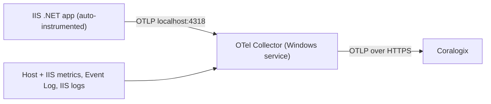

> 📡 This runbook covers installing the OpenTelemetry (OTel) Collector as a Windows service and wiring up zero-code instrumentation for .NET apps on IIS so they report to Coralogix. It is based on the integration session walkthrough and uses the attached `config.yaml` as the reference collector configuration.
> 

## Overview

There are two moving parts, and both are needed before Coralogix shows APM data.

First, the **OTel Collector** runs as a Windows service on each host. It receives telemetry over OTLP from your apps, scrapes host and IIS metrics on its own, and ships everything to Coralogix. The attached `config.yaml` configures this collector.

Second, the **application instrumentation** is what makes each app emit traces. Apps fall into two groups. Some teams already added the OpenTelemetry SDK to their code, so they emit OTLP directly and only need the collector running. Other teams have no SDK in their code, so they need zero-code (also called no-code) auto-instrumentation, which is installed separately on the box. The session focused on the second case for .NET on IIS.

Data flow:



This guide targets bare Windows hosts running .NET on IIS. It does not use Kubernetes. Node.js front ends and standalone Windows services are noted as separate variations near the end.

---

## Prerequisites

- Windows 10/11 or Windows Server 2016 or later, with Administrator access.
- PowerShell 5.1 or later. The .NET auto-instrumentation module requires Windows PowerShell 5.1 specifically, not PowerShell 7.
- A Coralogix Send-Your-Data API key (Data Flow > API Keys in the Coralogix UI).
- Your Coralogix domain, for example `eu1.coralogix.com` or `eu2.coralogix.com`.
- The Web Server (IIS) role installed if you plan to use the IIS receivers in the config.

---

## Part 1: Install the OTel Collector on Windows

### 1. Prepare the config file

The installer requires a config file. Start from the attached `config.yaml` (the full text is in the toggle at the bottom of this page) and save it on the machine, for example `C:\otel\config.yaml`.

Before installing, update these values for your environment:

- `exporters.coralogix.domain`: set to your Coralogix domain. The attached file uses `eu1.coralogix.com`.
- `exporters.coralogix.application_name` and `subsystem_name`: set these to meaningful names. The attached file uses `iis-instrumentation-test` and `SimpleWebApp`, which are placeholders from testing.
- `private_key` is read from the `CORALOGIX_PRIVATE_KEY` environment variable, which the installer sets for you. Do not paste the key into the file.

### 2. Run the installer

Run this in an elevated PowerShell (Run as Administrator), as a single line. Replace the key and the config path.

```powershell
$u='https://github.com/coralogix/telemetry-shippers/releases/latest/download/coralogix-otel-collector.ps1'; $f="$env:TEMP\coralogix-otel-collector.ps1"; Invoke-WebRequest -Uri $u -OutFile $f -UseBasicParsing; $env:CORALOGIX_PRIVATE_KEY='<your-private-key>'; & $f -Config 'C:\otel\config.yaml'
```

The key must be inside single quotes with the closing quote before the semicolon. On Windows Server 2016 or older, prepend `[Net.ServicePointManager]::SecurityProtocol = [Net.SecurityProtocolType]::Tls12;`  so the GitHub download succeeds.

The installer places the collector here:

| Component | Location |
| --- | --- |
| Binary | `C:\Program Files\OpenTelemetry Collector\otelcol-contrib.exe` |
| Config | `C:\ProgramData\OpenTelemetry\Collector\config.yaml` |
| Service | `otelcol-contrib` (Windows service) |
| Logs | Windows Event Log (Application), source `otelcol-contrib` |

### 3. Verify it is running

```powershell
# Service status
Get-Service otelcol-contrib

# Validate the config
& "C:\Program Files\OpenTelemetry Collector\otelcol-contrib.exe" validate --config "C:\ProgramData\OpenTelemetry\Collector\config.yaml"

# Recent errors if it did not start
Get-EventLog -LogName Application -Source otelcol-contrib -Newest 20
```

The config exposes a health check on `127.0.0.1:13133` and internal collector metrics on `127.0.0.1:8888`, which you can use to confirm the collector is healthy.

### 4. Useful install variants

```powershell
# Listen on all interfaces so other hosts can send to this one (gateway mode).
# Requires your config to reference ${env:OTEL_LISTEN_INTERFACE}.
& $f -ListenInterface 0.0.0.0

# Raise the memory limit (config must reference ${env:OTEL_MEMORY_LIMIT_MIB}).
& $f -MemoryLimit 2048

# Enable header-based parsing for IIS logs. Also required if your config uses the
# file_storage extension, otherwise the service fails to start.
& $f -EnableDynamicIISParsing

# Pin a specific version
& $f -Version 0.144.0
```

> ⚠️ The attached config listens on `127.0.0.1` only, which is correct when the instrumented apps run on the same host. If apps run on other machines, install that collector as a gateway with `-ListenInterface 0.0.0.0`.
> 

### 5. Service management

```powershell
Restart-Service otelcol-contrib
Stop-Service otelcol-contrib
Start-Service otelcol-contrib
```

---

## Part 2: What the example config enables

The attached config is a single per-host agent that both collects local signals and receives app telemetry, then ships directly to Coralogix. Each block maps to a specific capability in the product.

### Receivers (what data comes in)

The `otlp` receiver listens on `127.0.0.1:4317` (gRPC) and `127.0.0.1:4318` (HTTP). This is the entry point for traces and metrics from your instrumented apps.

The `hostmetrics` receiver scrapes CPU, memory, disk, filesystem, network, paging, and process metrics every 30 seconds. This powers the host dashboards in Infrastructure Explorer, including the Process tab. The process scraper is off by default upstream and is turned on here, with read errors muted to avoid noise.

The `windowsperfcounters` receiver pulls Windows and .NET counters and maps them to clean metric names: IIS request rate and current connections, ASP.NET request rate, execution time and queue length, .NET CLR time in GC and exceptions per second, and worker process CPU and private bytes. If you run multiple app pools, add `w3wp#1`, `w3wp#2` and so on to the Process object instances.

The `windowseventlog` receivers collect the Application and System event logs. The `filelog/iis` receiver tails the W3C IIS logs under `C:\inetpub\logs\LogFiles\W3SVC*\*.log` and drops the header and comment lines.

### Connector: span metrics (this is what drives APM)

The `spanmetrics` connector generates RED metrics (Request rate, Error rate, Duration) from every span. It runs on the agent so it sees 100% of spans before any downstream sampling. This is what fills the APM Service Catalog and the latency, error, and Apdex widgets. The extra dimensions unlock specific features: `service.version` enables group-by-version, `http.response.status_code` enables error tracking, and `db.system` with `db.namespace` enable Dependencies and Database Monitoring. Exemplars are enabled so you can jump from a metric to a representative trace.

> Version note: the `aggregation_cardinality_limit` on span metrics needs collector v0.130.0 or later, and the Prometheus pull reader used for internal telemetry needs v0.123 or later.
> 

### Processors (how data is shaped)

`memory_limiter` caps collector memory. `resourcedetection/system` adds `host.name` (plus `os.type`, `host.id`, `host.arch`) to every signal, including the app spans. This is the key to correlation: matching `host.name` on both spans and host metrics is what lets Coralogix tie a service to the host it runs on, and it gives each host's span metrics a unique resource so multi-host aggregation adds up instead of overwriting. `resource` stamps `service.namespace = windows-iis` on everything. `batch` groups signals into efficient payloads.

### Exporter and pipelines

The `coralogix` exporter ships to your Coralogix domain using the key from the environment, with a sending queue and retry on failure. The pipelines wire it together: traces flow to both the span-metrics connector and Coralogix, the generated span metrics go to Coralogix, and host, Windows, and app metrics plus all logs go to Coralogix.

> The header comment in the file describes an alternative topology where the agent forwards to a gateway that owns the credentials. As written, the file ships directly to Coralogix. If you adopt a gateway later, point the exporter at the gateway instead.
> 

### Summary: config section to Coralogix feature

| Config section | What you get in Coralogix |
| --- | --- |
| `otlp` receiver | Traces and metrics from your apps |
| `spanmetrics` connector | APM Service Catalog, latency / error / Apdex, group-by-version, dependencies |
| `hostmetrics` | Infrastructure Explorer host dashboards, Process tab |
| `windowsperfcounters` | IIS, ASP.NET, and .NET CLR metrics |
| `windowseventlog`  • `filelog/iis` | Windows event logs and IIS access logs |
| `resourcedetection` (`host.name`) | Service-to-host correlation, correct multi-host aggregation |

---

## Part 3: Instrument .NET apps on IIS (zero-code)

Use this when the app team has not added the OpenTelemetry SDK to their code. If the app already emits OTLP from its own SDK, skip this part and just make sure it points at the collector on `localhost:4317` or `4318`.

### 1. Install the auto-instrumentation module

Run in an elevated Windows PowerShell 5.1 session. This downloads the module, installs the core files, and registers IIS.

```powershell
# Set to the current release tag from the releases page, e.g. v1.16.0-beta.1
$version = "v1.16.0-beta.1"
$module_url = "https://github.com/open-telemetry/opentelemetry-dotnet-instrumentation/releases/download/$version/OpenTelemetry.DotNet.Auto.psm1"
$download_path = Join-Path $env:temp "OpenTelemetry.DotNet.Auto.psm1"
Invoke-WebRequest -Uri $module_url -OutFile $download_path -UseBasicParsing

# Import, install core files, and register IIS
Import-Module $download_path
Install-OpenTelemetryCore
Register-OpenTelemetryForIIS
```

`Register-OpenTelemetryForIIS` restarts IIS by default. Use `-NoReset` to skip the restart and recycle later.

> This maps to what happened on the call: import the module, install core, then register IIS. The early errors ("could not find path to OpenTelemetry") came from running the register step before the module and core files were in place.
> 

### 2. ASP.NET Core app pools need "No Managed Code"

For ASP.NET Core apps hosted in IIS, set the application pool's .NET CLR Version to "No Managed Code". If this is wrong, no telemetry is generated at all. .NET Framework apps do not need this. This is the practical difference behind the Framework versus Core confusion during the session.

### 3. Point the apps at the collector and set a service name

The apps need a few environment variables. The most important are the OTLP endpoint (the local collector) and a unique service name per app.

| Variable | Value | Purpose |
| --- | --- | --- |
| `OTEL_EXPORTER_OTLP_ENDPOINT` | `http://localhost:4318` | Send to the local collector |
| `OTEL_EXPORTER_OTLP_PROTOCOL` | `http/protobuf` | Match the HTTP endpoint |
| `OTEL_SERVICE_NAME` | unique per app | Names the service in APM |
| `OTEL_RESOURCE_ATTRIBUTES` | `deployment.environment=production,service.version=1.0.0` | Extra APM dimensions |

> **Environment label.** To split telemetry by environment in Coralogix (Infra
> Explorer / APM), set `CX_ENVIRONMENT` on the host. `deploy-app.ps1 -Environment
> <staging|production|...>` sets the machine var and appends `tags.cx_environment`,
> `tags.cx_env`, and `deployment.environment.name` to the app pool's
> `OTEL_RESOURCE_ATTRIBUTES`; the collector's `resource/environment` processor (in
> `SimpleWebApp\coralogix\config.yaml`) stamps the same three keys onto host/infra
> signals from `${env:CX_ENVIRONMENT:-unspecified}`. Restart the collector after
> setting the machine var so host signals pick it up.

There are three places to set these, in increasing order of scope.

**Per app, ASP.NET Core.** Add an `<environmentVariables>` block inside `<aspNetCore>` in that app's `web.config`.

```xml
<configuration>
  <system.webServer>
    <aspNetCore processPath="dotnet" arguments=".\MyApp.dll">
      <environmentVariables>
        <environmentVariable name="OTEL_SERVICE_NAME" value="wallet-api" />
        <environmentVariable name="OTEL_EXPORTER_OTLP_ENDPOINT" value="http://localhost:4318" />
        <environmentVariable name="OTEL_EXPORTER_OTLP_PROTOCOL" value="http/protobuf" />
      </environmentVariables>
    </aspNetCore>
  </system.webServer>
</configuration>
```

**Per app, ASP.NET Framework.** Use `appSettings` in that app's `Web.config`, for example `<add key="OTEL_SERVICE_NAME" value="wallet-api" />`. If you do not set a service name, one is generated as `SiteName\VirtualDirectoryPath`, which is why some services showed up automatically during the session but were not named the way you want.

**For all apps at once (host-wide).** Set the variables on the `W3SVC` and `WAS` Windows services in the registry. `Register-OpenTelemetryForIIS` already writes the profiler variables here, so you append the OTLP settings to the same multi-string value.

Registry path:

```
HKLM\SYSTEM\CurrentControlSet\Services\W3SVC\Environment
```

This is a REG_MULTI_SZ value with one `NAME=VALUE` entry per line. Add lines such as `OTEL_EXPORTER_OTLP_ENDPOINT=http://localhost:4318` and `OTEL_EXPORTER_OTLP_PROTOCOL=http/protobuf`. Do the same under the `WAS` service. Service name is the one thing you usually keep per app rather than host-wide, so set `OTEL_SERVICE_NAME` in each app's config even when everything else is global.

There is also a per app pool option: `Enable-OpenTelemetryForIISAppPool -AppPoolName <name>` and its `Disable-` counterpart toggle instrumentation for a single pool. An app pool environment variable takes precedence over the host-wide W3SVC registration. For setting the OTLP variables once across the apps that share a pool, see Part 4.

**Automated multi-app naming (recommended).** Instead of editing each app by hand, `deploy/Instrument-IIS.ps1` (fleet) and `scripts/deploy-app.ps1 -InstrumentAllApps` (single host) enumerate every IIS site and application via `deploy/Resolve-IISServiceNames.ps1` and assign each a distinct `OTEL_SERVICE_NAME`:

- **Naming (site + app path).** A site's root application takes the site name (e.g. `Wallet`); a nested application mounted at `/api` becomes `Wallet/api`. This is the clean, explicit form of the `SiteName\VirtualDirectoryPath` name the profiler would otherwise auto-generate.
- **Scope (dedicated pool vs shared pool).** An application that owns its app pool gets the name set on the pool — and the OTLP endpoint/protocol are re-set on that pool too, because a pool that declares its own `<environmentVariables>` stops inheriting `applicationPoolDefaults` (see Part 4). Applications that **share** a pool instead get the name written into each one's own `web.config`, since a single pool-level variable cannot distinguish co-hosted apps. Note: ASP.NET Core **in-process** hosting allows only one app per pool (a second in-process app in the same pool returns HTTP 500), so pool-sharing in practice means **out-of-process** or ASP.NET **Framework** apps — in-process apps each land on their own pool and take the pool-scoped path anyway.
- **Overrides.** Rename specific apps with `-ServiceNameOverrides @{ 'Wallet/api' = 'wallet-api' }` or `-OverridesJson <file>` (keys are the auto-derived names).

Classic ASP.NET **Framework** apps have no `<aspNetCore>` element, so the web.config writer skips them with a warning — set their name via `appSettings` as shown above. Because no app's name is stamped host-wide, host/infrastructure signals (hostmetrics, IIS receiver, event logs, access logs) no longer collapse under one app; they fall back to the collector's neutral `subsystem_name`.

### 4. Restart IIS or the pools

After changing config, recycle so the workers pick up the new environment.

```powershell
# Full IIS restart
iisreset.exe

# Or target the W3SVC service (stop, restart, start, as done on the call)
Stop-Service -Name W3SVC -Force
Restart-Service -Name W3SVC
Start-Service -Name W3SVC
```

If the registry value has a trailing blank line, IIS refuses to start with "cannot contain empty strings". Remove the empty entry.

### 5. Uninstall / rollback (single host)

To reverse the instrumentation on one box, run the inverse of the register steps
(elevated, Windows PowerShell 5.1). This clears the CLR-profiler entries from the
`W3SVC`/`WAS` service `Environment` and removes the core files:

```powershell
Import-Module .\OpenTelemetry.DotNet.Auto.psm1
Unregister-OpenTelemetryForIIS      # removes the profiler env from W3SVC/WAS + recycles IIS
Uninstall-OpenTelemetryCore         # removes the auto-instrumentation core files
```

Then remove the per-app `OTEL_SERVICE_NAME` from any `web.config` you set it in,
and the OTLP variables from `applicationPoolDefaults` / individual pools
(the `appcmd ... /-` removal form — note `applicationPoolDefaults` takes **no**
`[name=...]` predicate). Finally `iisreset`. Confirm `Get-Service W3SVC` is
**Running** — a leftover trailing blank line in the profiler `Environment` value
blocks IIS start (see the note above).

> On a **fleet-deployed** host, do NOT do this by hand — run `uninstall.bat` /
> `Uninstall-Agent.ps1`, which reverses all of the above from the backup manifest
> (and removes the collector/supervisor too). See `docs/fleet-deployment.md`.

---

## Part 4: Configuring shared IIS application pools

The recurring question on the call was how to set the OTLP variables once for many apps instead of editing every `web.config`. IIS lets you set environment variables at the application pool level, and every app assigned to that pool inherits them. This is the practical set-once answer for pools that several apps share.

### Where the variables can live, and what wins

There are four levels, from broadest to most specific. A more specific level overrides a broader one.

| Level | Where it is set | Applies to |
| --- | --- | --- |
| Service level (W3SVC, WAS) | Registry `Environment` value, written by `Register-OpenTelemetryForIIS` | Every worker process on the host |
| Application pool defaults | `applicationHost.config`, `<applicationPoolDefaults>` | Every pool that does not define its own variables |
| A specific application pool | `applicationHost.config`, that pool's `<environmentVariables>` | All apps assigned to that pool |
| A single app | that app's `web.config` | One app only |

For OpenTelemetry specifically, a pool-level variable takes precedence over the host-wide W3SVC registration. The clean pattern is to put the shared values (`OTEL_EXPORTER_OTLP_ENDPOINT`, `OTEL_EXPORTER_OTLP_PROTOCOL`, and shared resource attributes such as `deployment.environment`) at the pool-defaults or pool level, and keep only `OTEL_SERVICE_NAME` per app when a pool hosts more than one service.

> ⚠️ Inheritance rule: if a pool defines its own `<environmentVariables>` collection, it does NOT inherit anything from `<applicationPoolDefaults>`. Every variable that pool needs must be listed on the pool itself. Defaults only reach pools that have no `<environmentVariables>` of their own.
> 

> Requirement: per-pool environment variables need IIS 10.0 (Windows Server 2016 or Windows 10) or later. On older IIS, use the host-wide W3SVC and WAS registry approach from Part 3, or run the pool under a dedicated identity whose user environment carries the variables.
> 

### Option A: Set defaults for all pools

This is the closest to a true set-once and is ideal for the shared OTLP endpoint. It reaches every pool that has not defined its own environment variables.

PowerShell (run as Administrator):

```powershell
Import-Module WebAdministration

Add-WebConfigurationProperty -pspath 'MACHINE/WEBROOT/APPHOST' `
  -filter "system.applicationHost/applicationPools/applicationPoolDefaults/environmentVariables" `
  -name "." -value @{name='OTEL_EXPORTER_OTLP_ENDPOINT'; value='http://localhost:4318'}

Add-WebConfigurationProperty -pspath 'MACHINE/WEBROOT/APPHOST' `
  -filter "system.applicationHost/applicationPools/applicationPoolDefaults/environmentVariables" `
  -name "." -value @{name='OTEL_EXPORTER_OTLP_PROTOCOL'; value='http/protobuf'}
```

Or with appcmd from an elevated Command Prompt, one line per variable:

```bash
%windir%\system32\inetsrv\appcmd.exe set config -section:system.applicationHost/applicationPools /+"applicationPoolDefaults.environmentVariables.[name='OTEL_EXPORTER_OTLP_ENDPOINT',value='http://localhost:4318']" /commit:apphost
```

### Option B: Set the variables on one shared pool

Use this when several apps share a single pool and you want the variables scoped to just that pool. The resulting `applicationHost.config` (at `C:\Windows\System32\inetsrv\config\applicationHost.config`, under `<system.applicationHost><applicationPools>`) looks like this:

```xml
<applicationPools>
  <add name="SharedAppPool" managedRuntimeVersion="v4.0">
    <environmentVariables>
      <add name="OTEL_EXPORTER_OTLP_ENDPOINT" value="http://localhost:4318" />
      <add name="OTEL_EXPORTER_OTLP_PROTOCOL" value="http/protobuf" />
      <add name="OTEL_RESOURCE_ATTRIBUTES" value="deployment.environment=production" />
    </environmentVariables>
  </add>
</applicationPools>
```

For an ASP.NET Core pool, use `managedRuntimeVersion=""`, which is the "No Managed Code" setting the runtime requires (see Part 3).

Rather than editing the file by hand, set it with PowerShell:

```powershell
Import-Module WebAdministration
$pool = "SharedAppPool"

Add-WebConfigurationProperty -pspath 'MACHINE/WEBROOT/APPHOST' `
  -filter "system.applicationHost/applicationPools/add[@name='$pool']/environmentVariables" `
  -name "." -value @{name='OTEL_EXPORTER_OTLP_ENDPOINT'; value='http://localhost:4318'}
```

or with appcmd:

```bash
%windir%\system32\inetsrv\appcmd.exe set config -section:system.applicationHost/applicationPools /+"[name='SharedAppPool'].environmentVariables.[name='OTEL_EXPORTER_OTLP_ENDPOINT',value='http://localhost:4318']" /commit:apphost
```

To change or remove a variable later with appcmd:

```bash
REM change an existing value
%windir%\system32\inetsrv\appcmd.exe set config -section:system.applicationHost/applicationPools /"[name='SharedAppPool'].environmentVariables.[name='OTEL_EXPORTER_OTLP_ENDPOINT'].value:'http://localhost:4318'" /commit:apphost

REM remove one variable
%windir%\system32\inetsrv\appcmd.exe set config -section:system.applicationHost/applicationPools /"[name='SharedAppPool'].environmentVariables.[name='OTEL_EXPORTER_OTLP_ENDPOINT']" /commit:apphost
```

### Editing through IIS Manager

There is no dedicated field for pool environment variables in the IIS Manager UI, but you can manage them through Configuration Editor: open IIS Manager, select the server, open Configuration Editor, choose the `system.applicationHost/applicationPools` section, expand the pool (or `applicationPoolDefaults`), open the `environmentVariables` collection, add your entries, then use the Generate Script action to capture the exact appcmd or PowerShell so you can script the rest of the fleet.

### Turning instrumentation on or off per pool

Registering IIS enables the profiler for every pool. To exclude one pool, run `Disable-OpenTelemetryForIISAppPool -AppPoolName <name>`, which sets `COR_ENABLE_PROFILING=0` on that pool; `Enable-OpenTelemetryForIISAppPool -AppPoolName <name>` turns it back on. Because it is set on the pool, it overrides the host-wide registration. The app pool name is case sensitive.

### Applying the change

Editing `applicationHost.config` recycles the affected pools by default, so the new variables take effect on the next request. If you need to avoid an unplanned recycle during a rollout, set `disallowRotationOnConfigChange` to true on the pool so it does not auto-recycle on config changes, then recycle it yourself in a maintenance window:

```powershell
Restart-WebAppPool -Name "SharedAppPool"
```

---

## Part 5: Rolling this out across the fleet

The session tested this on a small group of servers first, which is the right approach: prove it on a handful, then automate. Two options for scale:

**Existing Windows tooling.** The customer uses BatchPatch to push agents and run PowerShell across many servers, the same way the New Relic and the reference agent agents were deployed. Both the collector installer and the auto-instrumentation steps are PowerShell, so they fit that model. Configuring IIS pool or registry variables can be scripted the same way.

**Central configuration management.** Use Coralogix Fleet Management (the OpAMP Supervisor). Install the collector with `-Supervisor` and set `CORALOGIX_DOMAIN` as well as the key. In this mode the collector config is managed remotely and merged with a local base config. The config must not contain an `opamp` extension, because the supervisor owns that connection. This is the cleaner path when you have around 100 or more hosts to keep consistent.

```powershell
$u='https://github.com/coralogix/telemetry-shippers/releases/latest/download/coralogix-otel-collector.ps1'; $f="$env:TEMP\coralogix-otel-collector.ps1"; Invoke-WebRequest -Uri $u -OutFile $f -UseBasicParsing; $env:CORALOGIX_DOMAIN='<your-domain>'; $env:CORALOGIX_PRIVATE_KEY='<your-private-key>'; & $f -Supervisor -SupervisorCollectorBaseConfig 'C:\otel\config.yaml'
```

---

## Troubleshooting

**Spans arrive but the APM Service Catalog or span metrics stay empty.** This is the exact issue hit at the end of the session: trace data was visible under tracing, but APM metrics were not generating. Likely causes: the `service.name` contains dots or hyphens that need normalizing, or the span-metrics connector is not producing metrics. Confirm the `spanmetrics` connector is in the traces pipeline, check that spans carry `http.response.status_code` (semantic conventions 1.21 or later) for error tracking, and review the service naming. Give it a few minutes after a change, since span metrics flush on an interval.

**"Could not find path to OpenTelemetry" or the module is not found.** The register or install step ran before the module was imported or the core files were installed. Run the steps in order: download, `Import-Module`, `Install-OpenTelemetryCore`, then `Register-OpenTelemetryForIIS`.

**No telemetry from an ASP.NET Core app.** The app pool is probably not set to "No Managed Code". Fix the pool and recycle it.

**Service fails to start.** Common causes: the config uses an IIS or `file_storage` feature the host is missing (install the IIS role, or re-run with `-EnableDynamicIISParsing`), the config is invalid (run the `validate` command), or `CORALOGIX_PRIVATE_KEY` is not set on the service. Check `Get-EventLog -LogName Application -Source otelcol-contrib -Newest 20`.

**GitHub download fails with an SSL/TLS error.** The host is defaulting to TLS 1.0. Enable TLS 1.2 first: `[Net.ServicePointManager]::SecurityProtocol = [Net.SecurityProtocolType]::Tls12`.

**PowerShell execution policy blocks the script.** Run `Set-ExecutionPolicy -ExecutionPolicy RemoteSigned -Scope CurrentUser`, or launch with `powershell -ExecutionPolicy Bypass`.

**IIS will not start after editing the registry variables.** A trailing empty line in the REG_MULTI_SZ triggers "cannot contain empty strings". Remove the blank entry.

---

## Choosing the right setup (template matrix)

The goal from the session was a small set of repeatable templates keyed to what a box runs. This guide is the Windows / IIS / .NET case. The others for reference:

| Scenario | What to use |
| --- | --- |
| Windows, IIS, .NET app, no SDK in code | Collector (this config) + zero-code IIS auto-instrumentation (Part 3) |
| Windows, standalone .NET service (EXE), no SDK | Collector + `Register-OpenTelemetryForWindowsService -WindowsServiceName <svc> -OTelServiceName <name>` |
| App already has the OpenTelemetry SDK in code | Collector only; point the app at `localhost:4317` or `4318` |
| Linux box (for example with Redis) | Separate Linux collector config with the matching receivers; not covered here |
| Node.js front end | Node.js auto-instrumentation; a separate template, to be validated |

Redis and similar components are optional add-ons rather than a baseline, so keep them as separate template fragments layered on the vanilla config only where that component actually runs.

---

- Full example config (config.yaml)
    
    ```yaml
    # This agent runs on each Windows host and exports OTLP to the GATEWAY. It does
    # NOT talk to Coralogix directly; the gateway owns the Coralogix credentials.
    #
    # Fleet Management is a DEPLOYMENT mode (run under the OpAMP Supervisor), NOT a
    # block in this file. Do not add an opamp extension here. See the note at the
    # bottom of the file.
    #
    
    # =============================================================================
    
    receivers:
      otlp:
        protocols:
          grpc:
            endpoint: "127.0.0.1:4317"
          http:
            endpoint: "127.0.0.1:4318"
    
      hostmetrics:
        collection_interval: 30s
        scrapers:
          cpu: {}
          memory: {}
          disk: {}
          filesystem: {}
          network: {}
          paging: {}
          # The process scraper powers the Process tab of the Infrastructure
          # Explorer host dashboard. Off by default upstream; enable it here.
          # Errors for processes the service cannot read are muted to avoid noise.
          process:
            mute_process_name_error: true
            mute_process_exe_error: true
            mute_process_io_error: true
    
      windowsperfcounters:
        collection_interval: 30s
        metrics:
          iis.request.rate:
            description: "Total IIS method requests per second"
            unit: "{request}/s"
            gauge: {}
          iis.connection.current:
            description: "Current IIS connections"
            unit: "{connection}"
            gauge: {}
          aspnet.request.rate:
            description: "ASP.NET requests per second"
            unit: "{request}/s"
            gauge: {}
          aspnet.request.execution_time:
            description: "ASP.NET request execution time"
            unit: "ms"
            gauge: {}
          aspnet.queue.length:
            description: "ASP.NET requests queued"
            unit: "{request}"
            gauge: {}
          dotnet.clr.gc.time_percent:
            description: "Percent of time spent in garbage collection"
            unit: "%"
            gauge: {}
          dotnet.clr.exceptions.rate:
            description: "CLR exceptions thrown per second"
            unit: "{exception}/s"
            gauge: {}
          process.cpu.percent:
            description: "Worker process processor time percent"
            unit: "%"
            gauge: {}
          process.memory.private_bytes:
            description: "Worker process private bytes"
            unit: "By"
            gauge: {}
        perfcounters:
          - object: "Web Service"
            instances: ["_Total"]
            counters:
              - name: "Total Method Requests/sec"
                metric: iis.request.rate
              - name: "Current Connections"
                metric: iis.connection.current
          - object: "ASP.NET Applications"
            instances: ["__Total__"]
            counters:
              - name: "Requests/Sec"
                metric: aspnet.request.rate
              - name: "Request Execution Time"
                metric: aspnet.request.execution_time
              - name: "Requests In Application Queue"
                metric: aspnet.queue.length
          - object: ".NET CLR Memory"
            instances: ["_Global_"]
            counters:
              - name: "% Time in GC"
                metric: dotnet.clr.gc.time_percent
          - object: ".NET CLR Exceptions"
            instances: ["_Global_"]
            counters:
              - name: "# of Exceps Thrown / sec"
                metric: dotnet.clr.exceptions.rate
          - object: "Process"
            instances: ["w3wp"]   # add w3wp#1, w3wp#2... for multiple app pools
            counters:
              - name: "% Processor Time"
                metric: process.cpu.percent
              - name: "Private Bytes"
                metric: process.memory.private_bytes
    
      windowseventlog/application:
        channel: Application
      windowseventlog/system:
        channel: System
    
      filelog/iis:
        include:
          - 'C:\inetpub\logs\LogFiles\W3SVC*\*.log'
        start_at: end
        operators:
          - type: filter
            expr: 'body matches "^#"'   # drop W3C header/comment lines
    
    connectors:
      # ---- APM: RED (Request, Error, Duration) span metrics --------------------
      # Generated on the agent so they cover 100% of spans BEFORE any tail sampling
      # downstream. This powers the APM Service Catalog and the latency / error /
      # Apdex widgets. The extra dimensions unlock specific APM features:
      #   service.version            -> "group by version"
      #   http.response.status_code  -> error tracking (semantic conventions 1.21+)
      #   db.system, db.namespace    -> Dependencies and Database Monitoring
      # host.name (added by resourcedetection on the spans) keeps each host's
      # metrics on a distinct resource so they aggregate instead of overwriting.
      spanmetrics:
        histogram:
          explicit:
            buckets: [100us, 1ms, 2ms, 6ms, 10ms, 50ms, 100ms, 250ms, 500ms, 1s, 2s, 5s]
        dimensions:
          - name: service.version
          - name: http.response.status_code
          - name: db.system
          - name: db.namespace
        exemplars:
          enabled: true
        metrics_flush_interval: 60s
        # Per-service per-metric cardinality cap. Requires collector v0.130.0+.
        aggregation_cardinality_limit: 100000
    
    processors:
      memory_limiter:
        check_interval: 1s
        limit_mib: 512
        spike_limit_mib: 128
    
      # Adds host.name (and os.type, host.id, host.arch...) to EVERY signal,
      # including the app spans arriving over OTLP. host.name on both spans and host
      # metrics is what lets Coralogix correlate a service with its host (APM and
      # Infrastructure Explorer), and it gives each host's span metrics a unique
      # resource so multi-host aggregation works correctly.
      resourcedetection/system:
        detectors: ["system", "env"]
        system:
          hostname_sources: ["os"]
        override: false
    
      # Only service.namespace is inserted (never a hard-coded service.name), so a
      # multi-app host does not stamp one app's name onto shared signals. Per-app
      # service.name arrives from each app's OTEL_SERVICE_NAME; signals without one
      # fall back to the exporter's subsystem_name below.
      resource:
        attributes:
          - key: service.namespace
            value: "windows-iis"
            action: insert
    
      batch:
        send_batch_size: 1024
        send_batch_max_size: 2048
        timeout: 1s
    
    exporters:
      # Ship directly to Coralogix (eu1). private_key is injected by the installer as an
      # environment variable (CORALOGIX_PRIVATE_KEY) for the collector service.
      coralogix:
        domain: "eu1.coralogix.com"
        private_key: "${env:CORALOGIX_PRIVATE_KEY}"
        application_name: "iis-instrumentation-test"
        # Neutral fallback subsystem for signals with no service.name (host/infra).
        # Per-app telemetry keeps its own service.name -> subsystem via *_attributes.
        subsystem_name: "windows"
        timeout: 30s
        sending_queue:
          enabled: true
          num_consumers: 10
          queue_size: 5000
        retry_on_failure:
          enabled: true
          initial_interval: 5s
          max_interval: 30s
          max_elapsed_time: 300s
    
    extensions:
      health_check:
        endpoint: "127.0.0.1:13133"
      # Do NOT add the opamp extension here. With Fleet Management, the OpAMP
      # Supervisor (a separate process) owns the OpAMP connection.
    
    service:
      extensions: [health_check]
      pipelines:
        # Raw spans go to the gateway AND fork into the span-metrics connector.
        traces:
          receivers: [otlp]
          processors: [memory_limiter, resourcedetection/system, resource, batch]
          exporters: [spanmetrics, coralogix]
        # RED metrics produced by the connector, forwarded to Coralogix.
        metrics/spanmetrics:
          receivers: [spanmetrics]
          processors: [memory_limiter, batch]
          exporters: [coralogix]
        # Host, Windows, and application metrics.
        metrics:
          receivers: [otlp, hostmetrics, windowsperfcounters]
          processors: [memory_limiter, resourcedetection/system, resource, batch]
          exporters: [coralogix]
        logs:
          receivers: [otlp, windowseventlog/application, windowseventlog/system, filelog/iis]
          processors: [memory_limiter, resourcedetection/system, resource, batch]
          exporters: [coralogix]
      telemetry:
        logs:
          level: info
        metrics:
          level: basic
          # Collector v0.123+ removed `address`; expose internal metrics via a
          # Prometheus pull reader instead (otelcol metrics on 127.0.0.1:8888).
          readers:
            - pull:
                exporter:
                  prometheus:
                    host: "127.0.0.1"
                    port: 8888
    
    # =============================================================================
    # FLEET MANAGEMENT (OpAMP) - deployment note, not config in this file
    # -----------------------------------------------------------------------------
    # Fleet Management is enabled by running this collector UNDER the OpenTelemetry
    # Supervisor, installed by the Coralogix Windows installer with -Supervisor:
    #
    #   $env:CORALOGIX_DOMAIN='eu2.coralogix.com'
    #   $env:CORALOGIX_PRIVATE_KEY='<send-your-data-key>'
    #   & .\coralogix-otel-collector.ps1 -Supervisor `
    #       -SupervisorMsi 'C:\path\to\opampsupervisor.msi' `
    #       -SupervisorCollectorBaseConfig 'C:\otel\config.yaml'   # this file
    #
    # The Supervisor config points at wss://opamp-server.<CORALOGIX_DOMAIN> with an
    # Authorization Bearer key. Recommended mode is remote-only (Fleet Manager is
    # the source of truth); this file then serves as the base config that is merged
    # with the remote config. Either way, the collector config must NOT contain an
    # opamp extension. The same applies if you Fleet-manage the gateway.
    # =============================================================================
    ```
    

> 📝 Session notes: The customer runs at very high volume and deliberately avoids Kubernetes and autoscalers. Telemetry into Coralogix APM must be OTLP. Some teams (for example the core API team) already emit OTLP from their own SDK; others rely on the agent-installed no-code instrumentation. During the call, installing the .NET auto-instrumentation started producing span data on the target host even before the environment variables were fully in place, because a service name is auto-generated when it is not set explicitly.
>