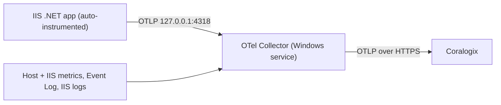

# Single-host installation

Install the OpenTelemetry Collector as a Windows service on one host, then wire up zero-code
instrumentation so its .NET applications on IIS report to Coralogix. This is the manual path —
for many hosts, use [fleet.md](fleet.md), which scripts everything here.

Two moving parts are needed before Coralogix shows APM data:

1. **The collector**, running as a Windows service. It receives telemetry over OTLP from local
   applications, scrapes host and IIS metrics itself, tails Windows and IIS logs, and ships
   everything to Coralogix.
2. **Application instrumentation**, which is what makes each application emit traces. An
   application whose team already added the OpenTelemetry SDK emits OTLP on its own and only needs
   the collector running. An application with no SDK needs **zero-code** auto-instrumentation,
   installed on the host — that is Part 3 below.



This guide targets bare Windows hosts running .NET on IIS — no Kubernetes. Node.js and standalone
Windows services are covered by [nodejs-pm2.md](nodejs-pm2.md) and the matrix at the end.

## Prerequisites

- Windows 10/11 or Windows Server 2016 or later, with Administrator access.
- **Windows PowerShell 5.1** — the .NET auto-instrumentation module requires 5.1 specifically, not
  PowerShell 7.
- A Coralogix **Send-Your-Data** API key (Data Flow → API Keys) and the **region** the key belongs
  to. A key used against the wrong region authenticates nowhere while the host still reports
  healthy.
- The Web Server (IIS) role installed, if you intend to use the IIS receivers.

## Part 1 — install the collector

### 1. Prepare the config

The installer requires a config file. Use [`../deploy/config.supervisor.yaml`](../deploy/config.supervisor.yaml)
as the reference — it is the same config the fleet package ships, it works in both supervisor and
plain modes, and it takes the region, the key and the environment label from environment variables
rather than hardcoding them. Copy it to the host, for example `C:\otel\config.yaml`.

What to review before installing:

- `exporters.coralogix.domain` resolves from `${env:CORALOGIX_DOMAIN}`. Set that variable rather
  than editing the file.
- `exporters.coralogix.subsystem_name` is the neutral fallback for signals that carry no
  `service.name` — host and infrastructure telemetry. Per-application telemetry keeps its own name.
- `application_name` resolves from `application_name_attributes`: the first non-empty of
  `cx.application.name`, `service.namespace` (from `CX_APPLICATION`), then **`host.name`**. Leave
  `CX_APPLICATION` unset and each host reports under its own hostname; set it only to group several
  hosts under one application.
- `private_key` reads `${env:CORALOGIX_PRIVATE_KEY}`, which the installer persists for the service.
  Never paste a key into the file.
- The config must **not** contain an `opamp` extension. With Fleet Management the supervisor owns
  that connection.

### 2. Run the installer

Elevated PowerShell, as a single line. The key must be inside single quotes, with the closing quote
before the semicolon.

```powershell
$u='https://github.com/coralogix/telemetry-shippers/releases/latest/download/coralogix-otel-collector.ps1'; $f="$env:TEMP\coralogix-otel-collector.ps1"; Invoke-WebRequest -Uri $u -OutFile $f -UseBasicParsing; $env:CORALOGIX_PRIVATE_KEY='<send-your-data-key>'; $env:CORALOGIX_DOMAIN='<region>.coralogix.com'; & $f -Config 'C:\otel\config.yaml'
```

On Windows Server 2016 or older, prepend
`[Net.ServicePointManager]::SecurityProtocol = [Net.SecurityProtocolType]::Tls12;` so the download
succeeds.

Where things land:

| Component | Location |
| --- | --- |
| Binary | `C:\Program Files\OpenTelemetry Collector\otelcol-contrib.exe` |
| Config | `C:\ProgramData\OpenTelemetry\Collector\config.yaml` |
| Service | `otelcol-contrib` |
| Logs | Windows Event Log (Application), source `otelcol-contrib` |

### 3. Verify

```powershell
Get-Service otelcol-contrib

& "C:\Program Files\OpenTelemetry Collector\otelcol-contrib.exe" validate --config "C:\ProgramData\OpenTelemetry\Collector\config.yaml"

Get-EventLog -LogName Application -Source otelcol-contrib -Newest 20
```

The config exposes a health check on `127.0.0.1:13133` and internal collector metrics on
`127.0.0.1:8888`.

On a host that has the deployment package, `doctor.bat` does all of the above in one read-only pass
— plus things these commands cannot tell you: whether anything is actually being **exported**,
whether the OTLP receiver ports are listening, and whether the CLR profiler is attached. Restrict
it to the collector with `set CX_DOCTOR_ONLY=services,health,exportCounters,ports && doctor.bat`.
See [diagnostics.md](diagnostics.md).

### 4. Install variants

```powershell
# Listen on all interfaces so other hosts can send here (gateway mode).
# The config must reference ${env:OTEL_LISTEN_INTERFACE}.
& $f -ListenInterface 0.0.0.0

# Raise the memory limit (config must reference ${env:OTEL_MEMORY_LIMIT_MIB}).
& $f -MemoryLimit 2048

# Header-based parsing for IIS logs. Also required when the config uses the
# file_storage extension, otherwise the service fails to start.
& $f -EnableDynamicIISParsing

# Pin a version
& $f -Version 0.144.0
```

> The reference config listens on `127.0.0.1` only, which is correct when the instrumented
> applications run on the same host. If applications run elsewhere, install that collector as a
> gateway with `-ListenInterface 0.0.0.0`.

### 5. Service management

```powershell
Restart-Service otelcol-contrib
Stop-Service otelcol-contrib
Start-Service otelcol-contrib
```

## Part 2 — what the config enables

A single per-host agent that both collects local signals and receives application telemetry, then
ships directly to Coralogix. Each block maps to a product capability.

**Receivers.** `otlp` listens on `127.0.0.1:4317` (gRPC) and `127.0.0.1:4318` (HTTP) — the entry
point for traces and metrics from instrumented applications. `hostmetrics` scrapes CPU, memory,
disk, filesystem, network, paging and process metrics, which powers the Infrastructure Explorer
host dashboards including the Process tab (the process scraper is off by default upstream and is
enabled here, with read errors muted). `windowsperfcounters` pulls Windows and .NET counters and
maps them to clean metric names: IIS request rate and current connections, ASP.NET request rate,
execution time and queue length, .NET CLR time in GC and exceptions per second, and worker process
CPU and private bytes — add `w3wp#1`, `w3wp#2` … to the Process object instances when a host runs
multiple pools. `windowseventlog` collects the Application, System and Security channels, and
`filelog/iis` tails the W3C IIS access logs, dropping header and comment lines.

**The span-metrics connector is what drives APM.** `spanmetrics` generates RED metrics (request
rate, error rate, duration) from every span, on the agent, so it sees 100% of spans before any
downstream sampling. This fills the APM Service Catalog and the latency, error and Apdex widgets.
The extra dimensions unlock specific features: `service.version` enables group-by-version,
`http.response.status_code` enables error tracking, and `db.system` with `db.namespace` enable
Dependencies and Database Monitoring. Exemplars are on, so you can jump from a metric to a
representative trace.

**Processors.** `memory_limiter` caps collector memory. `resourcedetection` adds `host.name` (plus
`os.type`, `host.id`, `host.arch`) to every signal, including application spans — this is the key
to correlation: matching `host.name` on both spans and host metrics is what ties a service to the
host it runs on, and it gives each host's span metrics a unique resource so multi-host aggregation
adds up instead of overwriting. `transform/environment` stamps the environment label from
`CX_ENVIRONMENT`, `transform/appname` resolves the application name, and `batch` groups signals
into efficient payloads.

**Exporter.** The `coralogix` exporter ships to your domain using the key from the environment,
with a sending queue and retry on failure.

| Config section | What you get in Coralogix |
| --- | --- |
| `otlp` receiver | Traces and metrics from your applications |
| `spanmetrics` connector | APM Service Catalog, latency / error / Apdex, group-by-version, dependencies |
| `hostmetrics` | Infrastructure Explorer host dashboards, Process tab |
| `windowsperfcounters` | IIS, ASP.NET and .NET CLR metrics |
| `windowseventlog`, `filelog/iis` | Windows event logs and IIS access logs |
| `resourcedetection` (`host.name`) | Service-to-host correlation, correct multi-host aggregation |
| `transform/iis_service_labels` | Host Service ownership — see [iis-service-ownership.md](iis-service-ownership.md) |

Version notes: `aggregation_cardinality_limit` on span metrics needs collector v0.130.0 or later,
and the Prometheus pull reader used for internal telemetry needs v0.123 or later.

## Part 3 — instrument .NET apps on IIS

Use this when the application team has not added the OpenTelemetry SDK. If an application already
emits OTLP from its own SDK, skip this part and point it at `127.0.0.1:4317` or `4318`.

### 1. Install the auto-instrumentation module

Elevated Windows PowerShell 5.1. Run the steps **in order** — a register step before the module and
core files are in place is what produces "could not find path to OpenTelemetry".

```powershell
$version = "v1.16.0-beta.1"   # current release tag
$module_url = "https://github.com/open-telemetry/opentelemetry-dotnet-instrumentation/releases/download/$version/OpenTelemetry.DotNet.Auto.psm1"
$download_path = Join-Path $env:temp "OpenTelemetry.DotNet.Auto.psm1"
Invoke-WebRequest -Uri $module_url -OutFile $download_path -UseBasicParsing

Import-Module $download_path
Install-OpenTelemetryCore
Register-OpenTelemetryForIIS
```

`Register-OpenTelemetryForIIS` restarts IIS by default; `-NoReset` skips the restart so you can
recycle in a maintenance window.

### 2. "No Managed Code" is for ASP.NET Core pools only

For ASP.NET **Core** applications hosted in IIS, set the pool's .NET CLR version to "No Managed
Code". Microsoft's wording is that this is *"optional but recommended"*: the application runs and
reports either way, but a managed-CLR pool loads a desktop CLR nothing in a Core application uses.
The doctor reports the mismatch as `POOL_NOT_NO_MANAGED_CODE` (warn) and the application stays
instrumented.

> **Do not apply this to an ASP.NET Framework pool.** "No Managed Code" means IIS does not load the
> .NET Framework CLR into the worker process, so a Framework application's managed handlers cannot
> be created and **IIS fails every request** with 500.21. That is an outage, not a telemetry gap.
> Framework pools need `v4.0`. Reported as `FRAMEWORK_POOL_NO_MANAGED_CLR`.

The setting is a property of the **pool**, not of the application, so it never decides on its own
whether an application can be instrumented. `Instrument-IIS.ps1` classifies each application first
— ASP.NET Core, ASP.NET Framework, non-.NET, or undeterminable — and only then judges the pairing.
A static site, a PHP or Node application behind IIS, or a URL-Rewrite reverse proxy is skipped
entirely and excluded from `CX_IIS_SERVICES`, because .NET auto-instrumentation produces nothing
for it. Full matrix, the reverse-proxy distinction and the `-RuntimeOverrides` escape hatch:
[diagnostics.md](diagnostics.md).

### 3. Point applications at the collector and name them

| Variable | Value | Purpose |
| --- | --- | --- |
| `OTEL_EXPORTER_OTLP_ENDPOINT` | `http://127.0.0.1:4318` | Send to the local collector |
| `OTEL_EXPORTER_OTLP_PROTOCOL` | `http/protobuf` | Match the HTTP endpoint |
| `OTEL_SERVICE_NAME` | unique per application | Names the service in APM |
| `OTEL_RESOURCE_ATTRIBUTES` | e.g. `service.version=1.0.0` | Extra APM dimensions |

> **Use `127.0.0.1`, not `localhost`.** On a dual-stack host `localhost` resolves to `::1` first and
> OTLP export is dropped **with no error** — the application looks healthy and no spans arrive.
> Reported per pool as `OTLP_ENDPOINT_LOCALHOST`.

To split telemetry by environment in Coralogix, set `CX_ENVIRONMENT` at machine scope and restart
the collector; the config's `transform/environment` processor stamps `deployment.environment.name`
onto host and infrastructure signals from it. Leave it unset and those signals read `unspecified`,
while an application that labelled itself keeps its own value. For host **Service ownership**, the same deploy that
names applications publishes `CX_IIS_SERVICES` and the union `CX_SERVICES` — see
[iis-service-ownership.md](iis-service-ownership.md).

There are three places to set these, in increasing scope.

**Per application, ASP.NET Core.** An `<environmentVariables>` block inside `<aspNetCore>` in that
application's `web.config`:

```xml
<configuration>
  <system.webServer>
    <aspNetCore processPath="dotnet" arguments=".\MyApp.dll">
      <environmentVariables>
        <environmentVariable name="OTEL_SERVICE_NAME" value="wallet-api" />
        <environmentVariable name="OTEL_EXPORTER_OTLP_ENDPOINT" value="http://127.0.0.1:4318" />
        <environmentVariable name="OTEL_EXPORTER_OTLP_PROTOCOL" value="http/protobuf" />
      </environmentVariables>
    </aspNetCore>
  </system.webServer>
</configuration>
```

**Per application, ASP.NET Framework — only on a dedicated pool.** `appSettings` in that
application's `Web.config`, e.g. `<add key="OTEL_SERVICE_NAME" value="wallet-api" />`. Any `OTEL_*`
setting works this way, and environment variables take precedence over it.

This does **not** give per-application names on a shared pool. From the upstream configuration
reference: on .NET Framework, `OTEL_*` values from `Web.config` or `App.config` are promoted to
process-level environment variables at startup, and the SDK is initialised once per process — so in
a pool shared by several applications, the first application to start determines the configuration
for all of them. The winner is a startup race, not the application you edited. The only reliable
per-application naming for Framework is **one pool per application**.

If no service name is set at all, one is auto-detected as `SiteName\VirtualDirectoryPath`. An
unnamed Framework application therefore **still reports** — it is absent from `CX_IIS_SERVICES`
while present in APM.

**Host-wide.** Set the variables on the `W3SVC` and `WAS` services in the registry.
`Register-OpenTelemetryForIIS` already writes the profiler variables there, so append the OTLP
settings to the same multi-string value:

```text
HKLM\SYSTEM\CurrentControlSet\Services\W3SVC\Environment
```

It is a REG_MULTI_SZ with one `NAME=VALUE` entry per line — add
`OTEL_EXPORTER_OTLP_ENDPOINT=http://127.0.0.1:4318` and
`OTEL_EXPORTER_OTLP_PROTOCOL=http/protobuf`, and repeat under `WAS`. Keep `OTEL_SERVICE_NAME` per
application rather than host-wide. A **trailing blank line in this value stops IIS starting** with
"cannot contain empty strings".

There is also a per-pool switch: `Enable-OpenTelemetryForIISAppPool -AppPoolName <name>` and its
`Disable-` counterpart. A pool environment variable takes precedence over the host-wide W3SVC
registration.

**Automated naming (recommended).** Rather than editing each application by hand,
[`../deploy/Instrument-IIS.ps1`](../deploy/Instrument-IIS.ps1) enumerates every IIS site and
application and assigns each a distinct `OTEL_SERVICE_NAME`:

- **Naming.** A site's root application takes the site name (`Wallet`); an application mounted at
  `/api` becomes `Wallet/api`. This is the explicit form of the name the profiler would otherwise
  auto-generate.
- **Scope.** An application that owns its pool gets the name on the pool — and the OTLP endpoint and
  protocol are re-set on that pool too, because a pool that declares its own
  `<environmentVariables>` stops inheriting `applicationPoolDefaults` (Part 4). Applications that
  **share** a pool get the name written into each one's own `web.config`, since one pool-level
  variable cannot distinguish co-hosted applications. ASP.NET Core **in-process** hosting allows
  only one application per pool, so pool-sharing in practice means out-of-process or ASP.NET
  Framework applications.
- **Overrides.** `-ServiceNameOverrides @{ 'Wallet/api' = 'wallet-api' }` or `-OverridesJson <file>`,
  keyed by the auto-derived name.

Classic Framework applications have no `<aspNetCore>` element, so the `web.config` writer skips them
with a warning; `appSettings` is not a workaround, because the writer is only reached for
pool-sharing applications and there `appSettings` is promoted process-wide. Give such an application
its own pool to bring it under management.

### 4. Recycle

```powershell
iisreset.exe

# or target the service
Restart-Service -Name W3SVC
```

### 5. Uninstall on one host

Elevated Windows PowerShell 5.1, the inverse of the register steps:

```powershell
Import-Module .\OpenTelemetry.DotNet.Auto.psm1
Unregister-OpenTelemetryForIIS      # removes the profiler env from W3SVC/WAS and recycles IIS
Uninstall-OpenTelemetryCore         # removes the auto-instrumentation core files
```

Then remove the per-application `OTEL_SERVICE_NAME` from any `web.config` you set it in, and the
OTLP variables from `applicationPoolDefaults` and individual pools — the `appcmd … /-` removal form,
noting that `applicationPoolDefaults` takes **no** `[name=…]` predicate. Finally `iisreset`, and
confirm `Get-Service W3SVC` is **Running**: a leftover trailing blank line in the profiler
`Environment` value blocks IIS start.

> On a host deployed from the package, do **not** do this by hand. Run `uninstall.bat` /
> `Uninstall-Agent.ps1`, which reverses all of the above from the backup manifest and removes the
> collector too. See [reference/cli.md](reference/cli.md).

## Part 4 — shared application pools

To set the OTLP variables once for many applications instead of editing every `web.config`, use
pool-level environment variables: every application assigned to that pool inherits them.

Four levels, broadest to most specific. A more specific level overrides a broader one.

| Level | Where it is set | Applies to |
| --- | --- | --- |
| Service (W3SVC, WAS) | Registry `Environment` value, written by `Register-OpenTelemetryForIIS` | Every worker process on the host |
| Application pool defaults | `applicationHost.config`, `<applicationPoolDefaults>` | Every pool that does not define its own variables |
| A specific pool | `applicationHost.config`, that pool's `<environmentVariables>` | All applications in that pool |
| A single application | that application's `web.config` | One application |

The clean pattern is shared values (`OTEL_EXPORTER_OTLP_ENDPOINT`, `OTEL_EXPORTER_OTLP_PROTOCOL`,
shared resource attributes) at pool-defaults or pool level, with only `OTEL_SERVICE_NAME` per
application.

> **Inheritance rule.** If a pool defines its own `<environmentVariables>` collection it does **not**
> inherit anything from `<applicationPoolDefaults>`. Every variable that pool needs must be listed
> on the pool itself. Defaults only reach pools with no collection of their own.

> **Requirement.** Per-pool environment variables need IIS 10.0 (Windows Server 2016 / Windows 10)
> or later. On older IIS use the host-wide W3SVC and WAS registry approach, or run the pool under a
> dedicated identity whose user environment carries the variables.

### Option A — defaults for all pools

```powershell
Import-Module WebAdministration

Add-WebConfigurationProperty -pspath 'MACHINE/WEBROOT/APPHOST' `
  -filter "system.applicationHost/applicationPools/applicationPoolDefaults/environmentVariables" `
  -name "." -value @{name='OTEL_EXPORTER_OTLP_ENDPOINT'; value='http://127.0.0.1:4318'}

Add-WebConfigurationProperty -pspath 'MACHINE/WEBROOT/APPHOST' `
  -filter "system.applicationHost/applicationPools/applicationPoolDefaults/environmentVariables" `
  -name "." -value @{name='OTEL_EXPORTER_OTLP_PROTOCOL'; value='http/protobuf'}
```

Or with `appcmd`, one line per variable:

```bat
%windir%\system32\inetsrv\appcmd.exe set config -section:system.applicationHost/applicationPools /+"applicationPoolDefaults.environmentVariables.[name='OTEL_EXPORTER_OTLP_ENDPOINT',value='http://127.0.0.1:4318']" /commit:apphost
```

### Option B — variables on one shared pool

The resulting `applicationHost.config`:

```xml
<applicationPools>
  <add name="SharedAppPool" managedRuntimeVersion="v4.0">
    <environmentVariables>
      <add name="OTEL_EXPORTER_OTLP_ENDPOINT" value="http://127.0.0.1:4318" />
      <add name="OTEL_EXPORTER_OTLP_PROTOCOL" value="http/protobuf" />
    </environmentVariables>
  </add>
</applicationPools>
```

For an ASP.NET Core pool use `managedRuntimeVersion=""`. Set it with PowerShell rather than editing
the file:

```powershell
Import-Module WebAdministration
$pool = "SharedAppPool"

Add-WebConfigurationProperty -pspath 'MACHINE/WEBROOT/APPHOST' `
  -filter "system.applicationHost/applicationPools/add[@name='$pool']/environmentVariables" `
  -name "." -value @{name='OTEL_EXPORTER_OTLP_ENDPOINT'; value='http://127.0.0.1:4318'}
```

or with `appcmd`:

```bat
REM add
%windir%\system32\inetsrv\appcmd.exe set config -section:system.applicationHost/applicationPools /+"[name='SharedAppPool'].environmentVariables.[name='OTEL_EXPORTER_OTLP_ENDPOINT',value='http://127.0.0.1:4318']" /commit:apphost

REM change an existing value
%windir%\system32\inetsrv\appcmd.exe set config -section:system.applicationHost/applicationPools /"[name='SharedAppPool'].environmentVariables.[name='OTEL_EXPORTER_OTLP_ENDPOINT'].value:'http://127.0.0.1:4318'" /commit:apphost

REM remove one variable
%windir%\system32\inetsrv\appcmd.exe set config -section:system.applicationHost/applicationPools /-"[name='SharedAppPool'].environmentVariables.[name='OTEL_EXPORTER_OTLP_ENDPOINT']" /commit:apphost
```

### Through IIS Manager

There is no dedicated field for pool environment variables, but Configuration Editor reaches them:
IIS Manager → select the server → Configuration Editor → section
`system.applicationHost/applicationPools` → expand the pool (or `applicationPoolDefaults`) → open
the `environmentVariables` collection → add entries → **Generate Script** to capture the exact
`appcmd` or PowerShell for the rest of the fleet.

### Turning instrumentation off for one pool

Registering IIS enables the profiler for every pool. `Disable-OpenTelemetryForIISAppPool
-AppPoolName <name>` sets `COR_ENABLE_PROFILING=0` on that pool;
`Enable-OpenTelemetryForIISAppPool` turns it back on. Because it is set on the pool it overrides the
host-wide registration. The pool name is case sensitive.

### Applying the change

Editing `applicationHost.config` recycles the affected pools by default, so new variables take
effect on the next request. To avoid an unplanned recycle during a rollout, set
`disallowRotationOnConfigChange` to true on the pool, then recycle it yourself:

```powershell
Restart-WebAppPool -Name "SharedAppPool"
```

## Known limitations

Behaviours to plan around, not bugs to file:

- **An ASP.NET Framework application on a shared pool cannot be given a per-application service
  name.** It has no `<aspNetCore>` element to write into, and `appSettings` on a shared pool is
  promoted process-wide with first-application-wins. It still reports, under the auto-detected
  `SiteName\VirtualPath`, and is excluded from `CX_IIS_SERVICES`. Workaround: a dedicated pool.
- **An application with no `web.config` on a shared pool** hits the same constraint for the same
  reason, with the same workaround.
- **Re-running an install while IIS is up can fail on locked profiler DLLs.** The .NET
  auto-instrumentation files are loaded into every `w3wp` process. Stop the affected pools (or accept
  the `iisreset` the module performs) before upgrading the module.
- **More than three distinct IIS log directories cannot all be tailed.** The config carries three
  `CX_IIS_LOG_DIR_n` slots, and `${env:VAR}` expands to a single scalar while `include:` is a list,
  so a fourth directory cannot be expressed without editing the config. Reported as
  `IIS_LOGDIR_SLOTS_EXCEEDED`; consolidate the directories or add slots.
- **A log-directory change needs a collector restart** before the new path is tailed — the receiver
  reads the slots at start.
- **Non-W3C IIS log formats arrive unparsed.** The lines are tailed fine, but the parser needs the
  W3C `#Fields:` header to split them. Reported as `IIS_LOG_FORMAT_UNSUPPORTED`; switch the site to
  W3C logging.
- **Central W3C logging loses per-site attribution.** One file for the whole host means the
  collector cannot tell which site a line came from. Reported as `IIS_CENTRAL_LOGGING` (info) —
  a valid IIS setup, not a fault.

## Troubleshooting

**Start with the doctor.** On a host that has the package, `doctor.bat` is read-only and answers
most of the entries below with a specific finding code instead of a guess;
`Test-IISInstrumentation.ps1` runs just the IIS half. Every code is listed in
[reference/exit-codes.md](reference/exit-codes.md).

**Spans arrive but the APM Service Catalog or span metrics stay empty.** First confirm data is
leaving the box at all — the `exportCounters` check distinguishes `EXPORT_COUNTERS_ZERO` (nothing
exported) from `EXPORT_SEND_FAILED` (exported and rejected); zero counters means the problem is
upstream of the connector, not in it. Otherwise: confirm the `spanmetrics` connector is in the
traces pipeline, check that spans carry `http.response.status_code` (semantic conventions 1.21 or
later) for error tracking, and review service naming — dots and hyphens may need normalising. Allow
a few minutes after a change, since span metrics flush on an interval.

**"Could not find path to OpenTelemetry", or the module is not found.** A register or install step
ran out of order. Download, `Import-Module`, `Install-OpenTelemetryCore`, then
`Register-OpenTelemetryForIIS`.

**No telemetry from an ASP.NET Core application.** Look for `PROFILER_NOT_REGISTERED` (the register
step never ran here), `PROFILER_PATH_MISSING` (the profiler DLL the registry points at was deleted —
IIS starts and emits nothing) and `OTLP_ENDPOINT_LOCALHOST` first: those produce silence.
`POOL_NOT_NO_MANAGED_CODE` is worth fixing but is **not** a cause of total silence.

**An application is reported `NON_DOTNET_APP_NOT_INSTRUMENTED` and you expected telemetry.** The
classifier found neither `<aspNetCore>` nor classic ASP.NET configuration. Usual causes: the publish
output is incomplete (no `web.config`, so IIS is not routing to ANCM either and the application is
not serving), the site really is static or a reverse proxy, or the application is a child of a
parent whose `<location inheritInChildApplications="false">` stops `<aspNetCore>` flowing down. If
detection is genuinely wrong, force it with `-RuntimeOverrides` — and pass the same override to the
doctor.

**An ASP.NET Framework application returns 500.21 after a "fix".** Its pool was set to "No Managed
Code". Set it back to `v4.0`.

**Endpoint fixed centrally but pools still export nowhere.** A pool with its own
`<environmentVariables>` block **replaces** `applicationPoolDefaults`, and IIS copies the defaults
into that block the first time `appcmd` writes any variable to the pool. That copy never refreshes.
Reported as `POOL_ENV_STALE`; fix by re-running `Instrument-IIS.ps1` and recycling the pool.

**The collector service fails to start.** Common causes: the config uses an IIS or `file_storage`
feature the host is missing (install the IIS role, or re-run with `-EnableDynamicIISParsing`); the
config is invalid (run `validate`); `CORALOGIX_PRIVATE_KEY` is not set for the service; or
`OTEL_MEMORY_LIMIT_MIB` is set but empty, which fails with `'limit_mib' or 'limit_percentage' must
be greater than zero`. Check the Application event log, source `otelcol-contrib`.

**Download fails with an SSL/TLS error.** The host is defaulting to TLS 1.0. Run
`[Net.ServicePointManager]::SecurityProtocol = [Net.SecurityProtocolType]::Tls12` first.

**Execution policy blocks the script.** `Set-ExecutionPolicy -ExecutionPolicy RemoteSigned -Scope
CurrentUser`, or launch with `powershell -ExecutionPolicy Bypass`.

**IIS will not start after editing the registry variables.** A trailing empty line in the
REG_MULTI_SZ triggers "cannot contain empty strings". Remove the blank entry.
`Test-IISInstrumentation.ps1` detects it as `PROFILER_REGISTRY_MALFORMED` — the only instrumentation
finding graded as a hard fail, because it stops IIS rather than merely degrading telemetry. Run it
**before** the next `iisreset` on a host whose registry you have hand-edited.

## Choosing the right setup

| Scenario | What to use |
| --- | --- |
| Windows, IIS, .NET application, no SDK in code | Collector + zero-code IIS auto-instrumentation (Part 3) |
| Windows, standalone .NET service, no SDK | Collector + [`../deploy/Instrument-DotNetService.ps1`](../deploy/Instrument-DotNetService.ps1), or `Register-OpenTelemetryForWindowsService` by hand |
| Application already has the OpenTelemetry SDK | Collector only; point it at `127.0.0.1:4317` or `4318` |
| Node.js under PM2 | [nodejs-pm2.md](nodejs-pm2.md) |
| Node.js as a Windows service, no PM2 | [`../deploy/Instrument-NodeService.ps1`](../deploy/Instrument-NodeService.ps1) |
| Windows host running RabbitMQ | Collector base plus the fragment [`../deploy/templates/rabbitmq.yaml`](../deploy/templates/rabbitmq.yaml); see [`../deploy/templates/README.md`](../deploy/templates/README.md) |
| Linux database host | [linux.md](linux.md) |
| More than a handful of hosts | [fleet.md](fleet.md) |

Optional components such as RabbitMQ are template fragments layered onto the base config only where
that component actually runs, rather than part of the baseline.

## Related

- [fleet.md](fleet.md) — the scripted, many-host version of this runbook
- [reference/cli.md](reference/cli.md) — every script, flag and default
- [reference/env-vars.md](reference/env-vars.md) — every variable, and which copy wins
- [diagnostics.md](diagnostics.md) — reading a doctor result
- [iis-service-ownership.md](iis-service-ownership.md) — host Service ownership
